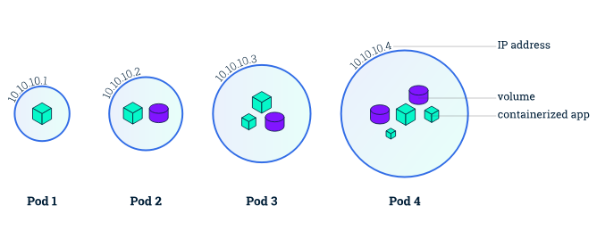

# Part 1 - Kubernetes Concepts

## 1 - Kubernetes Basics

This tutorial provides a walkthrough of the basics of the Kubernetes cluster orchestration system. Each module contains some background information on major Kubernetes features and concepts. You will actually deploy and manage a simple cluster and its containerized applications by yourself.

Following the tutorial steps, you can learn to:

* Deploy a Kubernetes cluster
* Deploy a simple containerized application on a cluster, scale it, update it with a new software version, debug it.
* Deploy a more complex containerized application with a stateful datastore, and scale/update jointly the application and the data store.

I purposely copied some reference documentation from the official Kubernetes site on design and architecture because it is exemplary of the philosophy underlying the whole Kubernetes project: clarity of purpose translated in the ability of distributed teams to efficiently contributes into a larger goal, native and forceful openness of the design, resilience-by-design deeply embeded in the implementation of every layer. It is REMARKABLE and should be a source of inspiration in many Orange endeavours...

### 1.1 - What can Kubernetes do for you?

With modern web services, users expect applications to be available 24/7, and developers expect to deploy new versions of those applications several times a day.

Kubernetes coordinates a highly available cluster of computers that are connected to work as a single unit. The abstractions in Kubernetes allow you to deploy containerized applications to a cluster without tying them specifically to individual machines. To make use of this new model of deployment, applications need to be packaged in a way that decouples them from individual hosts: they need to be containerized.

**KUBERNETES CAN MANAGE CONTAINERIZED APPLICATIONS ONLY**

Containerized applications are more flexible and available than in past deployment models, where applications were installed directly onto specific machines as packages deeply integrated into the host. Kubernetes automates the distribution and scheduling of application containers across a cluster in a more efficient way.

But beyond the gain of moving from physical to *another-type-of-virtual infrastructure*, Kubernetes brings a total automation of the basic operation of the applications running on it: beyond just orchestrating containers, it actually manages teh whole lifecycle of applications.

### 1.2 - K8s Community Mindset

I have decided to quote here the introduction of the project by the community itself, as it is to me exemplary of the 'mindset' which has enabled to set one of the most formidable open source platform ever (to which maybe only linux can be compared), both in its remarkable engineering foundations, but also in the way this 'mindset' is day-in-day out demonstrated in action.

> Kubernetes is a platform for deploying and managing containers. Kubernetes provides a container runtime, container orchestration, container-centric infrastructure orchestration, self-healing mechanisms such as health checking and re-scheduling, and service discovery and load balancing.
>
>Kubernetes aspires to be an extensible, pluggable, building-block OSS platform and toolkit. Therefore, architecturally, we want Kubernetes to be built as a collection of pluggable components and layers, with the ability to use alternative schedulers, controllers, storage systems, and distribution mechanisms, and we're evolving its current code in that direction.
>
> Furthermore, we want others to be able to extend Kubernetes functionality, such as with higher-level PaaS functionality or multi-cluster layers, without modification of core Kubernetes source. Therefore, its API isn't just (or even necessarily mainly) targeted at end users, but at tool and extension developers. Its APIs are intended to serve as the foundation for an open ecosystem of tools, automation systems, and higher-level API layers.
>
> Consequently, there are no "internal" inter-component APIs. All APIs are visible and available, including the APIs used by the scheduler, the node controller, the replication-controller manager, Kubelet's API, etc. There's no glass to break -- in order to handle more complex use cases, one can just access the lower-level APIs in a fully transparent, composable manner.

## 2 - Kubernetes Design & Architecture

### 2.1 - Overview

Kubernetes is a production-grade, open-source infrastructure for the deployment scaling, management, and composition of application containers across clusters of hosts, inspired by previous work at Google.Kubernetes is more than just a “container orchestrator.” It aims to eliminate the burden of orchestrating physical/virtual compute, network, and storage infrastructure, and enable application operators and developers to focus entirely on container-centric primitives for self-service operation. Kubernetes also provides a stable, portable foundation (a platform) for building customized workflows and higher-level automation.

Kubernetes is primarily targeted at applications composed of multiple containers. It therefore groups containers using ***pods*** and ***labels*** into tightly coupled and loosely coupled formations for easy management and discovery.

Kubernetes is a platform for deploying and managing containers. Kubernetes provides a container runtime, container orchestration, container-centric infrastructure orchestration, self-healing mechanisms such as health checking and re-scheduling, and service discovery and load balancing.

Kubernetes aspires to be an extensible, pluggable, building-block OSS platform and toolkit. Therefore, architecturally, we want Kubernetes to be built as a collection of pluggable components and layers, with the ability to use alternative schedulers, controllers, storage systems, and distribution mechanisms, and we're evolving its current code in that direction. Furthermore, we want others to be able to extend Kubernetes functionality, such as with higher-level PaaS functionality or multi-cluster layers, without modification of core Kubernetes source. Therefore, its API isn't just (or even necessarily mainly) targeted at end users, but at tool and extension developers. Its APIs are intended to serve as the foundation for an open ecosystem of tools, automation systems, and higher-level API layers. Consequently, there are no "internal" inter-component APIs. All APIs are visible and available, including the APIs used by the scheduler, the node controller, the replication-controller manager, Kubelet's API, etc. There's no glass to break --in order to handle more complex use cases, one can just access the lower-level APIs in a fully transparent, composable manner.

### 2.2 - Goals

The Kubernetes project is committed to the following (aspirational) design ideals:

* ***Portable:*** Kubernetes runs everywhere -- public cloud, private cloud, bare metal, laptop -- with consistent behavior so that applications and tools are portable throughout the ecosystem as well as between development and production environments.
* ***General-purpose:*** Kubernetes should run all major categories of workloads to enable you to run all of your workloads on a single infrastructure, stateless and stateful, microservices and monoliths, services and batch, greenfield and legacy.
* ***Meet users partway:*** Kubernetes doesn’t just cater to purely greenfield cloud-native applications, nor does it meet all users where they are. It focuses on deployment and management of microservices and cloud-native applications, but provides some mechanisms to facilitate migration of monolithic and legacy applications.
* ***Flexible:*** Kubernetes functionality can be consumed a la carte and (in most cases) Kubernetes does not prevent you from using your own solutions in lieu of built-in functionality.
* ***Extensible:*** Kubernetes enables you to integrate it into your environment and to add the additional capabilities you need, by exposing the same interfaces used by built-in functionality.
* ***Automatable:*** Kubernetes aims to dramatically reduce the burden of manual operations. It supports both declarative control by specifying users’ desired intent via its API, as well as imperative control to support higher-level orchestration and automation. The declarative approach is key to the system’s self-healing and autonomic capabilities.
* ***Advance the state of the art:*** While Kubernetes intends to support non-cloud-native applications, it also aspires to advance the cloud-native and DevOps state of the art, such as in the participation of applications in their own management. However, in doing so, we strive not to force applications to lock themselves into Kubernetes APIs, which is, for example, why we prefer configuration over convention in the downward API. Additionally, Kubernetes is not bound by the lowest common denominator of systems upon which it depends, such as container runtimes and cloud providers. An example where we pushed the envelope of what was achievable was in its IP per Pod networking model.

### 2.3 - Architecture

A running Kubernetes cluster contains:
* one or several ***Master(s)*** which operate the cluster control plane (AKA Master), and
* several ***Nodes*** which communicate with and are managed by the Master thanks to the Kubernetes REST APIs.
* several ***Pods*** which are groups of containers which compose an application: Kubernetes enable to run an application by its ability to orchestrates pods on the cluster's nodes.

The ***Master*** is responsible for managing the cluster. The master coordinates all activities in your cluster, such as scheduling applications, maintaining applications' desired state, scaling applications, and rolling out new updates.

A ***Node*** is a VM or a physical computer that serves as a worker machine in a Kubernetes cluster. Each Node has a `Kubelet`, which is an agent for managing the Node and communicating with the Kubernetes Master. The Node should also have tools (a **container runtime**) for handling container operations, such as `Docker` or `rkt`. A Kubernetes cluster that handles production traffic should have a minimum of three Nodes.

When you deploy applications on Kubernetes, you tell the Master to start the application pods, and each pod regroups one or several containres. The Master schedules the pods' containers to run on the cluster's Nodes. The Nodes communicate with the master using the Kubernetes API, which the Master exposes. End users can also use the Kubernetes API directly to interact with the cluster.

A Kubernetes cluster can be deployed on either physical or virtual machines. In our case, Part 2 shows how to deploy a Kubernetes cluster on 3 VMs running on your local machine: it is good enough for educational pruposes, but it obviously is not representative of a 'real' cluster (which typically gathers hundreds of physical servers).

### 2.4 - Cluster control plane (AKA Master)

The Kubernetes **control plane** is split into a set of logical components, which can all run on a single Master node, or can be replicated over several Master nodes in order to support high-availability clusters, or can even be run on Kubernetes itself (AKA self-hosted).

*Everything* within the cluster requires (or is triggered by) calls to the Kubernetes API. Kubernetes’s API provides:
* *container-centric primitives* such as Pods, Services, and Ingress, to manage underlying resources (compute, storage, network): it may be compared to the IaaS-type of APIs which enable to manage VMs, keeping in mind that Kubernetes can ONLY manage containers;
* *lifecycle APIs* to support 'orchestration' (self-healing, scaling, updates, termination) of common types of workloads (simple fungible/stateless app, stateful apps), batches, cron jobs...).

The main logical components of the control plane are:

* ### the API Server
  The Kubernetes REST API enable the Master to send orders to the Nodes such as 'start a pod', 'stop a pod', and also enable a Node to send updated status information to the Master (in order, for instance,  that the Master keep a global view on the resources available in the cluster).
  The **API server** serves up the *Kubernetes API*. It is intended to be a relatively simple server, with most/all business logic implemented in separate components or in plug-ins. It mainly processes REST operations, validates them, and updates the corresponding objects in `etcd` (and perhaps eventually other stores).
  Kubernetes cannot function without this basic API machinery, which includes:
  * REST semantics, watch, durability and consistency guarantees, API versioning, defaulting, and validation
  * Built-in admission-control semantics, synchronous admission-control hooks, and asynchronous resource initialization
  * API registration and discovery

  Additionally, the API server acts as the gateway to the cluster. By definition, the API server must be accessible by clients from outside the cluster, whereas the nodes, and certainly containers, may not be. Clients authenticate the API server and also use it as a bastion and proxy/tunnel to nodes and pods (and services).

* ### the cluster state store
  All persistent cluster state is stored in an instance of `etcd`. This provides a way to store configuration data reliably. With watch support, coordinating components can be notified very quickly of changes.

* ### the Controller Manager, Controllers and the Scheduler
  Most cluster-level functions are currently monitored by a separate process, called the **Controller Manager**. When the Controller Manager need to launch an action (e.G. "deploy the application A"), it will start a **controller** to actually do it.

  The **Controller** is given one input: the **'desired state'** (for instance deploying 5 instances of the application A). With this target, it will work continuously to drive the actual state towards the desired state, while reporting back the currently observed state in the cluster state store, so that users and other controllers can see it. The controller typically watch for changes to relevant resources in order to minimize reaction latency and redundant work: this enables decentralized and decoupled choreography-like coordination without a message bus.

  When the controller decides that an action is needed, it will rely on the **scheduler** to execute that action. For instance, if the controller observes that only 5 instances of the application A are running, it will trigger the scheduler to "add a Pod". The controller has no clue on which Node the new Pods should be launched: the **scheduler** automatically chooses nodes to run those pods on. The scheduler watches for unscheduled pods and binds them to nodes, according to the availability of the requested resources, quality of service requirements, affinity and anti-affinity specifications, and other constraints.

One of the most important notion to acquire is how to properly describe a 'desired state' and to feed it to the Master, so that the Master will do all the job for you. Most resources contain metadata, including labels and annotations, fully elaborated desired state (spec), including default values, and observed state (status). These metadata are typically described in YAML files, which are very useful to actually manage a Kubernetes cluster.

### 2.5 - The Kubernetes Node

The Kubernetes **node** runs the services necessary to host application containers and be managed from the master systems:

* ### Kubelet
  The most important and most prominent controller in Kubernetes is the ***Kubelet***, which is the primary implementer of the Pod and Node APIs, that drive the container execution layer. Without these APIs, Kubernetes would just be a CRUD-oriented REST application framework backed by a key-value store.

  Kubernetes executes isolated application containers as its default, native mode of execution, as opposed to processes and traditional operating-system packages. Not only are application containers isolated from each other, but they are also isolated from the hosts on which they execute, which is critical to decoupling management of individual applications from each other and from management of the underlying cluster physical/virtual infrastructure.

  Kubernetes provides ***Pods*** that can host multiple containers and storage volumes as its fundamental execution primitive in order to facilitate packaging a single application per container, decoupling deployment-time concerns from build-time concerns, and migration from physical/virtual machines. The Pod primitive is key to glean the primary benefits of deployment on modern cloud platforms, such as Kubernetes.

  API admission control may reject pods or add additional scheduling constraints to them, but Kubelet is the final arbiter of what pods can and cannot run on a given node, not the schedulers.

* ### Container runtime
  Each node runs a **container runtime**, which is responsible for downloading images and running containers.
  Kubelet does *not* link in the base container runtime. Instead, we're defining a Container Runtime Interface to control the underlying runtime and facilitate pluggability of that layer. This decoupling is needed in order to maintain clear component boundaries, facilitate testing, and facilitate pluggability. Runtimes supported today, either upstream or by forks, include at least `docker` (for Linux and Windows), `rkt`, `cri-o`, and `frakti`.

* ### Kube Proxy
  The service abstraction provides a way to group pods under a common access policy (e.g., load-balanced). The implementation of this creates a virtual IP which clients can access and which is transparently proxied to the pods in a Service. Each node runs a ``kube-proxy`` process which programs iptables rules to trap access to service IPs and redirect them to the correct backends. This provides a highly-available load-balancing solution with low performance overhead by balancing client traffic from a node on that same node.
  Service endpoints are found primarily via DNS.

### 2.6 - Add-ons

Contrarily to Kubernetes native components, ***Addons*** use Kubernetes resources (DaemonSet , Deployment , etc) to implement cluster features. Because these are providing cluster-level features, namespaced resources for addons belong within the kube-system namespace. In other words, the add-ons are truely part of the *system* but they are managed almost like any application you would deploy on Kubernetes.

Let's emntion few add-ons

* ### DNS
  While the other addons are not strictly required, all Kubernetes clusters should have cluster DNS, as many examples rely on it. Cluster DNS is a DNS server, in addition to the other DNS server(s) in your environment, which serves DNS records for Kubernetes services.
  Containers started by Kubernetes automatically include this DNS server in their DNS searches.
* ### Web UI (the Dashboard)
  Dashboard is a general purpose, web-based UI for Kubernetes clusters. It allows users to manage and troubleshoot applications running in the cluster, as well as the cluster itself.
  The Dashboard is the UI version of `kubectl`: it only passes API calls to the Master, and restitutes the answers in a graphical format. One could also say that `kubectl` is CLI version of the Dashboard ;-).
* ### Container Resource Monitoring
  Container Resource Monitoring records generic time-series metrics about containers in a central database, and provides a UI for browsing that data.
* ### Cluster-level Logging
  A cluster-level logging mechanism is responsible for saving container logs to a central log store with search/browsing interface.

### 2.7 - Pods

When you deploy an application on a cluster, Kubernetes creates a **Pod** to host your application instance. A Pod is a Kubernetes abstraction that represents a group of one or more application containers, and some shared resources for those containers. Those resources include:
* Shared storage, as **Volumes**
* Networking, as a unique **cluster IP address**
* Information about how to run each container, such as the container image version or specific ports to use...

A Pod models an application-specific "logical host" and can contain different application containers which are relatively tightly coupled. For example, a Pod might include both the container with your Node.js app as well as a different container that feeds the data to be published by the Node.js webserver. The containers in a Pod share an IP Address and port space, are always co-located and co-scheduled, and run in a shared context on the same Node.

Pods are the **atomic unit** on the Kubernetes platform. When we create a Deployment on Kubernetes, that Deployment creates Pods with containers inside them (as opposed to creating containers directly).

Each Pod is tied to the Node where it is scheduled, and remains there until termination (according to restart policy) or deletion. In case of a Node failure, identical Pods are scheduled on other available Nodes in the cluster.
