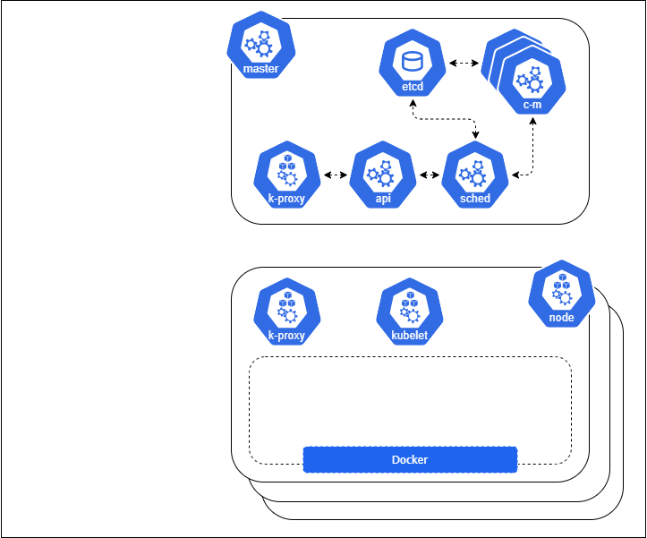
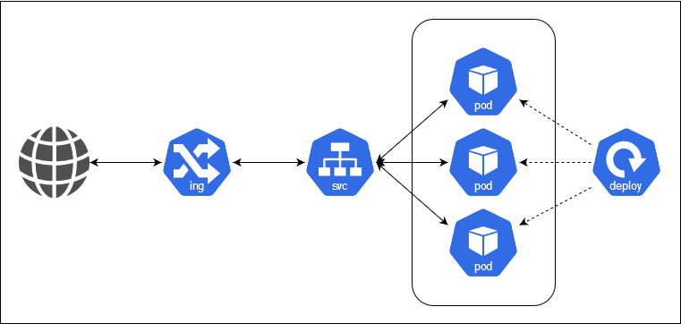

# Part 1 - Kubernetes Concepts

## 1 - Kubernetes Basics

This tutorial provides a walkthrough of the basics of the Kubernetes cluster orchestration system. Each module contains some background information on major Kubernetes features and concepts. You will actually deploy and manage a simple cluster and its containerized applications by yourself.

Following the tutorial steps, you can learn to:

* Deploy a Kubernetes cluster
* Deploy a simple containerized application on a cluster, scale it, update it with a new software version, debug it.
* Deploy a more complex containerized application with a stateful datastore, and scale/update jointly the application and the data store.

I purposely copied some reference documentation from the official Kubernetes site on design and architecture because it is exemplary of the philosophy underlying the whole Kubernetes project: clarity of purpose translated in the ability of distributed teams to efficiently contributes into a larger goal, native and forceful openness of the design, resilience-by-design deeply embeded in the implementation of every layer. It is **REMARKABLE** and should be a source of inspiration in many Orange endeavours...

### 1.1 - What can Kubernetes do for you?

With modern web services, users expect applications to be available 24/7, and developers expect to deploy new versions of those applications several times a day.

Kubernetes coordinates a highly available cluster of computers that are connected to work as a single unit. The abstractions in Kubernetes allow you to deploy containerized applications to a cluster without tying them specifically to individual machines. To make use of this new model of deployment, applications need to be packaged in a way that decouples them from individual hosts: they need to be containerized.

***KUBERNETES CAN MANAGE CONTAINERIZED APPLICATIONS ONLY***

Containerized applications are more flexible and available than in past deployment models, where applications were installed directly onto specific machines as packages deeply integrated into the host. Kubernetes automates the distribution and scheduling of application containers across a cluster in a more efficient way.

But beyond the gain of moving from physical to *another-type-of-virtual infrastructure*, Kubernetes brings a total automation of the basic operation of the applications running on it: beyond just orchestrating containers, it actually manages teh whole lifecycle of applications.

### 1.2 - K8s Community Mindset

I have decided to quote here the introduction of the project by the community itself, as it is to me exemplary of the 'mindset' which has enabled to set one of the most formidable open source platform ever (to which maybe only linux can be compared), both in its remarkable engineering foundations, but also in the way this 'mindset' is day-in-day out demonstrated in action.

*Kubernetes is a platform for deploying and managing containers. Kubernetes provides a container runtime, container orchestration, container-centric infrastructure orchestration, self-healing mechanisms such as health checking and re-scheduling, and service discovery and load balancing.*

*Kubernetes aspires to be an extensible, pluggable, building-block OSS platform and toolkit. Therefore, architecturally, we want Kubernetes to be built as a collection of pluggable components and layers, with the ability to use alternative schedulers, controllers, storage systems, and distribution mechanisms, and we're evolving its current code in that direction.*

*Furthermore, we want others to be able to extend Kubernetes functionality, such as with higher-level PaaS functionality or multi-cluster layers, without modification of core Kubernetes source. Therefore, its API isn't just (or even necessarily mainly) targeted at end users, but at tool and extension developers. Its APIs are intended to serve as the foundation for an open ecosystem of tools, automation systems, and higher-level API layers.*

*Consequently, there are no "internal" inter-component APIs. All APIs are visible and available, including the APIs used by the scheduler, the node controller, the replication-controller manager, Kubelet's API, etc. There's no glass to break -- in order to handle more complex use cases, one can just access the lower-level APIs in a fully transparent, composable manner.*

### 1.3 - Goals

The Kubernetes project is committed to the following (aspirational) design ideals:

* ***Portable:*** Kubernetes runs everywhere -- public cloud, private cloud, bare metal, laptop -- with consistent behavior so that applications and tools are portable throughout the ecosystem as well as between development and production environments.
* ***General-purpose:*** Kubernetes should run all major categories of workloads to enable you to run all of your workloads on a single infrastructure, stateless and stateful, microservices and monoliths, services and batch, greenfield and legacy.
* ***Meet users partway:*** Kubernetes doesn’t just cater to purely greenfield cloud-native applications, nor does it meet all users where they are. It focuses on deployment and management of microservices and cloud-native applications, but provides some mechanisms to facilitate migration of monolithic and legacy applications.
* ***Flexible:*** Kubernetes functionality can be consumed a la carte and (in most cases) Kubernetes does not prevent you from using your own solutions in lieu of built-in functionality.
* ***Extensible:*** Kubernetes enables you to integrate it into your environment and to add the additional capabilities you need, by exposing the same interfaces used by built-in functionality.
* ***Automatable:*** Kubernetes aims to dramatically reduce the burden of manual operations. It supports both declarative control by specifying users’ desired intent via its API, as well as imperative control to support higher-level orchestration and automation. The declarative approach is key to the system’s self-healing and autonomic capabilities.
* ***Advance the state of the art:*** While Kubernetes intends to support non-cloud-native applications, it also aspires to advance the cloud-native and DevOps state of the art, such as in the participation of applications in their own management. However, in doing so, we strive not to force applications to lock themselves into Kubernetes APIs, which is, for example, why we prefer configuration over convention in the downward API. Additionally, Kubernetes is not bound by the lowest common denominator of systems upon which it depends, such as container runtimes and cloud providers. An example where we pushed the envelope of what was achievable was in its IP per Pod networking model.

## 2 - Kubernetes Design & Architecture

Kubernetes is a production-grade, open-source infrastructure for the deployment scaling, management, and composition of application containers across clusters of hosts, inspired by previous work at Google. Kubernetes is more than just a *“container orchestrator”*. It aims to eliminate the burden of orchestrating physical/virtual compute, network, and storage infrastructure, and enable application operators and developers to focus entirely on container-centric primitives for self-service operation. Kubernetes also provides a stable, portable foundation (a platform) for building customized workflows and higher-level automation.

Kubernetes is primarily targeted at applications composed of multiple containers. It therefore groups containers using ***Pods*** and ***Labels*** into tightly coupled and loosely coupled formations for easy management and discovery.

### 2.1 - Overall architecture

A running Kubernetes cluster contains:
* one or several ***Master Node(s)*** which operate the cluster control plane (AKA Master), and
* several ***Worker Nodes*** which communicate with and are managed by the _Master_ thanks to the Kubernetes REST APIs.

A Kubernetes cluster can be deployed on either physical or virtual machines. In our case, because we do not aim at building a production environment but we only need it for education, Part 2 shows how to deploy a Kubernetes cluster by simulating every _Node_ with Docker container on your local machine, and then running all Kubernetes components as *Docker containers inside the _Nodes_ Docker containers*: it is good enough for educational purposes, but it obviously is not representative of a 'real' cluster (which typically gathers hundreds of physical servers): in the real world, a ***Node*** is a VM or a physical computer.

#### 2.2 - the *Pod*, atomic unit of an application

Kubernetes executes isolated application containers as its default, native mode of execution, as opposed to processes and traditional operating-system packages. Not only are application containers isolated from each other, but they are also isolated from the hosts on which they execute, which is critical to decoupling management of individual applications from each other and from management of the underlying cluster physical/virtual infrastructure.

In order to fully beenfit from the very powerful concepts of Kubernetes, the application must be designed and developped according the specific patterns: it should typically be organised in micro-services, which each have their own life-cycle (independant one from the other) and their technologies (i.e. use the best programming language, bus, event or database technologies wth regard to the specific focus of this micro-service). You will see very often in the litterature that the application must respect the ***12 factors***, which list typical guidelines that should be respected in order to fully benefit from a micro-service approach (ie. there is no magic: it is easy to mess up with micro-services...).

When you deploy an application on a cluster, Kubernetes creates a **Pod** to host your application instance. A _Pod_ is a Kubernetes abstraction that represents a group of one or more application containers, and some shared resources for those containers. Those resources include:

* Shared storage, as **Volumes**
* Networking, as a unique **cluster IP address**
* Information about how to run each container, such as the container image version or specific ports to use...

A _Pod_ models an application-specific "logical host" and can contain different application containers which are relatively tightly coupled. For example, a _Pod_ might include both the container with your node.js app as well as a different container that feeds the data to be published by the node.js webserver. The containers in a _Pod_ share an IP Address and port space, are always co-located and co-scheduled, and run in a shared context on the same Node.

_Pods_ are the **atomic unit** on the Kubernetes platform. When we create a Deployment on Kubernetes, that Deployment creates Pods with containers inside them (as opposed to creating containers directly).

### 2.3 - Looking into the _Master Node(s)_

The ***Master*** is responsible for managing the cluster, and as such is the control plane of the cluster. The _Master_ coordinates all activities in your cluster, such as scheduling applications, maintaining applications' desired state, scaling applications, and rolling out new updates. As you can see below, the _Master_ is split into a set of logical components, which can all run on one single or over several replicated _Nodes_ in order to support high-availability clusters, or can even be run on Kubernetes itself (AKA self-hosted):

The main logical components of the control plane are:

* the **API Server**
  Every possible communication from / to / within the cluster goes through the API Server: it enable the _Master_ to send orders to the _Nodes_ such as 'start a _Pod_', 'stop a _Pod_', and also enable a _Node_ to send updated status information to the _Master_ (in order, for instance,  that the _Master_ keep a global view on the resources available in the cluster, and store it in the _cluster state store_).
  The _API server_ serves up the *Kubernetes API*. It is intended to be a relatively simple server, with most/all business logic implemented in separate components or in plug-ins. It mainly processes REST operations, validates them, and updates the corresponding objects in `etcd` (and perhaps eventually other stores).
  Kubernetes cannot function without this basic API machinery, which includes:

  * REST semantics, watch, durability and consistency guarantees, API versioning, defaulting, and validation
  * Built-in admission-control semantics, synchronous admission-control hooks, and asynchronous resource initialization
  * API registration and discovery

  Additionally, the API server acts as the gateway to the cluster. By definition, the API server must be accessible by clients from outside the cluster, whereas the nodes, and certainly containers, may not be. Clients authenticate the API server and also use it as a bastion and proxy/tunnel to _Nodes_ and _Pods_ (and _Services_).

* **`etcd` = the cluster state store**
  All persistent cluster state is stored in an instance of `etcd`. This provides a way to store configuration data reliably. With watch support, coordinating components can be notified very quickly of changes.

* the **Controller Manager** and **Controllers**
  Most cluster-level functions are monitored by a separate process, called the _Controller Manager_. When the _Controller Manager_ need to launch an action (e.G. "deploy the application A"), it will start a _Controller_ to actually do it.
  The *Controller* is given one input: the ***'desired state'*** (for instance deploying 5 instances of the application A). With this target, it will work continuously to drive the actual state towards the desired state, while reporting back the currently observed state in the cluster state store, so that users and other controllers can see it. The controller typically watch for changes to relevant resources in order to minimize reaction latency and redundant work: this enables decentralized and decoupled choreography-like coordination without a message bus.

* the **Scheduler**
  When the _Controller_ decides that an action is needed, it will rely on the _Scheduler_ to execute that action. For instance, if the _Controller_ observes that only 4 instances of the application A are running instead of 5, it will trigger the _Scheduler_ to "add a _Pod_ A". The _Controller_ has no clue on which _Node_ the new _Pod_ should be launched: in collaboration with the _kubelets_ (see below), the *Scheduler* automatically chooses _Nodes_ to run those _Pods_ on. The _Scheduler_ watches for unscheduled _Pods_ and binds them to _Nodes_, according to the availability of the requested resources, quality of service requirements, affinity and anti-affinity specifications, and other constraints.

One of the most important notion to acquire is how to properly describe a *'desired state'* and to feed it to the _Master_, so that the _Master_ will do all the job for you. Most resources contain metadata, including labels and annotations, fully elaborated desired state (spec), including default values, and observed state (status). These metadata are typically described in YAML files, which are very useful to actually manage a Kubernetes cluster.

#### Add-ons

Contrarily to Kubernetes native components, ***Addons*** use Kubernetes resources (DaemonSet , Deployment , etc) to implement cluster features. Because these are providing cluster-level features, namespaced resources for addons belong within the kube-system namespace. In other words, the add-ons are truely part of the *system* but they are technically managed _almost_ like any application you would deploy on Kubernetes.

Let's mention few add-ons

* ***DNS***
  While the other addons are not strictly required, all Kubernetes clusters should have cluster DNS, as all internal communication rely on it. Cluster DNS is a DNS server, in addition to the other DNS server(s) in your environment, which serves DNS records for Kubernetes services.
  Containers started by Kubernetes automatically include this DNS server in their DNS searches.
* ***Web UI = the Dashboard***
  The _Dashboard_ is a general purpose, web-based UI for Kubernetes clusters. It allows users to manage and troubleshoot applications running in the cluster, as well as the cluster itself.
  The _Dashboard_ is the UI version of `kubectl`: it only passes API calls to the Master, and restitutes the answers in a graphical format. One could also say that `kubectl` is CLI version of the Dashboard :smile:.

### 2.4 - Looking into the _Worker Node_

As you can see below, each _Node_ runs several Kubernetes components which are core to its functionning :

* the **Kube Proxy**
  Each node runs a `kube-proxy` process which enables communication between all the _Nodes_ of the cluster (the _Master Node(s)_ and the _Worker Nodes_) and between all components within the _Node_. It provides a highly-available load-balancing solution with low performance overhead by balancing client traffic from a _Pod_ on that same _Node_.

* the **Kubelet**
  The most important and most prominent controller in Kubernetes is the _Kubelet_, which is the primary implementer of the _Pod_ and _Node_ APIs, that drive the container execution layer. Without these APIs, Kubernetes would just be a CRUD-oriented REST application framework backed by a key-value store.

  API admission control may reject pods or add additional scheduling constraints to them, but Kubelet is the final arbiter of what _Pods_ can and cannot run on a given _Node_, not the schedulers.

* **Container runtime** _(= Docker in our case)_
  Each node runs a _container runtime_, which is responsible for downloading images and running containers. In our case, we use Docker but you may choose for other technologies.
  > Kubelet does *not* link in the base _container runtime_. Instead, we're defining a Container Runtime Interface (CRI) to control the underlying runtime and facilitate pluggability of that layer. This decoupling is needed in order to maintain clear component boundaries, facilitate testing, and facilitate pluggability.
  > Runtimes supported today, either upstream or by forks, include at least `docker` (for Linux and Windows), `rkt`, `cri-o`, and `frakti`.

When you launch an application, Kubernetes actually schedules _Pods_ on _Nodes_, which then look like this:
.

But for the sake of simplicity, we will show it like this:

.

### 2.5 - Assembling everything to build a cluster

When you deploy a _Master_ and several _Workers, you actually get a Kubeneretes cluster:

If you do nothing more, this is no very useful: you now have a cluster standing still and doing... nothing. You actually need to give instructions to the _Master_, which will then take actions towards the _Workers_ in order exectute.

The simplest way to interact with the cluster is to use `kubectl`: it is a CLI tool which will take your commands as input, and translate them into valid requests to the _API Server_: it will also translate into a human readable format the answers received from the _API Server_. This namely is a classical way to provision an application on the cluster.

So let's now look at what you need to do in order to deploy an application on Kubernetes.

### 2.6 - How do I deploy an application on Kubernetes

#### 2.6.1 - Schedule a _Pod_

We know that an application is cut in small pieces (micro-services), and that each small piece is instantiated with a _Pod_. We still need to understand how the _Pods_ are running on the _Nodes_, and what other Kubernetes mechanisms are actioned in order to get an application running.

First let's follow the path of instruction wich will result in deploying one _Pod_ on the cluster:

As you can see when you follow the red arrow, you will first use `kubectl` to send an order (actually, you will describe a _desired state_) to the Master: `kubectl` will formulate an request to the API server, which will trigger the _Controller Manager_, which in turn will start a _Controller_. This is it: you have done your part of the work.

The _Controller_ will now tke over and take actions - following the green arrow - to get to the _desired state_: it will send request to the _Scheduler_ which will look for _Nodes_ with enough available capacity to host a new _Pod_ and it will send the request - via the _API Server_ and the _proxy_ - to the _Node's kubelet_, which will ultimately decide to accept or not the request, and will execute it: the _kubelet_ will isntruct the _Container runtime_ to load the images and start the containers composing that _Pod_. And as many such requests will be sent from the _Scheduler_ to multiple _Kubelets_ as necessary for the cluster to deliver the promise: _actual state = desired state_.

### 2.6.2 - From Pods to an Application

It is great to have a _Pod_ scheduled on a _Node_, but how does this translate into having an Application actually running on a Kubernetes cluster ?

This requires that we explain a _Deployment_, a _Service_ and an _Ingress_: let's start from a _Pod_ and follow the various steps required to expose an application:

1. _Pods_ are scheduled by a _Deployment_ (a _Deployment_ is typically a _Controller_ running in the _Master Node_), in order to have one or multiple replicas of the same piece of software (to handle more load than one single replica could handle, but also to bring resilience in case a _Pod_ - or the underlying _Node_- would fail).

Once these _Pods_ are scheduled by the _Deployment_, they can handle requests coming from inside the cluster: however the consummer need to know the ID of the _Deployment_ in order to reach the _Pods_ (ie. the cluster DNS will resolve the connection request with the _Deployment ID_, load-balancing requests to the various _Pods_ belonging to the _Deployment_). The _Deployment_ is focused on how the Pods should be deployed (affinity, anti-affinity, minimum resources available, etc etc).

2. To make it much easier to reach these _Pods_ and expose them to the whole cluster and even outside, we need to activate a _Service_ which will link an IP address / port to the _Deployment_, and route to it the incoming traffic: other applications will then be able to reach the _Pods_.

The _Service_ is focused on how the group of _Pods_ should be reached.

3.  Finally, when we want to make the _Service_ publicly visible from the outside of the cluster, reachable via a fixed URL, then you need to activate an _Ingress_: its duty is to establish a public routing/loadbalancing/... from the outside to the application.

So let's drill a bit into these mechanisms.

### 2.6.3 - the _Deployment_ in more detail

A _Deployment_ will enable you to instantiate a group of _Pods_ in order to garantee that the application will meet the expected performance, availability, resilience... Namely, you will describe to the _Deployment_ the _Desired State_ (let's say that we want 3 replicas, all on different _Nodes_ and with enough resources), and it will trigger the _Scheduler_ in order to actually deploy the _Pod_ on as many _Nodes_ as required to meet the target.

By changing the description of the _Desired state_, you also trigger the _Deployment Controller_ to changes the _Actual state_ to get the new _Desired state_ (scale up, scale down, upgrade version...) at a controlled rate. Also, if you instruct the _Deployment_ so, it will remove existing _Pods_ and release all their resources (to make them available to other _Deployments_).

The following are typical use cases for Deployments:

* Create a _Deployment_ to rollout a _ReplicaSet_ (= a Set of _Pods_). The _ReplicaSet_ creates _Pods_ in the background. Check the status of the rollout to see if it succeeds or not.
* Scale up the _Deployment_ to facilitate more load, or scale it down if the load decreases.
* Upgrade the version of the applicaton, by changing the version of the _Pods_: changing the Docker image which should be used for the _Pod_. This means that the _Deployment_ will create new _Pods_ and terminate the old _Pods_ at a controlled rate.
* Rollback to an earlier _Deployment_ revision if the current state of the _Deployment_ is not stable.
* Pause the _Deployment_ to apply multiple fixes to its Pod template and then resume it to start a new rollout.
* Clean up older _Deployment_ that you don't need anymore.

### 2.6.4 - Service

Kubernetes _Pods_ are mortal. They are born and when they die, they are not resurrected. If you use a _Deployment_ to run your app, it can create and destroy _Pods_ dynamically in order to meet the objectives as describe in the _Desired state_. Each _Pod_ gets its own IP address, however in a _Deployment_, the set of _Pods_ running in one moment in time could be different from the set of _Pods_ running that application a moment later.

This leads to a problem: if some set of _Pods_ (call them “backends”) provides functionality to other _Pods_ (call them “frontends”) inside your cluster, how do the frontends find out and keep track of which IP address to connect to, so that the frontend can use the backend part of the workload? The answer is "setup a _Service-".

The _Service_ will expose a _Deployment_ to the cluster `ENDPOINT` (the IP address which is shared for all services) and a port dedicated to each _Deployment_ (most often a `NODE_PORT`) : the _Service_ will forward and load-balance a request reaching `ENDPOINT:NODE_PORT` towards the _Pods_ which belong to the _Deployment_. You will see how to do it in [Part 3](./tutorial-3-simple-app.md) of the tutorial.

This is enough for most internal exposition requirements, but it is clearly not suited for exposing the application to the outside world.

### 2.6.5 - Ingress

And this is why Kubernetes offers the _Ingress_ feature: setting up an _Ingress_ enable to route the traffic from `ENDPOINT:NODE_PORT` to an externally visible `URL/path` so that it is easy for the external users to access the application. And in our tutorial, we will typically establish a pulic routing towards... `localhost`, the local machine on which we will run the tutorial :smile:.

## Conclusion

That's is for concepts: you know enough on the theory and it's high time to get into practising: so let's jump to **[Part 2](.//tutorial-2-create-cluster.md "Tutorial Part 2: Create the Kubernetes Cluster")**.
