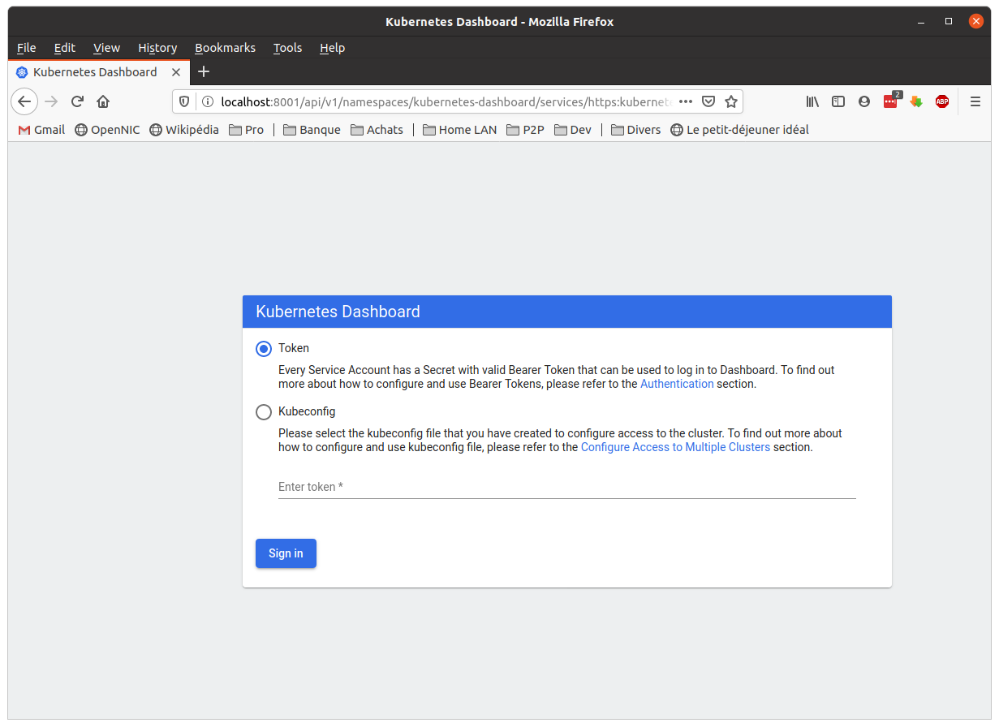
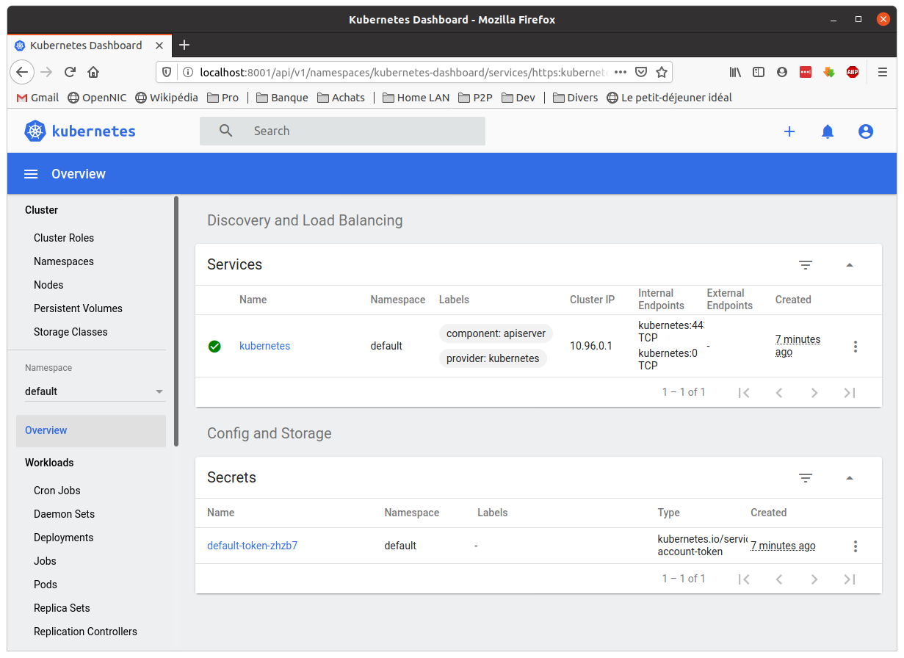

# Part 2 - Setting up the Kubernetes cluster


## 2.1 - Introduction

We will describe here the setting up of a Kubernetes cluster using `Kind`, i.e. simulating each Node with a Docker container, and faking teh behaviour of the Kubernetes cluster. `Kind` does it so well that the Pods have no clue that their containers are running directly on the host: they are actually being proxied by the *Containers-behaving-as-Nodes*: in this way, Kubelet sees the Master exactly the same way as if it were running on a *true* Node (i.e. a VM or on bare metal), and the API servers exposes exactly the same APIs as a genuie cluster (`Kind` is certified *K8s compliant* by the CNCF).

We provide two scripts which automate the full procedure:

1. to install the libraries required for this tutorial (git, curl, docker, kind, kubectl) setting up the cluster
2. to deploy the cluster and the dashboard.

These scripts are in the main directory: `install.sh` and `deploy.sh`. We will now describe the steps gathered in these two scripts, so that you can understand the procedure to setup a `Kind` cluster.

The procedure can also be followed on a VM, which make the tutorial more portable: We will describe later in this appendix the setup of such a VM, using Vagrant and VirtualBox: the resulting image can then run on a windows machine.

> Note: Kubernetes evolves constantly as the community keeps enriching/improving/patching it. As a consequence, I experienced  at least two version changes with `Kind`, with for instance the need to keep strictly aligned align the versions of the `dashboard` and of `Kubectl` with the one of `Kind`. And obviously, very little documentation is available to explains the dependencies: trial and error remains the rule...

## 2.2 - Prepare the machine

We assume that you have a Linux laptop and an account with `sudo` privilege.

In order to make sure that all versions are compatible (it's moving fast) and we do not suffer side effects due to version changes, we force the versions for each component. Here are the verions used for this tutorial:

* `Docker` of version 18.9 minimum
* `GO` version 1.14.2 and later (language on which Kind is developped)
* `Kind` version 0.8.1 (which runs Kubernetes version 1.18.2)
* `dashboard` version 2.0.0
* `kubectl` version 1.18.2

The corresponding binary files are available in the `deploy` directory.

Alternatively, you can use the Virtual Machine image (which runs with VirtualBox) which I prepared for this tutorial: it is [here]().

### 2.2.1 Deploy the cluster

Previous deployments may have left temporary files, which may interfere with the proper rollout of the cluster. The `deploy.sh` script will first tidy the place and hten deploy the Kubernetes cluster:

```bash
tuto@laptop:~$ cd learn-kubernetes/
tuto@laptop:~/learn-kubernetes$ ./deloy.sh
=======================================================================
 Create/populate the sandbox
=======================================================================
...
done
...

========================================================================
Installing a 5-nodes Kubernetes cluster (K8s-in-Docker)
========================================================================
...
Creating cluster "k8s-tuto" ...
 ✓ Ensuring node image (kindest/node:v1.18.2) 🖼
 ✓ Preparing nodes 📦 📦 📦 📦 📦
 ✓ Writing configuration 📜
 ✓ Starting control-plane 🕹️
 ✓ Installing CNI 🔌
 ✓ Installing StorageClass 💾
 ✓ Joining worker nodes 🚜
Set kubectl context to "kind-k8s-tuto"
You can now use your cluster with:

kubectl cluster-info --context kind-k8s-tuto

Thanks for using kind! 😊
..... wait 5 seconds .....
done
...

========================================================================
Installing Kubernetes Dashboard
========================================================================
...
namespace/kubernetes-dashboard created
serviceaccount/kubernetes-dashboard created
service/kubernetes-dashboard created
secret/kubernetes-dashboard-certs created
secret/kubernetes-dashboard-csrf created
secret/kubernetes-dashboard-key-holder created
configmap/kubernetes-dashboard-settings created
role.rbac.authorization.k8s.io/kubernetes-dashboard created
clusterrole.rbac.authorization.k8s.io/kubernetes-dashboard created
rolebinding.rbac.authorization.k8s.io/kubernetes-dashboard created
clusterrolebinding.rbac.authorization.k8s.io/kubernetes-dashboard created
deployment.apps/kubernetes-dashboard created
service/dashboard-metrics-scraper created
deployment.apps/dashboard-metrics-scraper created
done
...

========================================================================
Create sample user with the right to access the dashboard
========================================================================
...
serviceaccount/admin-user created
clusterrolebinding.rbac.authorization.k8s.io/admin-user created
..... wait 5 seconds .....
done
...

========================================================================
Get Token
========================================================================
...
done
...

========================================================================
Start kube proxy in another tab of the existing terminal
========================================================================
...
# _g_io_module_get_default: Found default implementation gvfs (GDaemonVfs) for ‘gio-vfs’
# _g_io_module_get_default: Found default implementation dconf (DConfSettingsBackend) for ‘gsettings-backend’
# watch_fast: "/org/gnome/terminal/legacy/" (establishing: 0, active: 0)
# unwatch_fast: "/org/gnome/terminal/legacy/" (active: 0, establishing: 1)
# watch_established: "/org/gnome/terminal/legacy/" (establishing: 0)
done
...

========================================================================
Launch dashboard in a web browser
========================================================================
...
Here is the token needed to log into the dashboard:
eyJhbGciOiJSUzI1NiIsImtpZCI6IjBuTXF1dDRvUGFFUVJ4RVBUN0lOVXlQak1xNl8xQ0kzME1IRzJRdFA5U00ifQ.eyJpc3MiOiJrdWJlcm5ldGVzL3NlcnZpY2VhY2NvdW50Iiwia3ViZXJuZXRlcy5pby9zZXJ2aWNlYWNjb3VudC9uYW1lc3BhY2UiOiJrdWJlcm5ldGVzLWRhc2hib2FyZCIsImt1YmVybmV0ZXMuaW8vc2VydmljZWFjY291bnQvc2VjcmV0Lm5hbWUiOiJhZG1pbi11c2VyLXRva2VuLW1mcHdwIiwia3ViZXJuZXRlcy5pby9zZXJ2aWNlYWNjb3VudC9zZXJ2aWNlLWFjY291bnQubmFtZSI6ImFkbWluLXVzZXIiLCJrdWJlcm5ldGVzLmlvL3NlcnZpY2VhY2NvdW50L3NlcnZpY2UtYWNjb3VudC51aWQiOiI3OTMyOTZmNy1jOTliLTQ1YjItYTIwNS04NGZmOGIzMzhlZWQiLCJzdWIiOiJzeXN0ZW06c2VydmljZWFjY291bnQ6a3ViZXJuZXRlcy1kYXNoYm9hcmQ6YWRtaW4tdXNlciJ9.yiPhIVovxoAS7hf8rPMpExw3ODs7Cp6L2nQHZRKbwjKLhPcckAOXXfKUoRNFzFgy0x7FX2r-K-BGlIaAMhPbaW9RoI_cqXKWQoKTfuGQMSSwr5wVx4keE8elrznL1g7kfA5YrXjDPdjGptf06jfUFeXB-f6ohTLmhVxk0PLUeCA7GA_Y2BzkqUp0cGLX79zuHkBcGinBeN66G7frGlJQoCROT7JT7F0EVZ-YxiSBbX7prnfUY8d1d7KHFAgEWCzlZvXE7p2z43fxU0NfaI0cb6Ppy5n2b8BJQ0mMURL0reRlk_wTBmqnSTuDIIO5W6-6xayj4DLJ1eoyL33wijehpQ
done
...

========================================================================
The END
========================================================================
```

Look at the bottom of the `deploy.sh` script output: a *token* is displayed (the very very long sequence of characters, starting here with `eyJhbGciOiJS...` and finishing with `...33wijehpQ`): this token is *unique* (i.e. it will change everytime you will start up a new cluster) so you need to **copy** the one which will be displayed when you run the `deploy.sh` script on your machine.

The `deploy.sh` script launched automaticaly:
1. another tab in the terminal, which runs the kubectl proxy: this proxy exposes the Kubernetes cluster towards the local machine. This means that, thanks to this proxy, you will be able to acces the API server and query requests to the Kubernetes APIs (via a browser or via `kubectl`).
```
Starting to serve on 127.0.0.1:8001
```
1. a browser window pointing the dashboard URL: it may not look ok at the beginning since the cluster may take few more seconds to get everything up and running, but very soon the API server will be able to answer the browser request, and you will see this.
  

  You now need to paste the *token* which you copied from the script output:
  

  And ***here you are*** : you are logged into the Dashboard!!!
  

You can now control that the cluster is accessible from `kubectl` and that the Nodes have been deployed (in a `kind` way):


## 2.3 - Conclusion of the `kind` cluster deployment

Thats's it: you have a cluster running, which you can access with `kubectl`. It simulates 5 nodes, and `kind` spoofs Kubernetes: the various containers behave as Nodes and Pods and interact via the API server, with `kubelet`. The fact that the topology is now 100% logical (topology between containers) and not physical (the containers do not run on different machines) is not visible from the various Kubernetes components. The containers respect the APIs.

The interest here is both simplicity and footprint:
* simplicity snice it takes very few steps to get a full cluster up and running, without having to bother about the network and other miscellaneous details...
* footprint because it takes just one *kindest* container per node to simulate the whole underlying infrastructure, and you then get a light-weight Kubernetes.

To me, this is more than just a spoof: `Kind` could bring the steps towards a '100% containers' Kubernetes, where the whole infrastructure would ONLY manage containers, and not anymore rotate around servers or VMs. To be continued...

```bash
tuto@laptop:~/projects/learn-kubernetes$ kind get clusters
k8s-tuto

tuto@laptop:~/projects/learn-kubernetes$ kubectl get nodes
NAME                     STATUS   ROLES    AGE   VERSION
k8s-tuto-control-plane   Ready    master   24m   v1.18.2
k8s-tuto-worker          Ready    <none>   24m   v1.18.2
k8s-tuto-worker2         Ready    <none>   24m   v1.18.2
k8s-tuto-worker3         Ready    <none>   24m   v1.18.2
k8s-tuto-worker4         Ready    <none>   24m   v1.18.2
```

## 2.4 - Running the Kind cluster on a VM

This scenario comes from the constraints of a colleague who could not run the tutorial on a Linux laptop... because he does not have a computer running Linux (*he's a VP, not a developper: his laptop is running MS Office...*).

I did not want to bother with porting the whole thing onto Windows, and I am really not familiar with coding on windows: looking for a *simple* way to meet his need, I finally resolved into setting up a VM with all the prerequisites (Ubuntu desktop, docker, GO, Kind, Kubectl...).

I initially went the Vagrant way: however, for some reason, I felt it difficult to work out with a desktop linux, while everything works fine with server versions). So I eventually decided to setup the VM with VirtualBox, export the OVA VM image and make it available to students so that they can run the tutorial *as if they were running `kind` on Linux*.

The VM was set:
* from a Ubuntu 20.04 LTS base OS
* with docker 19.03
* with `GO` version 1.14.2 or later
* with `kind` version 0.8.1
* with `kubectl` version 1.18.2

and I cloned the 'learn-kubernetes' tutorial into the `~/learn-kubernetes` directory.

As of this step, it is then very similar with the Part 2: you only have to deploy a cluster with `kind` (with the `deploy.sh` script).
