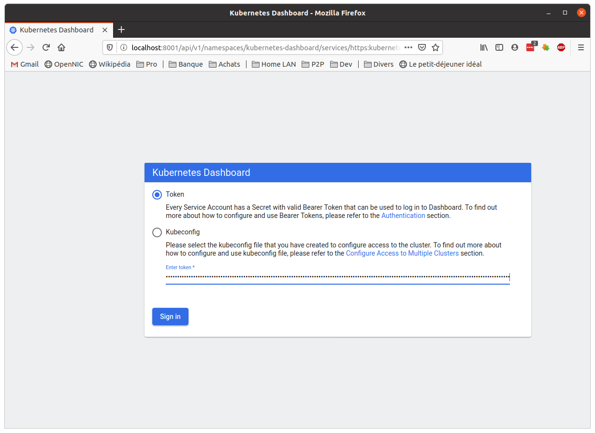

# Part 2 - Setting up the Kubernetes cluster


## 2.1 - Introduction

We will describe here the setting up of a Kubernetes cluster using `KinD`, i.e. simulating each _Node_ with a Docker container, and faking the behaviour of the Kubernetes cluster by having all the Kubernetes native components - the Master's components, the kubelet... - which are themselves Docker containers - to run inside the _Node containers_ and letting them believe that they are running on a server.


The Kubernetes componants actually run as *Docker containers inside the Node containers* using [`DinD`](https://github.com/docker-library/docs/tree/master/docker "DinD reference website") (Docker-in-Docker). `KinD` does it so well that the Pods have no clue that they are running directly on the host: in this way, Kubelet sees the Master exactly the same way as if it were running on a *true Node* (i.e. a VM or on bare metal), and the API servers exposes exactly the same APIs as a genuine cluster (`KinD` is certified *K8s compliant* by the CNCF).

We provide two scripts which automate the full procedure:

* `deploy.sh`.will deploy a brand new `KinD` cluster and all needed add-ons
* `cleanup.sh` will tidy the place and remove the `KinD` cluster.

These scripts are in the main directory. We will now describe the steps gathered in these two scripts, so that you can understand the procedure to setup a `KinD` cluster. You can also run this procedure inside a VM, which make the tutorial more portable.

> Note: Kubernetes evolves constantly as the community keeps enriching/improving/patching it. As a consequence, I experienced  at least two version changes with `KinD`, with for instance the need to keep strictly aligned align the versions of the `dashboard` and of `Kubectl` with the one of `KinD`. And obviously, very little documentation is available to explains the dependencies: trial and error remains the rule...


### 2.2 Deploy the cluster


Previous deployments may have left temporary files, which may interfere with the proper rollout of the cluster. Run `deploy.sh` script in a the terminal window, and it will first tidy the place and then deploy the Kubernetes cluster. The script will print the following text as it goes throught the cluster rollout process:

```bash
tuto@laptop:/tuto/learn-kubernetes$ ./deploy.sh
=======================================================================
 Tutorial "learn-kubernetes" - Deploy a K8S-in-Docker cluster
=======================================================================


=======================================================================
 Cleanup the place
=======================================================================
...
Deleting cluster "k8s-tuto" ...
done
...

=======================================================================
 Create/populate the sandbox
=======================================================================
...
done
...

========================================================================
Installing a 5-nodes Kubernetes cluster (K8s-in-Docker)
========================================================================
...
Creating cluster "k8s-tuto" ...
 ✓ Ensuring node image (kindest/node:v1.18.2) 🖼
 ✓ Preparing nodes 📦 📦 📦 📦
 ✓ Writing configuration 📜
 ✓ Starting control-plane 🕹️
 ✓ Installing CNI 🔌
 ✓ Installing StorageClass 💾
 ✓ Joining worker nodes 🚜
Set kubectl context to "kind-k8s-tuto"
You can now use your cluster with:

kubectl cluster-info --context kind-k8s-tuto

Have a nice day! 👋
..... wait 5 seconds .....
done
...

========================================================================
Deploy an ingress controller
========================================================================
...
customresourcedefinition.apiextensions.k8s.io/ambassadorinstallations.getambassador.io created
namespace/ambassador created
configmap/static-helm-values created
serviceaccount/ambassador-operator created
clusterrole.rbac.authorization.k8s.io/ambassador-operator-cluster created
clusterrolebinding.rbac.authorization.k8s.io/ambassador-operator-cluster created
role.rbac.authorization.k8s.io/ambassador-operator created
rolebinding.rbac.authorization.k8s.io/ambassador-operator created
deployment.apps/ambassador-operator created
ambassadorinstallation.getambassador.io/ambassador created
ambassadorinstallation.getambassador.io/ambassador condition met
..... wait 10 seconds .....
done
...

========================================================================
Installing Kubernetes Dashboard
========================================================================
...
namespace/kubernetes-dashboard created
serviceaccount/kubernetes-dashboard created
service/kubernetes-dashboard created
secret/kubernetes-dashboard-certs created
secret/kubernetes-dashboard-csrf created
secret/kubernetes-dashboard-key-holder created
configmap/kubernetes-dashboard-settings created
role.rbac.authorization.k8s.io/kubernetes-dashboard created
clusterrole.rbac.authorization.k8s.io/kubernetes-dashboard created
rolebinding.rbac.authorization.k8s.io/kubernetes-dashboard created
clusterrolebinding.rbac.authorization.k8s.io/kubernetes-dashboard created
deployment.apps/kubernetes-dashboard created
service/dashboard-metrics-scraper created
deployment.apps/dashboard-metrics-scraper created
serviceaccount/admin-user created
clusterrolebinding.rbac.authorization.k8s.io/admin-user created
..... wait 5 seconds .....
done
...

========================================================================
Launch dashboard in a web browser
========================================================================
...
Here is the token needed to log into the dashboard:
eyJhbGciOiJSUzI1NiIsImtpZCI6IlVOMUNMWVRRcnNGci01ZW11MzFuZTZaNi14REluYWdHZTBvVmVoMlh6VDAifQ.eyJpc3MiOiJrdWJlcm5ldGVzL3NlcnZpY2VhY2NvdW50Iiwia3ViZXJuZXRlcy5pby9zZXJ2aWNlYWNjb3VudC9uYW1lc3BhY2UiOiJrdWJlcm5ldGVzLWRhc2hib2FyZCIsImt1YmVybmV0ZXMuaW8vc2VydmljZWFjY291bnQvc2VjcmV0Lm5hbWUiOiJhZG1pbi11c2VyLXRva2VuLWpxZ25kIiwia3ViZXJuZXRlcy5pby9zZXJ2aWNlYWNjb3VudC9zZXJ2aWNlLWFjY291bnQubmFtZSI6ImFkbWluLXVzZXIiLCJrdWJlcm5ldGVzLmlvL3NlcnZpY2VhY2NvdW50L3NlcnZpY2UtYWNjb3VudC51aWQiOiIwMWZlNTM2Ny1lMWYxLTQyNzEtOGZjZi05OGUxMzJjMDg1MmUiLCJzdWIiOiJzeXN0ZW06c2VydmljZWFjY291bnQ6a3ViZXJuZXRlcy1kYXNoYm9hcmQ6YWRtaW4tdXNlciJ9.T1NtCO7rc4RSnPDFg-MbUvArALc3YMI27kk7XkK_02vI1m9jvFw4C2IYg9bvMYsJa6t0dLWycDJj6-YiExJcsbwgAk8XbPZmlMdW751R0vdRQNlv5kI7wAS6SoMq_pN0NQ9AO9unovmIriJSzMKA1qI5mtr7zw7FpcqUauRLqi1pLA50QzUQNrwZGlDCvupFwnu0tNc9CSUHSSdxvJLCjAkn0meiYTJOAnJvIOKuHq5GAJHZDvbD93HfbIZlNulzd9C3XYUHomt2U3ufRjyx5O_vuN0Iy2QMRpfyKyyGA3rNTZ2ku3sZhs6vvL1gHkLOeXr-Cs8f4hXd2jKHaFOCwQ

You can copy this token in the Text Editor window, and paste it in the
browser, as a login token:
done
...

========================================================================
The END
========================================================================
```

While printing this message and rolling out the cluster, the script will have:

* launched another tab in the terminal window, which runs the `kubectl proxy`: this proxy exposes the Kubernetes cluster towards the local machine and it is critical to enable you to run commands towards the Kubernetes cluster. This means that, thanks to this proxy, you will be able to acces the API server and query requests to the Kubernetes APIs (via a browser or via `kubectl`).


* launched a text editor showing a long and meaningless list of characters: it is the ***Token*** *(you should pronounce 'my precious...' like in a famous Saga)*. Copy the _Token_ (<kbd>Ctl+A</kbd><kbd>Ctl+C</kbd>) preciously as it is **unique** and it is the password which you need to log into the _Dashboard_. Once copied, you can close this window.

> Note: in case you missed the token and you can't find it anymore, it was saved in a text file called `dashboard-token` in the `sandbox` directory. This `sandbox` directory is a temporary working space, and it is deleted when you launch the `cleanup.sh` script.

* launched a browser window showing the **Dashboard**: it may look like this at the beginning, waiting for the whole process to complete in the background.

You only have to wait a bit and refresh the page and it soon should like this:

You now need to paste the *token* which you copied from the script output:

And ***here you are*** : you are logged into the Dashboard!!!


You can now control the cluster since the _Nodes_ have been deployed by `KinD` and it is accessible from `kubectl` thanks to the proxy.


## 2.3 - Running the `KinD` cluster on a VM

This scenario comes from the constraints of a colleague who could not run the tutorial on a Linux laptop... because he does not have a computer running Linux (*he's a VP, not a developper: his laptop is mainly used to show Powerpoint...*).

I did not want to bother with porting the whole thing onto Windows, and I am really not familiar with coding on windows: looking for a *simple* way to meet his need, I finally resolved into setting up a VM with all the prerequisites (Ubuntu desktop, docker, GO, KinD, Kubectl...). I guess that it could get even simpler with Docker Desktop, but I will look into this option in a later version of this tutorial *(and obviously help is more than welcome!!!)*.

I initially went the Vagrant way: however, for some reason, I felt it difficult to work out with a desktop linux, while everything works fine with server versions). So I eventually decided to setup the VM with VirtualBox, export the OVA VM image and make it available to students so that they can run the tutorial *as if they were running `KinD` on Linux*.

The VM was set from a Ubuntu 20.04 LTS base OS, I created the `/tuto` directory and cloned the `learn-kubernetes` git repository there, thus creating the `/tuto/learn-kubernetes` directory.

As of this step, it is then very similar with the Linux case: you only have to deploy a cluster with `./deploy.sh`.


## Conclusion

Thats's it: you have a cluster running, which you can access with `kubectl`. It simulates 3 worker nodes, and `KinD` spoofs Kubernetes: the various containers behave as Nodes, and interact via the API server, with `kubelet`. The fact that the topology is now 100% logical (Docker topology between containers) and not physical (the containers do not run on different virtual or physical machines) is not visible from the various Kubernetes components.

The interest here is both simplicity and footprint:

* simplicity since it takes very few steps and time to get a full cluster up and running, without having to bother about the network and other miscellaneous details...
* footprint because it takes just one `kindest` container per node to simulate the whole underlying infrastructure, and you then get a very light-weight Kubernetes cluster.

> To me, this is more than just a spoof: `KinD` could bring the steps towards a '100% containers' Kubernetes, where the whole infrastructure would ONLY manage containers, and not anymore rotate around servers or VMs. To be continued...
