# Part 3 - Deploy a simple app


## 3.1 - Kubernetes Deployments

Once you have a running Kubernetes cluster, you can deploy your containerized applications on top of it. To deploy your containerized application on top of the cluster, you create what is called a ***Kubernetes Deployment***. The Deployment materializes through a text file (a YAML file) which defines the *target state* of your application (which Docker container or which set of containers will compose your application, on how many _Nodes_ - in order to bring resilience - or other criterias your application should respect once it is actually deployed on the cluster).
This text file instructs Kubernetes how to create and update instances of your application: actually,
* it tells the **Controller Manager** to spawn a **Deployment Controller**
* this newly created Deployment Controller will have as first task to read this text file and tell the **Scheduler** the technical rules which should be respected when 'scheduling' the _Pods_ onto individual _Nodes_ in the cluster,
* and the Scheduler will actually find the appropriate _Nodes_ and assign the _Pods_ (which carry the containers composing your application).

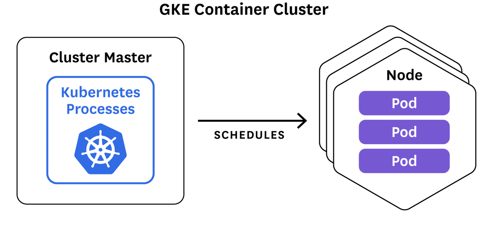

Once the application instances are created, the Deployment Controller continuously *monitors* those instances (i.e. it will monitors the changes in any resources allocated to the application it is in charge of: _Nodes_, network, storage, _Pods_...). If the _Node_ hosting an instance goes down or is deleted, the Deployment controller replaces the instance with an instance on another _Node_ in the cluster. This provides a self-healing mechanism to address machine failure or maintenance: since the text file describes the *desired target state* of the deployment, the Deployment controller actually detects that there is a deviation of the real deployment vs. the described target, and it reacts by deploying new _Pods_ to available _Nodes_ in order to get bask to the *desired state*.

In a pre-orchestration world, installation scripts would often be used to start applications, but they did not allow recovery from machine failure since there was little way to actually monitor the status of the application. By both creating your application instances and keeping them running across _Nodes_, Kubernetes Deployments provide a fundamentally different approach to application management.


## 3.2 - Deploying your first app on Kubernetes

In this module, you'll learn the most common `kubectl` commands needed to create *Deployments* that run your applications on a Kubernetes cluster.

When you create a *Deployment*, you'll need to specify the container image for your application and the number of replicas that you want to run. You can change that information later by updating your *Deployment* (i.e. updating the YAML file and apply it to the *Master* using `kubectl`). Once the application is deployed, sections 3.5 and 3.6 of this tutorial discuss how you can scale and update your *Deployments*.

Applications need to be packaged into one of the supported container formats in order to be deployed on Kubernetes: here we will use **Docker**. For your first Deployment, you'll use a simple Python *"hello worl"* application. The docker image is available from DockerHub under my public repository, with the name `learn-kubernetes` and the tag `part3`: the **Appendix 1** explains how this image is built. The source files are in the `./app-part3/v1` and `./app-part3/v1` directories. Let' look in the `v1` directory:

File 1: `./app-part3/v1/app-part3-v1.py`

```python
from flask import Flask
import os
import socket

app = Flask(__name__)

@app.route("/")
def hello():
    html = "<h3>Hello {name}!</h3> - application version 1 - " \
           "<b>Hostname:</b> {hostname}<br/>"
    return html.format(name=os.getenv("NAME", "world"), hostname=socket.gethostname())

if __name__ == "__main__":
    app.run(host='0.0.0.0', port=80)
```

File 2: `./app-part3/v1/requirements.txt`
```javascript
Flask
```

File 3: `./app-part3/v1/Dockerfile`
```bash
# Use an official Python runtime as a parent image
FROM python:3.6
# Set the working directory to /app
WORKDIR /app
# Copy the current directory contents into the container at /app
ADD . /app
# Install any needed packages specified in requirements.txt
RUN pip install --trusted-host pypi.python.org -r requirements.txt
# Make port 80 available to the world outside this container
EXPOSE 80
# Define environment variable
ENV NAME World
# Run app.py when the container launches
CMD ["python", "app-part3-v1.py"]
```

You can create and manage a _Deployment_ by using the Kubernetes command line interface, `kubectl`. `kubectl` uses the Kubernetes API to interact with the cluster: its role is actually to translate commands which you enter (or more often YAML files containing your instructions) into API calls to the Kubernetes API server. It actually does *nothing*: it only passes your instructions to the *Master* via the API server, the *Master* does the job, and then `kubectl` translates back the *Master*'s answers into a human readable format.

At this moment in time, there is no application running on the Kubernetes cluster: this is visible on the *Dashboard*, for instance if we look at the *Deployments*.

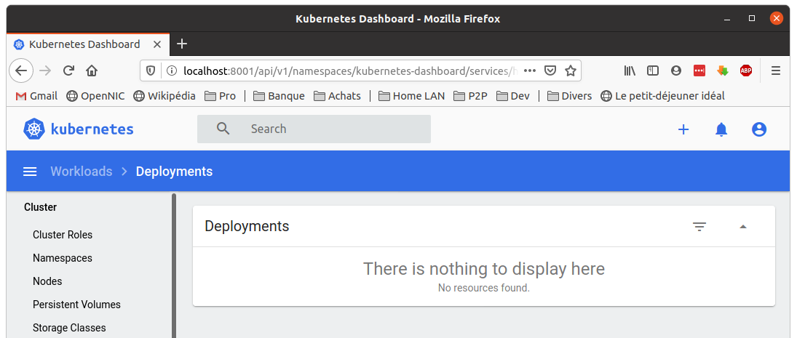

Let’s deploy this first app on Kubernetes with the `kubectl create deployment` command. We need to provide the deployment name and app image location (include the full repository url if the container images are hosted outside Docker hub):

```bash
tuto@laptop:~/learn-kubernetes$ kubectl create deployment hello-part3 --image=tsouche/learn-kubernetes:part3v1
deployment.apps/hello-part3 created
```
It takes few seconds for the application to be deployed: the *Dashboard* will first show an intermediate state :

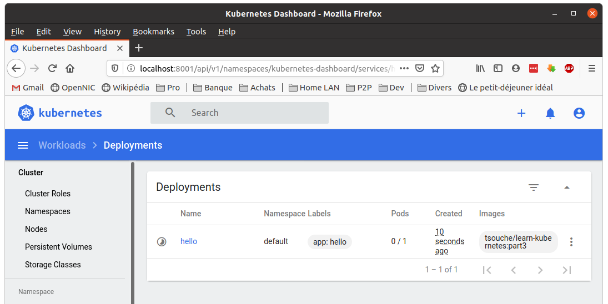

And then you can see the Deployment live:

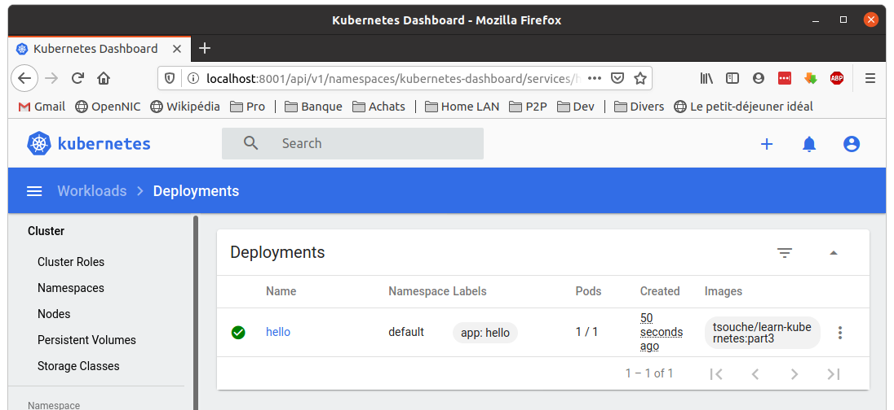

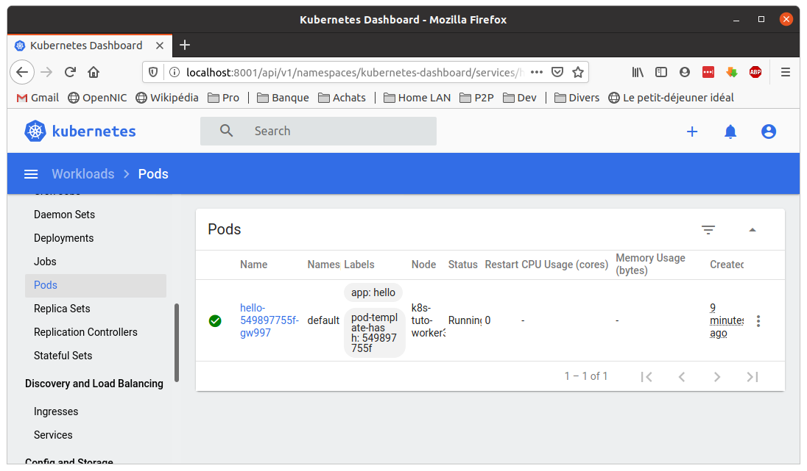

***Great!*** You just deployed your first application by creating a deployment! You can also see that it created a Pod called ` hello-part3-5849fddfff-sqp49` as it is visible on the *Dashboard*. Now is the time to get the same information in the terminal, using `kubectl` instead of the *Dashboard*: we will ask `kubectl` to look for all the _Pods_ on the cluster:

```bash
tuto@laptop:/projects/kind$ kubectl get pods
NAME                           READY   STATUS    RESTARTS   AGE
hello-part3-5849fddfff-sqp49   1/1     Running   0          5m11s
```

In few seconds, the application is deployed. :smile:

> Note: from now on, we assume that you will go frequently on the *Dashboard* to check the changes happening on the cluster, and we will focus the tutorial only on the CLI commands and results as they appear in the terminal. Again, the purpose of this tutorial is solely to get you aquainted with the Kubernetes concepts and to manipulate the cluster, while you may get far more efficient at manipulating directly the REST APIs or managing some actions via the *Dashboard* itself.
> So, as of now, we will not mention directly screenshots related to the progress on the tutorial, but you may see more screenshots in the `./images` directory.

This `kubectl create deployment` command performed a few things for you:

* searched for a suitable _Node_ where an instance of the application could be run (we have only 1 available _Node_)
* scheduled the application to run on that _Node_
* configured the cluster to reschedule the instance on a new _Node_ when needed

To list your deployments use the `kubectl get deployments` command:

```bash
tuto@laptop:~/learn-kubernetes$ kubectl get deployments
NAME          READY   UP-TO-DATE   AVAILABLE   AGE
hello-part3   1/1     1            1           6m36s
```

Let's details this line since you will see later in the tutorial many results
similar to this one:
* The `1/1` means `1 ready for 1 Desired`: 1 ready is the number of pod active (with  the container which is mentioned in the YAML file) and the YAML file specifies that we should always have 1 instance running.
* The `1 UP-TO-DATE` means that the one active is of the right version: there is consequently no need for Kubernetes to update the Pod with a fresher version.
* The `1 AVAILABLE` means that 1 instance of the Pod is actually available to the end-users (and there could be many reasons for which the Pod would not be available: for instance, the network could be down for a part of the cluster, thus the corresponding _Node_ would be isolated, and Kubernetes would have to spawn a new instance of the Pod on another _Node_ with good connectivity, in order to secure that the end-users keep having 1 instance truely available to them).

We can see here that there is 1 deployment, running 1 single instance of your app. The instance is running inside a Docker container on one of the _Nodes_. To get more details, we expand the results of the `kubectl get pods` command: we can see that this Pod is running on the worker 2.

```bash
tuto@laptop:~/learn-kubernetes$ kubectl get pods -o wide
NAME                           READY   STATUS    RESTARTS   AGE    IP           NODE               NOMINATED NODE   READINESS GATES
hello-part3-5849fddfff-sqp49   1/1     Running   0          7m6s   10.244.2.2   k8s-tuto-worker2   <none>           <none>
```


## 3.3 - Connecting to your app from within the cluster

_Pods_ that are running inside Kubernetes are running on a private, isolated network. By default they are visible from other _Pods_ and services within the same kubernetes cluster, but not outside that network. When we use `kubectl`, we're interacting - via the proxy - with an API endpoint to communicate with our application.

We will cover other options on how to expose your application outside the kubernetes cluster in the later section. For the moment, we will still use the proxy that will forward communications into the cluster-wide, private network. The proxy can be terminated by pressing <kbd>Ctl-C</kbd> and won't show any output while its running.

If you terminated the proxy, we will restart it in a second terminal tab:

```bash
tuto@laptop:~/learn-kubernetes$ gnome-terminal bash --tab -- kubectl proxy -p 8001
# _g_io_module_get_default: Found default implementation gvfs (GDaemonVfs) for ‘gio-vfs’
# _g_io_module_get_default: Found default implementation dconf (DConfSettingsBackend) for ‘gsettings-backend’
# watch_fast: "/org/gnome/terminal/legacy/" (establishing: 0, active: 0)
# unwatch_fast: "/org/gnome/terminal/legacy/" (active: 0, establishing: 1)
# watch_established: "/org/gnome/terminal/legacy/" (establishing: 0)
tuto@laptop:~/learn-kubernetes$
```

and we can see the following message on the newly create terminal tab:

```bash
Starting to serve on 127.0.0.1:8001
```

Make sure that the proxy is actually running: it enables direct access to the API from these terminals: you can see all those APIs hosted through the proxy endpoint. For example, we can query the version directly through the API using the `curl` command:

```bash
tuto@laptop:~/learn-kubernetes$ curl http://localhost:8001/version
{
  "major": "1",
  "minor": "18",
  "gitVersion": "v1.18.2",
  "gitCommit": "52c56ce7a8272c798dbc29846288d7cd9fbae032",
  "gitTreeState": "clean",
  "buildDate": "2020-04-30T20:19:45Z",
  "goVersion": "go1.13.9",
  "compiler": "gc",
  "platform": "linux/amd64"
}
```

The API server will automatically create an endpoint for each pod, based on the pod name, that is also accessible through the proxy. First we need to get the Pod name, and we'll store in the environment variable `POD_NAME`:

```bash
tuto@laptop:~/learn-kubernetes$ export POD_NAME=$(kubectl get pods -o go-template --template '{{range .items}}{{.metadata.name}}{{"\n"}}{{end}}')

tuto@laptop:~/learn-kubernetes$ echo $POD_NAME
hello-part3-5849fddfff-sqp49
```
Done: this will be useful later in the tutorial.

In order for the new deployment to be accessible without using the _Proxy_, a _Service_ is required which will be explained in the next modules.


## 3.4 - Explore your app

### 3.4.1 - Kubernetes _Pods_

When you created a *Deployment* in Section 2, Kubernetes created a _Pod_ to host your application instance. A _Pod_ is a Kubernetes abstraction that represents a group of one or more application containers, and some shared resources for those containers. Those resources include:

* Shared storage, as _Volumes_
* Networking, as a unique cluster IP address
* Information about how to run each container, such as the container image version or specific ports to use

A _Pod_ models an application-specific *logical host* and can contain different application containers which are relatively tightly coupled. For example, a _Pod_ might include both the container with your Node.js app as well as a different container that feeds the data to be published by the Node.js webserver. All containers in the same _Pod_ share the same IP Address and port space, are always co-located and co-scheduled, and run in a shared context on the same _Node_.

As explained in Part 1, _Pods_ are the atomic unit on the Kubernetes platform.

### 3.4.2 - _Nodes_

A _Pod_ always runs on a _Node_. A _Node_ is a worker machine in Kubernetes and may be either a virtual or a physical machine, depending on the cluster. Each _Node_ is managed by the *Master*. A _Node_ can have multiple _Pods_, and the Kubernetes *Master* automatically handles scheduling the _Pods_ across the _Nodes_ in the cluster. The *Master*'s automatic scheduling takes into account the available resources on each _Node_.

Every Kubernetes _Node_ runs at least:

* `Kubelet`, a process responsible for communication between the Kubernetes *Master* and the _Node_; it manages the _Pods_ and the containers running on a machine.
* A container runtime (like `Docker`, `rkt`) responsible for pulling the container image from a registry, unpacking the container, and running the application.


Containers should only be scheduled together in a single Pod if they are tightly coupled and need to share resources such as disk.


### 3.4.3 - Check the application configuration

We already have checked the _Pods_ with `kubectl`, so we know that a `hello` _Pod_ runs on the `worker 2`. Now, let's view what containers are inside that _Pod_ and what images are used to build those containers. To do so, we run the `kubectl describe pods` command:

```bash
tuto@laptop:~/learn-kubernetes$ kubectl describe pods
Name:         hello-part3-5849fddfff-sqp49
Namespace:    default
Priority:     0
Node:         k8s-tuto-worker2/172.18.0.4
Start Time:   Fri, 26 Jun 2020 22:13:58 +0200
Labels:       app=hello-part3
              pod-template-hash=5849fddfff
Annotations:  <none>
Status:       Running
IP:           10.244.2.2
IPs:
  IP:           10.244.2.2
Controlled By:  ReplicaSet/hello-part3-5849fddfff
Containers:
  learn-kubernetes:
    Container ID:   containerd://53e980e2669582d47a3fb4e1c433e0db5509c44b9df0412ca3c55222e6d7473c
    Image:          tsouche/learn-kubernetes:part3v1
    Image ID:       docker.io/tsouche/learn-kubernetes@sha256:c431a4859e82a37660719793a8f745ca116ea3c4c4445f554cb68f99b1e6e786
    Port:           <none>
    Host Port:      <none>
    State:          Running
      Started:      Fri, 26 Jun 2020 22:14:21 +0200
    Ready:          True
    Restart Count:  0
    Environment:    <none>
    Mounts:
      /var/run/secrets/kubernetes.io/serviceaccount from default-token-5w9jd (ro)
Conditions:
  Type              Status
  Initialized       True
  Ready             True
  ContainersReady   True
  PodScheduled      True
Volumes:
  default-token-5w9jd:
    Type:        Secret (a volume populated by a Secret)
    SecretName:  default-token-5w9jd
    Optional:    false
QoS Class:       BestEffort
Node-Selectors:  <none>
Tolerations:     node.kubernetes.io/not-ready:NoExecute for 300s
                 node.kubernetes.io/unreachable:NoExecute for 300s
Events:
  Type    Reason     Age    From                       Message
  ----    ------     ----   ----                       -------
  Normal  Scheduled  8m54s  default-scheduler          Successfully assigned default/hello-part3-5849fddfff-sqp49 to k8s-tuto-worker2
  Normal  Pulling    8m53s  kubelet, k8s-tuto-worker2  Pulling image "tsouche/learn-kubernetes:part3v1"
  Normal  Pulled     8m35s  kubelet, k8s-tuto-worker2  Successfully pulled image "tsouche/learn-kubernetes:part3v1"
  Normal  Created    8m31s  kubelet, k8s-tuto-worker2  Created container learn-kubernetes
  Normal  Started    8m31s  kubelet, k8s-tuto-worker2  Started container learn-kubernetes
```

Whaou... :dizzy_face:  Plenty of information is available, as you can see: IP address, the ports used and a list of events related to the lifecycle of the _Pod_.

The output of the describe command is extensive and covers some concepts that we didn’t explain yet, but don’t worry, they will become familiar by the end of this tutorial.

> Note: the `kubectl describe` command can be used to get detailed information about most of the Kubernetes primitives: _Node_, _Pods_, _Deployments_. The described output is designed to be human readable, not to be scripted against.


### 3.4.4 - Show the app in the terminal

Recall that _Pods_ are running in an isolated, private network - so we continue with the `kubectl proxy` command in a second terminal window (on port 8001).

You have stored the _Pod_ name in the `POD_NAME` environment variable.

To see the output of our application, run a `curl` request.

```bash
tuto@laptop:~/learn-kubernetes$ kubectl get namespace
NAME                   STATUS   AGE
default                Active   13m
kube-node-lease        Active   13m
kube-public            Active   13m
kube-system            Active   13m
kubernetes-dashboard   Active   13m
local-path-storage     Active   13m

tuto@laptop:~/learn-kubernetes$ curl http://localhost:8001/api/v1/namespaces/default/pods/$POD_NAME/
{
  "kind": "Pod",
  "apiVersion": "v1",
  "metadata": {
    "name": "hello-part3-5849fddfff-sqp49",
    "generateName": "hello-part3-5849fddfff-",
    "namespace": "default",
    "selfLink": "/api/v1/namespaces/default/pods/hello-part3-5849fddfff-sqp49",
    "uid": "34ef4724-c155-4b0c-835e-444fbdac174d",
    "resourceVersion": "1437",
    "creationTimestamp": "2020-06-26T20:13:58Z",
    "labels": {
      "app": "hello-part3",
      "pod-template-hash": "5849fddfff"
    },
    "ownerReferences": [
      {
        "apiVersion": "apps/v1",
        "kind": "ReplicaSet",
        "name": "hello-part3-5849fddfff",
        "uid": "cd4aca5c-e4bb-4c6e-912b-8aca2d78d2a4",
        "controller": true,
        "blockOwnerDeletion": true
      }
    ],
    "managedFields": [
      {
        "manager": "kube-controller-manager",
        "operation": "Update",
        "apiVersion": "v1",
        "time": "2020-06-26T20:13:58Z",
        "fieldsType": "FieldsV1",
        "fieldsV1": {"f:metadata":{"f:generateName":{},"f:labels":{".":{},"f:app":{},"f:pod-template-hash":{}},"f:ownerReferences":{".":{},"k:{\"uid\":\"cd4aca5c-e4bb-4c6e-912b-8aca2d78d2a4\"}":{".":{},"f:apiVersion":{},"f:blockOwnerDeletion":{},"f:controller":{},"f:kind":{},"f:name":{},"f:uid":{}}}},"f:spec":{"f:containers":{"k:{\"name\":\"learn-kubernetes\"}":{".":{},"f:image":{},"f:imagePullPolicy":{},"f:name":{},"f:resources":{},"f:terminationMessagePath":{},"f:terminationMessagePolicy":{}}},"f:dnsPolicy":{},"f:enableServiceLinks":{},"f:restartPolicy":{},"f:schedulerName":{},"f:securityContext":{},"f:terminationGracePeriodSeconds":{}}}
      },
      {
        "manager": "kubelet",
        "operation": "Update",
        "apiVersion": "v1",
        "time": "2020-06-26T20:14:21Z",
        "fieldsType": "FieldsV1",
        "fieldsV1": {"f:status":{"f:conditions":{"k:{\"type\":\"ContainersReady\"}":{".":{},"f:lastProbeTime":{},"f:lastTransitionTime":{},"f:status":{},"f:type":{}},"k:{\"type\":\"Initialized\"}":{".":{},"f:lastProbeTime":{},"f:lastTransitionTime":{},"f:status":{},"f:type":{}},"k:{\"type\":\"Ready\"}":{".":{},"f:lastProbeTime":{},"f:lastTransitionTime":{},"f:status":{},"f:type":{}}},"f:containerStatuses":{},"f:hostIP":{},"f:phase":{},"f:podIP":{},"f:podIPs":{".":{},"k:{\"ip\":\"10.244.2.2\"}":{".":{},"f:ip":{}}},"f:startTime":{}}}
      }
    ]
  },
  "spec": {
    "volumes": [
      {
        "name": "default-token-5w9jd",
        "secret": {
          "secretName": "default-token-5w9jd",
          "defaultMode": 420
        }
      }
    ],
    "containers": [
      {
        "name": "learn-kubernetes",
        "image": "tsouche/learn-kubernetes:part3v1",
        "resources": {

        },
        "volumeMounts": [
          {
            "name": "default-token-5w9jd",
            "readOnly": true,
            "mountPath": "/var/run/secrets/kubernetes.io/serviceaccount"
          }
        ],
        "terminationMessagePath": "/dev/termination-log",
        "terminationMessagePolicy": "File",
        "imagePullPolicy": "IfNotPresent"
      }
    ],
    "restartPolicy": "Always",
    "terminationGracePeriodSeconds": 30,
    "dnsPolicy": "ClusterFirst",
    "serviceAccountName": "default",
    "serviceAccount": "default",
    "nodeName": "k8s-tuto-worker2",
    "securityContext": {

    },
    "schedulerName": "default-scheduler",
    "tolerations": [
      {
        "key": "node.kubernetes.io/not-ready",
        "operator": "Exists",
        "effect": "NoExecute",
        "tolerationSeconds": 300
      },
      {
        "key": "node.kubernetes.io/unreachable",
        "operator": "Exists",
        "effect": "NoExecute",
        "tolerationSeconds": 300
      }
    ],
    "priority": 0,
    "enableServiceLinks": true
  },
  "status": {
    "phase": "Running",
    "conditions": [
      {
        "type": "Initialized",
        "status": "True",
        "lastProbeTime": null,
        "lastTransitionTime": "2020-06-26T20:13:58Z"
      },
      {
        "type": "Ready",
        "status": "True",
        "lastProbeTime": null,
        "lastTransitionTime": "2020-06-26T20:14:21Z"
      },
      {
        "type": "ContainersReady",
        "status": "True",
        "lastProbeTime": null,
        "lastTransitionTime": "2020-06-26T20:14:21Z"
      },
      {
        "type": "PodScheduled",
        "status": "True",
        "lastProbeTime": null,
        "lastTransitionTime": "2020-06-26T20:13:58Z"
      }
    ],
    "hostIP": "172.18.0.4",
    "podIP": "10.244.2.2",
    "podIPs": [
      {
        "ip": "10.244.2.2"
      }
    ],
    "startTime": "2020-06-26T20:13:58Z",
    "containerStatuses": [
      {
        "name": "learn-kubernetes",
        "state": {
          "running": {
            "startedAt": "2020-06-26T20:14:21Z"
          }
        },
        "lastState": {

        },
        "ready": true,
        "restartCount": 0,
        "image": "docker.io/tsouche/learn-kubernetes:part3v1",
        "imageID": "docker.io/tsouche/learn-kubernetes@sha256:c431a4859e82a37660719793a8f745ca116ea3c4c4445f554cb68f99b1e6e786",
        "containerID": "containerd://53e980e2669582d47a3fb4e1c433e0db5509c44b9df0412ca3c55222e6d7473c",
        "started": true
      }
    ],
    "qosClass": "BestEffort"
  }
}
```

Pretty verbose, huh... :yum:

At least, it demonstrates that we can access the cluster from the host machine, and poll directly the REST APIs to retrieve information about the currently deployed applications. Interestingly, doing so manually with `curl`, we operate exactly the same way `kubectl` or the *Dashboard* do: they poll the REST APIs exposed by the cluster.

The URL structure is self explicit:

* it specifies the API version (v1 since Kubernetes versions 1.15 at least)
* it then indicated the namespaces (here: `default`)
* and then indicates the resource we need to poll (_Pods_, _Deployment_...).

In our case, as we stated `.../namespaces/default/pods/$POD_NAME/` in the URL, we indicated that we wanted information on a _Pod_ named `POD_NAME`.


### 3.4.5 - View the container logs

Anything that the application would normally send to `STDOUT` becomes logs for the container within the _Pod_. We can retrieve these logs using the `kubectl logs` command:

```bash
tuto@laptop:~/learn-kubernetes$ kubectl logs $POD_NAME
* Serving Flask app "app-part3-v1" (lazy loading)
* Environment: production
  WARNING: This is a development server. Do not use it in a production deployment.
  Use a production WSGI server instead.
* Debug mode: off
* Running on http://0.0.0.0:80/ (Press CTRL+C to quit)
```

We can see everything that the application sent to `stdout`, because we have not set a proper `syslog` in the app or in the container. Obviously, in a real environment, the logs would be sent towards a syslog agent, and Kubernetes would then manage the redirection of the logs to the log management system (outside Kubernetes).


### 3.4.6 - Executing command inside the container

We can execute commands directly in the container once the _Pod_ is up and running. For this, we use the `kubectl exec <POD> -- <COMMAND>` command, and use the name of the _Pod_ as a parameter. It is actually very similar to the `docker -ti exec <COMMAND>` command, but here we need to identify which container we want to get logged into. Since the _Pod_ has only one container, the _Pod's_ name is enough to identify the container.

So let’s list the environment variables as they exist within the container:

```bash
tuto@laptop:~/learn-kubernetes$ kubectl exec $POD_NAME -- env
PATH=/usr/local/bin:/usr/local/sbin:/usr/local/bin:/usr/sbin:/usr/bin:/sbin:/bin
HOSTNAME=hello-part3-5849fddfff-sqp49
LANG=C.UTF-8
GPG_KEY=0D96DF4D4110E5C43FBFB17F2D347EA6AA65421D
PYTHON_VERSION=3.6.10
PYTHON_PIP_VERSION=20.1.1
PYTHON_GET_PIP_URL=https://github.com/pypa/get-pip/raw/eff16c878c7fd6b688b9b4c4267695cf1a0bf01b/get-pip.py
PYTHON_GET_PIP_SHA256=b3153ec0cf7b7bbf9556932aa37e4981c35dc2a2c501d70d91d2795aa532be79
NAME=World
KUBERNETES_SERVICE_PORT_HTTPS=443
KUBERNETES_PORT=tcp://10.96.0.1:443
KUBERNETES_PORT_443_TCP=tcp://10.96.0.1:443
KUBERNETES_PORT_443_TCP_PROTO=tcp
KUBERNETES_PORT_443_TCP_PORT=443
KUBERNETES_PORT_443_TCP_ADDR=10.96.0.1
KUBERNETES_SERVICE_HOST=10.96.0.1
KUBERNETES_SERVICE_PORT=443
HOME=/root
```

Again, worth mentioning that the name of the container itself can be omitted since we only have a single container in the _Pod_.

Next let’s start a bash session in the _Pod’s_ container:

```bash
tuto@laptop:~/learn-kubernetes$ kubectl exec -ti $POD_NAME -- bash
root@hello-part3-5849fddfff-sqp49:/app#
```

We have now an open console on the container where we run our Python application, and we are logged as root. The source code of the app is in the `/app/app-part3-v1.py` file:

```python
root@hello-part3-5849fddfff-sqp49:/app# ls
Dockerfile  app-part3-v1.py  requirements.txt

root@hello-part3-5849fddfff-sqp49:/app# cat app-part3-v1.py
from flask import Flask
import os
import socket


app = Flask(__name__)

@app.route("/")
def hello():
    html = "<h3>Hello {name}! - application version 1</h3>" \
           "<b>Hostname:</b> {hostname}<br/>"
    return html.format(name=os.getenv("NAME", "world"), hostname=socket.gethostname())

if __name__ == "__main__":
    app.run(host='0.0.0.0', port=80)
```

You can check that the application is up by running a `curl` command:

```bash
root@hello-549897755f-gw997:/app# curl localhost:80
<h3>Hello World! - application version 1</h3><b>Hostname:</b> hello-part3-5849fddfff-sqp49<br/>
```

> Note: here we used `localhost:80` because we executed the `curl` command from inside the container inside the _Pod_. Outside the container, the port 8001 is exposed. If you cannot connect to localhost:80, check to make sure you have run the `kubectl exec -ti <POD_NAME> -- command` and are launching the command from *within* the _Pod_.

To close your container connection type `exit`.

```bash
root@hello-part3-5849fddfff-sqp49:/app# exit
exit
tuto@laptop:~/learn-kubernetes$
```


## 3.5 - Expose Your App Publicly


### 3.5.1 - Overview of Kubernetes Services

Kubernetes _Pods_ are mortal. _Pods_ in fact have a lifecycle. When a worker _Node_ dies, the _Pods_ running on the _Node_ are also lost. A `ReplicaSet` might then dynamically drive the cluster back to desired state via creation of new _Pods_ to keep your application running. As another example, consider an image-processing backend with 3 replicas. Those replicas are exchangeable; the front-end system should not care about backend replicas or even if a _Pod_ is lost and recreated. That said, each _Pod_ in a Kubernetes cluster has a unique IP address, even different _Pods_ on the same _Node_, so there needs to be a way of automatically reconciling changes among _Pods_ so that your applications continue to function.

A _Service_ in Kubernetes is an abstraction which defines a logical set of _Pods_ and a policy by which to access them. _Services_ enable a loose coupling between dependent _Pods_. A _Service_ is defined using `YAML` (preferred) or `JSON`, like all Kubernetes objects. The set of _Pods_ targeted by a _Service_ is usually determined by a `LabelSelector`: a `LabelSelector` is a the usual way Kubernetes will identify the right _Pods_.

Although each _Pod_ has a unique IP address, those IPs are not exposed outside the cluster without a _Service_. _Services_ allow your applications to receive traffic (from outside or from other applications runnig on the same cluster). _Services_ can be exposed in different ways by specifying a type in the `ServiceSpec`:

* #### ClusterIP (default)
Exposes the _Service_ on an internal IP in the cluster. This type makes the _Service_ only reachable from within the cluster, by other services running on the same cluster.
* #### NodePort
Exposes the _Service_ on the same port of each selected _Node_ in the cluster using NAT. Makes a _Service_ accessible from outside the cluster using `<NodeIP>:<NodePort>`.
The principle here is that the `<NodeIP>` is shared by all _Services_ running on the same cluster: they only differentiate one from another by their port number. This is very convenient to enable a controlled communication between services, typically when they should primarily get exposed via an API gateway which will handle security and access rights.
* #### LoadBalancer
Creates an external load balancer in the current cloud (if supported) and assigns a fixed, external IP to the Service.
Here, the service has its own IP and its own (set of) port(s): it is very easily reacheable from outside the cluster, which implies that it must embed security by design.
* ### ExternalName
Exposes the Service using an arbitrary name (specified by `externalName` in the spec) by returning a `CNAME` record with the name. No proxy is used.


Additionally, note that there are some use cases with _Services_ that involve not defining selector in the spec. A _Service_ created without selector will also not create the corresponding `Endpoints` object. This allows users to manually map a _Service_ to specific `Endpoints`.


### 3.5.2 - _Services_ and _Labels_


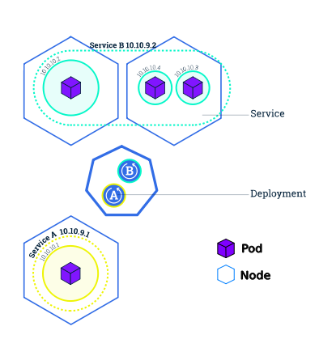

A _Service_ routes traffic across a set of _Pods_. _Services_ are the abstraction that allow _Pods_ to die and replicate in Kubernetes without impacting your application. Discovery and routing among dependent _Pods_ (such as the frontend and backend components in an application) is handled by Kubernetes _Services_.

_Services_ match a set of _Pods_ using _labels_ and _selectors_, a grouping primitive that allows logical operation on objects in Kubernetes. _Labels_ are key/value pairs attached to objects and can be used in any number of ways:

* Designate objects for development, test, and production
* Embed version tags
* Classify an object using tags

    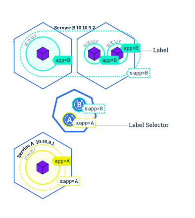

_Labels_ can be attached to objects at creation time or later on. They can be modified at any time. Let's expose our application now using a _Service_ and apply some _labels_.


### 3.5.3 - Create a new _service_


Let’s verify that our application is running. We’ll use the `kubectl get` command and look for existing _Pods_:

```bash
tuto@laptop:~/learn-kubernetes$ kubectl get pods
NAME                           READY   STATUS    RESTARTS   AGE
hello-part3-5849fddfff-sqp49   1/1     Running   0          17m
```

Next, let’s list the current _Services_ from our cluster:

```bash
tuto@laptop:~/learn-kubernetes$ kubectl get services
NAME         TYPE        CLUSTER-IP   EXTERNAL-IP   PORT(S)   AGE
kubernetes   ClusterIP   10.96.0.1    <none>        443/TCP   28m
```

We have a _Service_ called `kubernetes` that is created by default when the cluster starts. To create a new service and expose it to external traffic, we’ll use the `kubectl expose` command with `NodePort` as parameter.

```bash
tuto@laptop:~/learn-kubernetes$ kubectl expose deployment/hello-part3 --type="NodePort" --port 80
service/hello-part3 exposed
```

Let’s run again the `kubectl get services` command:

```bash
tuto@laptop:~/learn-kubernetes$ kubectl get services
NAME          TYPE        CLUSTER-IP       EXTERNAL-IP   PORT(S)        AGE
hello-part3   NodePort    10.101.247.225   <none>        80:30379/TCP   20s
kubernetes    ClusterIP   10.96.0.1        <none>        443/TCP        22m
```

**Yes!** :smile: We have now a running _Service_ called `hello-part3`. Here we see that the _Service_ received a unique cluster-IP, an internal port and no external-IP (the shared IP of the cluster must be used to access it).

To find out what port was opened externally (by the `NodePort` option), we’ll run the `kubectl describe service` command:

```bash
tuto@laptop:~/learn-kubernetes$ kubectl describe services/hello-part3
Name:                     hello-part3
Namespace:                default
Labels:                   app=hello-part3
Annotations:              <none>
Selector:                 app=hello-part3
Type:                     NodePort
IP:                       10.101.247.225
Port:                     <unset>  80/TCP
TargetPort:               80/TCP
NodePort:                 <unset>  30379/TCP
Endpoints:                10.244.2.2:80
Session Affinity:         None
External Traffic Policy:  Cluster
Events:                   <none>
```

We ceate an environment variable called `NODE_PORT` that has the value of the Node port assigned:

```bash
tuto@laptop:~/learn-kubernetes$ export NODE_PORT=30379
```

Then we need to identify the external IP which is exposed for the whole cluster: this IP is used as the `endpoint` for the default `kubernetes` service:

```bash
tuto@laptop:~/learn-kubernetes$ kubectl describe services/kubernetes
Name:              kubernetes
Namespace:         default
Labels:            component=apiserver
                   provider=kubernetes
Annotations:       <none>
Selector:          <none>
Type:              ClusterIP
IP:                10.96.0.1
Port:              https  443/TCP
TargetPort:        6443/TCP
Endpoints:         172.18.0.3:6443
Session Affinity:  None
Events:            <none>
```

Here we can see the cluster's shared `Endpoint`: `172.18.0.3`.

```bash
tuto@laptop:~/learn-kubernetes$ export ENDPOINT=172.18.0.3
```

Now that we have both the ip@ (`172.18.0.3`) and the port (`30379`), we can test
that the app is exposed outside of the cluster using `curl`:

```bash
tuto@laptop:~/learn-kubernetes$ curl $ENDPOINT:$NODE_PORT
<h3>Hello World! - application version 1</h3><b>Hostname:</b> hello-part3-5849fddfff-sqp49<br/>
```

And we get a response from the server: the _Service_ is exposed.


### 3.5.4 - Using labels

The _Deployment_ created automatically a _label_ for our _Pod_. With `kubectl describe deployment` command, you can see the name of the _label_:

```bash
tuto@laptop:~/learn-kubernetes$ kubectl describe deployment
Name:                   hello-part3
Namespace:              default
CreationTimestamp:      Fri, 26 Jun 2020 22:13:58 +0200
Labels:                 app=hello-part3
Annotations:            deployment.kubernetes.io/revision: 1
Selector:               app=hello-part3
Replicas:               1 desired | 1 updated | 1 total | 1 available | 0 unavailable
StrategyType:           RollingUpdate
MinReadySeconds:        0
RollingUpdateStrategy:  25% max unavailable, 25% max surge
Pod Template:
  Labels:  app=hello-part3
  Containers:
   learn-kubernetes:
    Image:        tsouche/learn-kubernetes:part3v1
    Port:         <none>
    Host Port:    <none>
    Environment:  <none>
    Mounts:       <none>
  Volumes:        <none>
Conditions:
  Type           Status  Reason
  ----           ------  ------
  Available      True    MinimumReplicasAvailable
  Progressing    True    NewReplicaSetAvailable
OldReplicaSets:  <none>
NewReplicaSet:   hello-part3-5849fddfff (1/1 replicas created)
Events:
  Type    Reason             Age   From                   Message
  ----    ------             ----  ----                   -------
  Normal  ScalingReplicaSet  21m   deployment-controller  Scaled up replica set hello-part3-5849fddfff to 1
```

As you can see, the _label_ is '`app`' and its value is '`hello-part3`', so it appears as '`app=hello-part3`'. Let’s use this _label_ to query our list of _Pods_. We’ll use the `kubectl get pods` command with `-l` as a parameter, followed by the _label_ values:

```bash
tuto@laptop:~/learn-kubernetes$ kubectl get pods -l app=hello-part3
NAME                           READY   STATUS    RESTARTS   AGE
hello-part3-5849fddfff-sqp49   1/1     Running   0          21m
```

You can do the same to list the existing services:

```bash
tuto@laptop:~/learn-kubernetes$ kubectl get services -l app=hello-part3
NAME          TYPE       CLUSTER-IP       EXTERNAL-IP   PORT(S)        AGE
hello-part3   NodePort   10.101.247.225   <none>        80:30379/TCP   4m18s
```

To apply a new _label_, we use the `kubectl label` command followed by the object type, object name and the new _label_: we create the _label_ '`version`' and we assign it a value of '`v1`'.

```bash
tuto@laptop:~/learn-kubernetes$ kubectl label pod $POD_NAME version=v1
pod/hello-part3-5849fddfff-sqp49 labeled
```

This will apply a new _label_ to our _Pod_ (we pinned the application version to the _Pod_), and we can check it with the `kubectl describe pod` command:

```bash
tuto@laptop:~/learn-kubernetes$ kubectl describe pods $POD_NAME
Name:         hello-part3-5849fddfff-sqp49
Namespace:    default
Priority:     0
Node:         k8s-tuto-worker2/172.18.0.4
Start Time:   Fri, 26 Jun 2020 22:13:58 +0200
Labels:       app=hello-part3
              pod-template-hash=5849fddfff
              version=v1
Annotations:  <none>
Status:       Running
IP:           10.244.2.2
[...]
```

We see here that both '`app`' and '`version`' labels are attached now to our _Pod_ (as well as another _label_ `pod-template-hash` generated by Kubernetes for its own usage). And we can query now the list of _Pods_ using the new _label_:

```bash
tuto@laptop:~/learn-kubernetes$ kubectl get pods -l version=v1
NAME                           READY   STATUS    RESTARTS   AGE
hello-part3-5849fddfff-sqp49   1/1     Running   0          23m
```

... and we see the _Pod_.


### 3.5.5 - Deleting a _Service_

To delete _Services_ you can use the `kubectl delete service` command. _Labels_ can be used also here:

```bash
tuto@laptop:~/learn-kubernetes$ kubectl delete service -l app=hello-part3
service "hello-part3" deleted
```

Confirm that the _Service_ is gone:

```bash
tuto@laptop:~/learn-kubernetes$ kubectl get services
NAME         TYPE        CLUSTER-IP   EXTERNAL-IP   PORT(S)   AGE
kubernetes   ClusterIP   10.96.0.1    <none>        443/TCP   28m
```

This confirms that our _Service_ was removed. To confirm that route is not exposed anymore you can `curl` the previously exposed IP and port:

```bash
tuto@laptop:~/learn-kubernetes$ curl $ENDPOINT:$NODE_PORT
curl: (7) Failed to connect to 172.18.0.3 port 30379: Connection refused
```

This proves that the app is not reachable anymore from outside of the cluster, but it does NOT imply that the _Pods_ are down: by putting down the _Service_, we only impacted the way the cluster is exposing these _Pods_ to the outside world. But not how they run **within** the cluster.

You can confirm that the app is still running with a `curl` from inside the _Pod_:

```bash
tuto@laptop:~/learn-kubernetes$ kubectl exec -ti $POD_NAME -- curl localhost:80
<h3>Hello World! - application version 1</h3><b>Hostname:</b> hello-part3-5849fddfff-sqp49<br/>
```

We see here that the application is up. This is because the _Deployment_ is managing the application. To shut down the application, you would need to delete the _Deployment_ as well.

So let's now restart the _Service_ so that we can finish this part of the tutorial:

```bash
tuto@laptop:~/learn-kubernetes$ kubectl expose deployment/hello-part3 --type="NodePort" --port 80
service/hello-part3 exposed
```

And we need to refresh the `NodePort` value and test that the app is still reachable from within the cluster:

```bash
tuto@laptop:~/learn-kubernetes$ kubectl describe svc/hello-part3
Name:                     hello-part3
Namespace:                default
Labels:                   app=hello-part3
Annotations:              <none>
Selector:                 app=hello-part3
Type:                     NodePort
IP:                       10.103.200.42
Port:                     <unset>  80/TCP
TargetPort:               80/TCP
NodePort:                 <unset>  30558/TCP
Endpoints:                10.244.2.2:80
Session Affinity:         None
External Traffic Policy:  Cluster
Events:                   <none>
```

The `NodePort` was renewed, and we must refresh our variable:

```bash
tuto@laptop:~/learn-kubernetes$ export NODE_PORT=30558
tuto@laptop:~/learn-kubernetes$ curl $ENDPOINT:$NODE_PORT
<h3>Hello World! - application version 1</h3><b>Hostname:</b> hello-part3-5849fddfff-sqp49<br/>
```

We're ready for the next section :smile: !


## 3.6 - Scale Your App

### 3.6.1 - Explanation - Scaling an application

In the previous modules we created a __Deployment__, and then exposed it publicly via a _Service_. The _Deployment_ created only one _Pod_ for running our application. When traffic increases, we will need to scale the application to keep up with user demand.

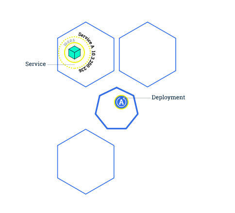

Scaling is accomplished by changing the number of replicas in a _Deployment_, i.e. updating the _Deployment_ YAML file and change the indicated number of replicas. And that's it: you have nothing else to do.

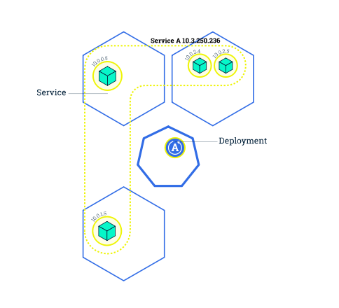

Scaling out a _Deployment_ will ensure new _Pods_ are created and scheduled to _Nodes_ which have available resources. Scaling will increase the number of _Pods_ to the new `desired state`. Kubernetes also supports autoscaling of _Pods_, but we will not see it here in detail. Scaling to zero is also possible, and it will terminate all _Pods_ of the specified _Deployment_.

Running multiple instances of an application will require a way to distribute the traffic to all of them. _Services_ have an integrated load-balancer that will distribute network traffic to all _Pods_ of an exposed _Deployment_. _Services_ will monitor continuously the running _Pods_ using `endpoints`, to ensure the traffic is sent only to available _Pods_.

Once you have multiple instances of an Application running, you would be able to do Rolling updates without downtime. We'll cover that in the next module. Now, let's go to the online terminal and scale our application.


### 3.6.2 - Scaling a deployment

To list your _Deployments_ use the `kubectl get deployments` command:

```bash
tuto@laptop:~/learn-kubernetes$ kubectl get deployments
NAME          READY   UP-TO-DATE   AVAILABLE   AGE
hello-part3   1/1     1            1           30m
```

This shows:
* `READY` shows the ratio of `CURRENT` to `DESIRED` replicas
  * `CURRENT` is the number of replicas running now
  * `DESIRED` is the configured number of replicas
* `UP-TO-DATE` is the number of replicas that were updated to match the desired (configured) state
* `AVAILABLE` shows how many replicas are actually available to the users

Next, let’s scale the _Deployment_ to 4 replicas. We’ll use the `kubectl scale` command, followed by the _Deployment_ type, name and desired number of instances:

```bash
tuto@laptop:~/learn-kubernetes$ kubectl scale deployments/hello-part3 --replicas=4
deployment.apps/hello-part3 scaled
```

To list your Deployments once again, use `kubectl get deployments`:

```bash
NAME          READY   UP-TO-DATE   AVAILABLE   AGE
hello-part3   2/4     4            2           31m

tuto@laptop:~/learn-kubernetes$ kubectl get pods -o wide
NAME                           READY   STATUS              RESTARTS   AGE   IP           NODE               NOMINATED NODE   READINESS GATES
hello-part3-5849fddfff-5sbgf   0/1     ContainerCreating   0          32s   <none>       k8s-tuto-worker    <none>           <none>
hello-part3-5849fddfff-lp6lt   0/1     ContainerCreating   0          32s   <none>       k8s-tuto-worker3   <none>           <none>
hello-part3-5849fddfff-qjb7z   1/1     Running             0          32s   10.244.2.3   k8s-tuto-worker2   <none>           <none>
hello-part3-5849fddfff-sqp49   1/1     Running             0          31m   10.244.2.2   k8s-tuto-worker2   <none>           <none>

tuto@laptop:~/learn-kubernetes$ kubectl get pods -o wide
NAME                           READY   STATUS    RESTARTS   AGE   IP           NODE               NOMINATED NODE   READINESS GATES
hello-part3-5849fddfff-5sbgf   1/1     Running   0          50s   10.244.3.2   k8s-tuto-worker    <none>           <none>
hello-part3-5849fddfff-lp6lt   1/1     Running   0          50s   10.244.1.2   k8s-tuto-worker3   <none>           <none>
hello-part3-5849fddfff-qjb7z   1/1     Running   0          50s   10.244.2.3   k8s-tuto-worker2   <none>           <none>
hello-part3-5849fddfff-sqp49   1/1     Running   0          31m   10.244.2.2   k8s-tuto-worker2   <none>           <none>

tuto@laptop:~/learn-kubernetes$ kubectl get deployments
NAME          READY   UP-TO-DATE   AVAILABLE   AGE
hello-part3   4/4     4            4           33m
```

The change was applied, and we now have 4 _Pods_, with different IP addresses. The change was registered in the _Deployment_ events log. To check that, use the `kubectl describe` command:

```bash
tuto@laptop:~/learn-kubernetes$ kubectl describe deployments/hello-part3
Name:                   hello-part3
Namespace:              default
CreationTimestamp:      Fri, 26 Jun 2020 22:13:58 +0200
Labels:                 app=hello-part3
Annotations:            deployment.kubernetes.io/revision: 1
Selector:               app=hello-part3
Replicas:               4 desired | 4 updated | 4 total | 4 available | 0 unavailable
StrategyType:           RollingUpdate
MinReadySeconds:        0
RollingUpdateStrategy:  25% max unavailable, 25% max surge
Pod Template:
  Labels:  app=hello-part3
  Containers:
   learn-kubernetes:
    Image:        tsouche/learn-kubernetes:part3v1
    Port:         <none>
    Host Port:    <none>
    Environment:  <none>
    Mounts:       <none>
  Volumes:        <none>
Conditions:
  Type           Status  Reason
  ----           ------  ------
  Progressing    True    NewReplicaSetAvailable
  Available      True    MinimumReplicasAvailable
OldReplicaSets:  <none>
NewReplicaSet:   hello-part3-5849fddfff (4/4 replicas created)
Events:
  Type    Reason             Age    From                   Message
  ----    ------             ----   ----                   -------
  Normal  ScalingReplicaSet  33m    deployment-controller  Scaled up replica set hello-part3-5849fddfff to 1
  Normal  ScalingReplicaSet  2m53s  deployment-controller  Scaled up replica set hello-part3-5849fddfff to 4
```

You can also view in the output of this command that there are 4 replicas now. Interestingly, you can also see at the bottom a full history of the _Deployment_, showing how it was set initially at 1 instance, and then scaled up to 4.


### 3.6.3 - Load Balancing

Let’s check that the _Service_ is load-balancing the traffic. To find out the exposed IP and Port we can use the `kubectl describe service` command as we learned in the previous section:

```bash
tuto@laptop:~/learn-kubernetes$ kubectl describe services/hello-part3
Name:                     hello-part3
Namespace:                default
Labels:                   app=hello-part3
Annotations:              <none>
Selector:                 app=hello-part3
Type:                     NodePort
IP:                       10.103.200.42
Port:                     <unset>  80/TCP
TargetPort:               80/TCP
NodePort:                 <unset>  30558/TCP
Endpoints:                10.244.1.2:80,10.244.2.2:80,10.244.2.3:80 + 1 more...
Session Affinity:         None
External Traffic Policy:  Cluster
Events:                   <none>
```

The `ENDPOINT` (the one used for the whole cluster, including the kubernetes _Service_) did not change, so we can now do a `curl` to the exposed IP and port. Execute the command multiple times:

```bash
tuto@laptop:~/learn-kubernetes$ curl $ENDPOINT:$NODE_PORT
<h3>Hello World! - application version 1</h3><b>Hostname:</b> hello-part3-5849fddfff-5sbgf<br/>
tuto@laptop:~/learn-kubernetes$ curl $ENDPOINT:$NODE_PORT
<h3>Hello World! - application version 1</h3><b>Hostname:</b> hello-part3-5849fddfff-sqp49<br/>
tuto@laptop:~/learn-kubernetes$ curl $ENDPOINT:$NODE_PORT
<h3>Hello World! - application version 1</h3><b>Hostname:</b> hello-part3-5849fddfff-sqp49<br/>
tuto@laptop:~/learn-kubernetes$ curl $ENDPOINT:$NODE_PORT
<h3>Hello World! - application version 1</h3><b>Hostname:</b> hello-part3-5849fddfff-sqp49<br/>
tuto@laptop:~/learn-kubernetes$ curl $ENDPOINT:$NODE_PORT
<h3>Hello World! - application version 1</h3><b>Hostname:</b> hello-part3-5849fddfff-lp6lt<br/>
tuto@laptop:~/learn-kubernetes$ curl $ENDPOINT:$NODE_PORT
<h3>Hello World! - application version 1</h3><b>Hostname:</b> hello-part3-5849fddfff-lp6lt<br/>
tuto@laptop:~/learn-kubernetes$ curl $ENDPOINT:$NODE_PORT
<h3>Hello World! - application version 1</h3><b>Hostname:</b> hello-part3-5849fddfff-sqp49<br/>
tuto@laptop:~/learn-kubernetes$ curl $ENDPOINT:$NODE_PORT
<h3>Hello World! - application version 1</h3><b>Hostname:</b> hello-part3-5849fddfff-5sbgf<br/>
```

We hit a different _Pod_ with every request, as the changing Pod reference indicate. This demonstrates that the load-balancing is working.


### 3.6.4 - Scale Down

To scale down the Service to 2 replicas, run again the `kubectl scale` command:

```bash
tuto@laptop:~/learn-kubernetes$ kubectl scale deployments/hello-part3 --replicas=2
deployment.apps/hello-part3 scaled
```

List the Deployments to check if the change was applied with the `kubectl get deployments` command:

```bash
tuto@laptop:~/learn-kubernetes$ kubectl get deployments
NAME          READY   UP-TO-DATE   AVAILABLE   AGE
hello-part3   2/2     2            2           38m
```

The number of replicas decreased to 2. List the number of _Pods_:

```bash
tuto@laptop:~/learn-kubernetes$ kubectl get pods -o wide
NAME                           READY   STATUS        RESTARTS   AGE     IP           NODE               NOMINATED NODE   READINESS GATES
hello-part3-5849fddfff-5sbgf   1/1     Running       0          7m24s   10.244.3.2   k8s-tuto-worker    <none>           <none>
hello-part3-5849fddfff-lp6lt   1/1     Running       0          7m24s   10.244.1.2   k8s-tuto-worker3   <none>           <none>
hello-part3-5849fddfff-qjb7z   1/1     Terminating   0          7m24s   10.244.2.3   k8s-tuto-worker2   <none>           <none>
hello-part3-5849fddfff-sqp49   1/1     Terminating   0          38m     10.244.2.2   k8s-tuto-worker2   <none>           <none>

tuto@laptop:~/learn-kubernetes$ kubectl get pods -o wide
NAME                           READY   STATUS    RESTARTS   AGE     IP           NODE               NOMINATED NODE   READINESS GATES
hello-part3-5849fddfff-5sbgf   1/1     Running   0          7m51s   10.244.3.2   k8s-tuto-worker    <none>           <none>
hello-part3-5849fddfff-lp6lt   1/1     Running   0          7m51s   10.244.1.2   k8s-tuto-worker3   <none>           <none>
```

This confirms that 2 _Pods_ were terminated.


## 3.7 - Update Your App

### 3.7.1 - Updating an application

Users expect applications to be available all the time and developers are expected to deploy new versions of them several times a day. In Kubernetes, this is done with rolling updates. Rolling updates allow _Deployments_' update to take place with zero downtime by incrementally updating _Pods_ instances with new ones. The new _Pods_ will be scheduled on _Nodes_ with available resources.

In the previous module, we scaled our application to run multiple instances. This is a requirement for performing updates without affecting application availability. By default, the maximum number of _Pods_ that can be unavailable during the update and the maximum number of new _Pods_ that can be created, is one. Both options can be configured to either numbers or percentages (of _Pods_). In Kubernetes, updates are versioned and any _Deployment_ update can be reverted to previous (stable) version.


### 3.7.2 - Rolling updates overview

Let's take an example of an application composed of 4 _Pods_ deployed on 3 _Nodes_, following a _Deployment_ **A**. A _Service_ exposes this application with the IP set to `10.3.250.236` (visible from within the cluster).


When you want to update the application, you simply change the _Deployment_ **A** YAML file to indicate the _Deployement_ that it should use a new image:

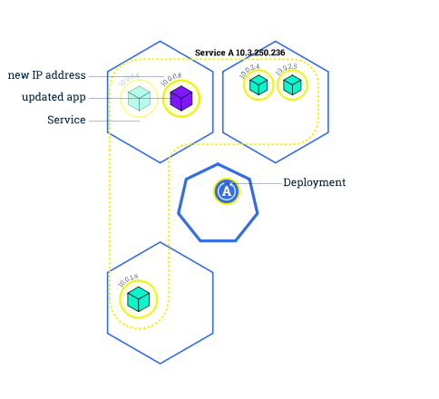

The *Master* will spawn a new _Pod_ with the new image, and will shut down the old _Pods_ on the same _Node_. The new _Pod_ get assigned a new IP.

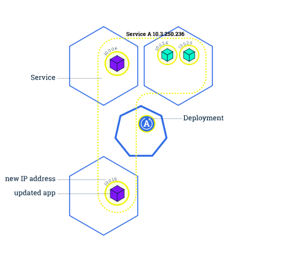

Continuing the Rolling update, the *Master* will do the same with a second old _Pod_: spawn a new _Pod_ and shut down the old _Pod_.

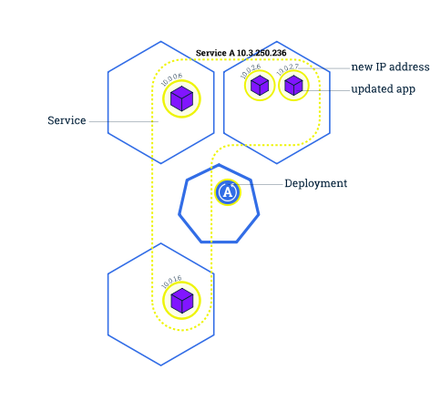

At the end of the process, all 4 _Pods_ are new (i.e. with the new image) and the _Service_ still is up, with the same IP as before the update. Thanks to this, the external world (i.e. anyone outside the _Service_) has not seen any visible change: the _Service_ was always up, with the same IP, and the only visible symptom is that - during the update - some request may still be handled by the old version of the paplciation while some others will already be handled by the new version, thus delivering during the transition period a possibly inconsistent customer experience.

Similar to application Scaling, if a _Deployment_ is exposed publicly, the _Service_ will load-balance the traffic only to available _Pods_ during the update. An available _Pod_ is an instance that is available to the users of the application.

Rolling updates allow the following actions:

* Promote an application from one environment to another (via container image updates)
* Rollback to previous versions
* Continuous Integration and Continuous Delivery of applications with zero downtime


### 3.7.3 - Update the version of the app

To list your deployments use the get deployments command:

```bash
tuto@laptop:~/learn-kubernetes$ kubectl get deployments
NAME          READY   UP-TO-DATE   AVAILABLE   AGE
hello-part3   2/2     2            2           39m
```

To view the current image version of the app, run a `kubectl describe` command against the _Pods_ (look at the Image field):

```bash
tuto@laptop:~/learn-kubernetes$ kubectl describe pods
Name:         hello-part3-5849fddfff-5sbgf
Namespace:    default
Priority:     0
Node:         k8s-tuto-worker/172.18.0.2
Start Time:   Fri, 26 Jun 2020 22:44:48 +0200
Labels:       app=hello-part3
              pod-template-hash=5849fddfff
Annotations:  <none>
Status:       Running
IP:           10.244.3.2
[...]
Events:
  Type    Reason     Age    From                      Message
  ----    ------     ----   ----                      -------
  Normal  Scheduled  9m23s  default-scheduler         Successfully assigned default/hello-part3-5849fddfff-5sbgf to k8s-tuto-worker
  Normal  Pulling    9m22s  kubelet, k8s-tuto-worker  Pulling image "tsouche/learn-kubernetes:part3v1"
  Normal  Pulled     9m2s   kubelet, k8s-tuto-worker  Successfully pulled image "tsouche/learn-kubernetes:part3v1"
  Normal  Created    8m47s  kubelet, k8s-tuto-worker  Created container learn-kubernetes
  Normal  Started    8m47s  kubelet, k8s-tuto-worker  Started container learn-kubernetes


Name:         hello-part3-5849fddfff-lp6lt
Namespace:    default
Priority:     0
Node:         k8s-tuto-worker3/172.18.0.5
Start Time:   Fri, 26 Jun 2020 22:44:48 +0200
Labels:       app=hello-part3
              pod-template-hash=5849fddfff
Annotations:  <none>
Status:       Running
IP:           10.244.1.2
[...]
Events:
  Type    Reason     Age    From                       Message
  ----    ------     ----   ----                       -------
  Normal  Scheduled  9m23s  default-scheduler          Successfully assigned default/hello-part3-5849fddfff-lp6lt to k8s-tuto-worker3
  Normal  Pulling    9m22s  kubelet, k8s-tuto-worker3  Pulling image "tsouche/learn-kubernetes:part3v1"
  Normal  Pulled     9m4s   kubelet, k8s-tuto-worker3  Successfully pulled image "tsouche/learn-kubernetes:part3v1"
  Normal  Created    8m47s  kubelet, k8s-tuto-worker3  Created container learn-kubernetes
  Normal  Started    8m47s  kubelet, k8s-tuto-worker3  Started container learn-kubernetes
```

To update the image of the application to `version 2`, use the `kubectl set image` command, followed by the deployment name and the new image version. Before that, we list the active _Pods_ and we note their ID's suffix: `5sbgf` and `lp6lt`.

```bash
tuto@laptop:~/learn-kubernetes$ kubectl get pods -o wide
kubectl get pods -o wide
NAME                           READY   STATUS    RESTARTS   AGE   IP           NODE               NOMINATED NODE   READINESS GATES
hello-part3-5849fddfff-5sbgf   1/1     Running   0          11m   10.244.3.2   k8s-tuto-worker    <none>           <none>
hello-part3-5849fddfff-lp6lt   1/1     Running   0          11m   10.244.1.2   k8s-tuto-worker3   <none>           <none>

tuto@laptop:~/learn-kubernetes$ kubectl set image deployment/hello-part3 learn-kubernetes=tsouche/learn-kubernetes:part3v2
deployment.apps/hello image updated
```

The command notified the Deployment to use a different image for your app and initiated a rolling update. Check the status of the new _Pods_, and view the old one terminating with the `kubectl get pods` command:

```bash
tuto@laptop:~/learn-kubernetes$ kubectl get pods -o wide
NAME                           READY   STATUS              RESTARTS   AGE   IP           NODE               NOMINATED NODE   READINESS GATES
hello-part3-5849fddfff-5sbgf   1/1     Running             0          12m   10.244.3.2   k8s-tuto-worker    <none>           <none>
hello-part3-5849fddfff-lp6lt   1/1     Running             0          12m   10.244.1.2   k8s-tuto-worker3   <none>           <none>
hello-part3-6b85bbfbc4-sfc4v   0/1     ContainerCreating   0          3s    <none>       k8s-tuto-worker2   <none>           <none>

tuto@laptop:~/learn-kubernetes$ kubectl get pods -o wide
NAME                           READY   STATUS        RESTARTS   AGE   IP           NODE               NOMINATED NODE   READINESS GATES
hello-part3-5849fddfff-5sbgf   1/1     Terminating   0          12m   10.244.3.2   k8s-tuto-worker    <none>           <none>
hello-part3-5849fddfff-lp6lt   1/1     Terminating   0          12m   10.244.1.2   k8s-tuto-worker3   <none>           <none>
hello-part3-6b85bbfbc4-ptjn5   1/1     Running       0          6s    10.244.1.3   k8s-tuto-worker3   <none>           <none>
hello-part3-6b85bbfbc4-sfc4v   1/1     Running       0          10s   10.244.2.4   k8s-tuto-worker2   <none>           <none>

tuto@laptop:~/learn-kubernetes$ kubectl get pods -o wide
NAME                           READY   STATUS    RESTARTS   AGE   IP           NODE               NOMINATED NODE   READINESS GATES
hello-part3-6b85bbfbc4-ptjn5   1/1     Running   0          74s   10.244.1.3   k8s-tuto-worker3   <none>           <none>
hello-part3-6b85bbfbc4-sfc4v   1/1     Running   0          78s   10.244.2.4   k8s-tuto-worker2   <none>           <none>
```

Following the progress of the update, you see new _Pods_ being created (with ID's suffix `ptjn5` and `sfc4v`), and as the update progresses, old _Pods_ being terminated, while the _Deployment Controller_ always keeps (at least) the desired number of _Pods_ active.

Since during a certain transition period both versions of the _Pod_ are active at the same time, the end users would not all get exactly the same experience: some will still hit the `v1` version, while other will already hit the `v2` version. However, this transition period may be kept reasonably short... if everything happens nominal.


### 3.7.4 - Verify an update

First, let’s check that the App is running. To find out the exposed IP and Port we can use describe service:

```bash
tuto@laptop:~/learn-kubernetes$ kubectl describe services/hello-part3
Name:                     hello-part3
Namespace:                default
Labels:                   app=hello-part3
Annotations:              <none>
Selector:                 app=hello-part3
Type:                     NodePort
IP:                       10.103.200.42
Port:                     <unset>  80/TCP
TargetPort:               80/TCP
NodePort:                 <unset>  30558/TCP
Endpoints:                10.244.1.3:80,10.244.2.4:80
Session Affinity:         None
External Traffic Policy:  Cluster
Events:                   <none>
```

The `NodePort` did not change (since the update took place within the _Service_ which kept up), and neither did the `EntryPoint` for the whole cluster, so we can still poll the service at the same URL:

```bash
tuto@laptop:~/learn-kubernetes$ curl $ENDPOINT:$NODE_PORT
<h3>Hello World! - application version 2</h3><b>Hostname:</b> hello-part3-6b85bbfbc4-sfc4v<br/>
tuto@laptop:~/learn-kubernetes$ curl $ENDPOINT:$NODE_PORT
<h3>Hello World! - application version 2</h3><b>Hostname:</b> hello-part3-6b85bbfbc4-sfc4v<br/>
tuto@laptop:~/learn-kubernetes$ curl $ENDPOINT:$NODE_PORT
<h3>Hello World! - application version 2</h3><b>Hostname:</b> hello-part3-6b85bbfbc4-ptjn5<br/>
tuto@laptop:~/learn-kubernetes$ curl $ENDPOINT:$NODE_PORT
<h3>Hello World! - application version 2</h3><b>Hostname:</b> hello-part3-6b85bbfbc4-ptjn5<br/>
tuto@laptop:~/learn-kubernetes$ curl $ENDPOINT:$NODE_PORT
<h3>Hello World! - application version 2</h3><b>Hostname:</b> hello-part3-6b85bbfbc4-sfc4v<br/>
tuto@laptop:~/learn-kubernetes$ curl $ENDPOINT:$NODE_PORT
<h3>Hello World! - application version 2</h3><b>Hostname:</b> hello-part3-6b85bbfbc4-sfc4v<br/>
tuto@laptop:~/learn-kubernetes$ curl $ENDPOINT:$NODE_PORT
<h3>Hello World! - application version 2</h3><b>Hostname:</b> hello-part3-6b85bbfbc4-ptjn5<br/>
```

So we can observe that:

* we hit a different _Pod_ with every request, and
* all _Pods_ are running the latest version (`v2`).

The update can be confirmed also by running a rollout status command:

```bash
tuto@laptop:~/learn-kubernetes$ kubectl rollout status deployments/hello-part3
deployment "hello-part3" successfully rolled out
```

To view the current image version of the app, run a `kubectl describe` command against the _Pods_:

```bash
tuto@laptop:~/learn-kubernetes$ kubectl describe deployment/hello-part3
Name:                   hello-part3
Namespace:              default
CreationTimestamp:      Fri, 26 Jun 2020 22:13:58 +0200
Labels:                 app=hello-part3
Annotations:            deployment.kubernetes.io/revision: 2
Selector:               app=hello-part3
Replicas:               2 desired | 2 updated | 2 total | 2 available | 0 unavailable
StrategyType:           RollingUpdate
MinReadySeconds:        0
RollingUpdateStrategy:  25% max unavailable, 25% max surge
Pod Template:
  Labels:  app=hello-part3
  Containers:
   learn-kubernetes:
    Image:        tsouche/learn-kubernetes:part3v2
    Port:         <none>
    Host Port:    <none>
    Environment:  <none>
    Mounts:       <none>
[...]
```

We run now the version `v2` of the app!


### 3.7.5 - Rollback an update

Let’s perform another update, and deploy image tagged as `v10` :

```bash
tuto@laptop:~/learn-kubernetes$ kubectl set image deployment/hello-part3 learn-kubernetes=tsouche/learn-kubernetes:part3v10
deployment.apps/hello-part3 image updated
```

Use `kubectl get deployments` to see the status of the _Deployment_:

```bash
tuto@laptop:~/learn-kubernetes$ kubectl get deployments
NAME          READY   UP-TO-DATE   AVAILABLE   AGE
hello-part3   2/2     1            2           52m
```

And something is wrong… We do not have the desired number of _Pods_ `UP-TO-DATE`. List the _Pods_ again:

```bash
tuto@laptop:~/learn-kubernetes$ kubectl get pods -o wide
NAME                           READY   STATUS         RESTARTS   AGE     IP           NODE               NOMINATED NODE   READINESS GATES
hello-part3-5674f88797-9nkt9   0/1     ErrImagePull   0          12s     10.244.3.3   k8s-tuto-worker    <none>           <none>
hello-part3-6b85bbfbc4-ptjn5   1/1     Running        0          9m9s    10.244.1.3   k8s-tuto-worker3   <none>           <none>
hello-part3-6b85bbfbc4-sfc4v   1/1     Running        0          9m13s   10.244.2.4   k8s-tuto-worker2   <none>           <none>
```

A describe command on the _Pods_ should give more insights:

```bash
tuto@laptop:~/learn-kubernetes$ kubectl describe pods
```

The output is, as usual, very verbose, so we isolate only the events associated to the first Pod:

```bash
Events:
  Type     Reason     Age               From                      Message
  ----     ------     ----              ----                      -------
  Normal   Scheduled  23s               default-scheduler         Successfully assigned default/hello-part3-5674f88797-9nkt9 to k8s-tuto-worker
  Normal   BackOff    20s               kubelet, k8s-tuto-worker  Back-off pulling image "tsouche/learn-kubernetes:part3v10"
  Warning  Failed     20s               kubelet, k8s-tuto-worker  Error: ImagePullBackOff
  Normal   Pulling    9s (x2 over 23s)  kubelet, k8s-tuto-worker  Pulling image "tsouche/learn-kubernetes:part3v10"
  Warning  Failed     8s (x2 over 21s)  kubelet, k8s-tuto-worker  Failed to pull image "tsouche/learn-kubernetes:part3v10": rpc error: code = NotFound desc = failed to pull and unpack image "docker.io/tsouche/learn-kubernetes:part3v10": failed to resolve reference "docker.io/tsouche/learn-kubernetes:part3v10": docker.io/tsouche/learn-kubernetes:part3v10: not found
  Warning  Failed     8s (x2 over 21s)  kubelet, k8s-tuto-worker  Error: ErrImagePull
```

There is no image tagged `part3v10` in the repository, so Kubernetes is not able to pull the image. Let’s roll back to our previously working version. We’ll use the `kubectl rollout undo` command:

```bash
tuto@laptop:~/learn-kubernetes$ kubectl rollout undo deployments/hello-part3
deployment.apps/hello-part3 rolled back
```

The rollout command reverted the _Deployment_ to the previous known state (`v2` of the image). Updates are versioned and you can revert to any previously know state of a Deployment. List again the _Pods_:

```bash
tuto@laptop:~/learn-kubernetes$kubectl get deployments
NAME          READY   UP-TO-DATE   AVAILABLE   AGE
hello-part3   2/2     2            2           56m

tuto@laptop:~/learn-kubernetes$ kubectl get pods -o wide
NAME                           READY   STATUS    RESTARTS   AGE   IP           NODE               NOMINATED NODE   READINESS GATES
hello-part3-6b85bbfbc4-ptjn5   1/1     Running   0          13m   10.244.1.3   k8s-tuto-worker3   <none>           <none>
hello-part3-6b85bbfbc4-sfc4v   1/1     Running   0          13m   10.244.2.4   k8s-tuto-worker2   <none>           <none>
```

Two _Pods_ are running. Check again the image deployed on the them:

```bash
tuto@laptop:~/learn-kubernetes$ kubectl describe pods
[...]
Events:
  Type    Reason     Age   From                       Message
  ----    ------     ----  ----                       -------
  Normal  Scheduled  13m   default-scheduler          Successfully assigned default/hello-part3-6b85bbfbc4-ptjn5 to k8s-tuto-worker3
  Normal  Pulling    13m   kubelet, k8s-tuto-worker3  Pulling image "tsouche/learn-kubernetes:part3v2"
  Normal  Pulled     13m   kubelet, k8s-tuto-worker3  Successfully pulled image "tsouche/learn-kubernetes:part3v2"
  Normal  Created    13m   kubelet, k8s-tuto-worker3  Created container learn-kubernetes
  Normal  Started    13m   kubelet, k8s-tuto-worker3  Started container learn-kubernetes
```

We see that the _Deployment_ is using a stable version of the `app` (`v2`). The Rollback was successful.


## 3.8 - Conclusion

At this step in the tutorial, you know how to deploy a stateless app on the cluster, and how to manage simple operations like a scaling in and out, or a version update.

Let's make it clear however that this is greatly simplified by the high level of automation made possible through Kubernetes: you actually only managed _labels_, and every command we did though `kubectl` could have been done by managing YAML files (i.e. by updating YAML files and feeding these files to the *Master*) or by directly accessing the REST APIs like the *Dashboard* does.

It is time now to get into slightly more complex things like a...
... stateful app: let's get to **Part 4** of the tutorial.
