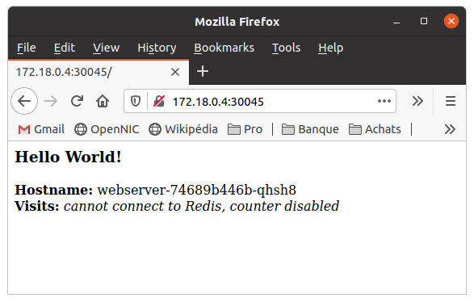

# Part 4 - Deploy a stateful app


In this section, you will build and deploy a simple, multi-tier web application: it is an improved version of the *Hello World!* application deployed in Part 3:
* the web frontend is a python application (very similar to Part 3 application), except that it displays a _'visitors counter'_ which increments each time the web page is visited. We will deploy several instances of this frontend, and the interesting feature is that the visit counter is shared amonst all instances;
* a single-instance Redis backend, used to store and share the _visitors counter_ which is the only stateful information in our very simple case.


## 4.1 - Set up and Expose the Hello-world webserver


The `hello-world` application is a web frontend writen in python and serving the HTTP requests. It is configured to connect to the _Redis Service_ for reading and incrementing the _visitors counter_.


### 4.1.1 - Looking into the new 'Hello-World' application


As we saw in Part 3, the new 'hello-world' application which we will use in Part 4 must be packaged into a Docker container: the corresponding image is available from DockerHub under my public repository, with the name `learn-kubernetes` and the tag `part4`: the **Appendix 1** explains how this image is built. The source files are in the `./app-part4` directory:

File 1: `./app-part4/app-part4.py`

```python
from flask import Flask
from redis import Redis, RedisError
import os

# Connect to Redis
redis = Redis(host="redis-master", db=0, socket_connect_timeout=2, socket_timeout=2)

app = Flask(__name__)

@app.route("/version")
def version():
    return "<b>Version 1</b> - <i>bonne année</i>"

@app.route("/")
def hello():
    #capture the variables
    name=os.getenv("NAME", "world")
    host=os.getenv("HOSTNAME")
    try:
        visits = redis.incr("counter")
    except RedisError:
        visits = "<i>cannot connect to Redis, counter disabled</i>"
        # build the html response
    html = "<h3>Hello {name}!</h3><br/>" \
           "<b>Visits:</b>   {visits}<br/>" \
           "<b>Hostname:</b> {hostname} " \
           "<br/>".format(name=name, hostname=host, visits=visits)
    return html

if __name__ == "__main__":
    app.run(host='0.0.0.0', port=80)
```

File 2: `./app-part4/requirements.txt`
```javascript
Flask
Redis
```

File 3: `./app-part4/Dockerfile`
```bash
# Use an official Python runtime as a parent image
FROM python:3.6
# Set the working directory to /app
WORKDIR /app
# Copy the current directory contents into the container at /app
ADD . /app
# Install any needed packages specified in requirements.txt
RUN pip install --trusted-host pypi.python.org -r requirements.txt
# Make port 80 available to the world outside this container
EXPOSE 80
# Define environment variable
ENV NAME World
# Run app.py when the container launches
CMD ["python", "app-part4.py"]
```

As you can see when looking into the python script, the application will show a "Hello World!" message *(or you can replace "World" with any other name in the `Dockerfile` by setting the NAME environement variable)* and try to connect to the Redis backend in order to read the visitors counter:

* if the backend is available, then it will display the number of visitors so far, and increment the counter;
* if the Redis backend is not available, then it will simply indicate it.


### 4.1.2 - Creating the "Hello World!" Frontend Deployment


In this section of the tutorial, we will use more elaborate YAML files to describe the backend and frontend _Deployments_ and _Services_, not only because they must talk to each others, but also because we will use _labels_ in order to identify the various components of the applications. When looking into the configuration files, you will see the following _labels_:

| `LabelSelector` | `Value` | Explanation |
| --- | --- | --- |
| `application` | `hello-world-part4` | This is the name that we give to the **_application_**, which is composed of a **_frontend_** tier and a **_backend_** tier. This label will enable to identify or selct all the resources needed to run  contributing to the **_application_**. |
| `tier` | `frontend` or `backend` | This label enables to identify / select all the resources needed to run a given **_tier_**: the **_front-_** or the **_back-end_**. In our case, there is only one _Deployment_ and only one _Service_ for each **_tier_**, but you could have built the app with two **_backend components_**: a _Redis Master_ used to serve the write requests (it would still be a SPOF: one single Pod running on one single Node) and a _Redis Slave_ used to serve the read requests, which could run several replicas in order to manage more loads from the multiple **_frontend_** replicas. |
| `component` | `webserver` or `redis-master` | This _labels_ identify each **_components_**, of which the **_tiers_** are composed. |


File: `./app-part4/webserver-deployment.yaml`

```yaml
apiVersion: apps/v1 # for versions before 1.9.0 use apps/v1beta2
kind: Deployment
metadata:
  name: webserver
  labels:
    application: hello-world-part4
    tier: frontend
    component: webserver
spec:
  selector:
    matchLabels:
      application: hello-world-part4
      tier: frontend
      component: webserver
  replicas: 3
  template:
    metadata:
      labels:
        application: hello-world-part4
        tier: frontend
        component: webserver
    spec:
      containers:
      - name: app-part4
        image: tsouche/learn-kubernetes:part4
        resources:
          requests:
            cpu: 100m
            memory: 100Mi
        env:
        - name: GET_HOSTS_FROM
          value: dns
          # Using `GET_HOSTS_FROM=dns` requires your cluster to
          # provide a dns service. As of Kubernetes 1.3, DNS is a built-in
          # service launched automatically. However, if the cluster you are using
          # does not have a built-in DNS service, you can instead
          # access an environment variable to find the master
          # service's host. To do so, comment out the 'value: dns' line above, and
          # uncomment the line below:
          # value: env
        ports:
        - containerPort: 80
```

Let's apply this file to run the frontend _Deployment_:

```bash
tuto@laptop:~/learn-kubernetes$ kubectl apply -f ./app-part4/webserver-deployment.yaml
deployment.apps/webserver created
```

Query the list of Pods to verify that the 3 frontend replicas are running:

```bash
tuto@laptop:~/learn-kubernetes$ kubectl get pods -l application=hello-world-part4 -l tier=frontend
NAME                         READY   STATUS              RESTARTS   AGE
webserver-74689b446b-fll64   0/1     ContainerCreating   0          19s
webserver-74689b446b-qhsh8   0/1     ContainerCreating   0          19s
webserver-74689b446b-wfzrh   0/1     ContainerCreating   0          19s

tuto@laptop:~/learn-kubernetes$ kubectl get pods -l application=hello-world-part4 -l tier=frontend
NAME                         READY   STATUS    RESTARTS   AGE
webserver-74689b446b-fll64   1/1     Running   0          78s
webserver-74689b446b-qhsh8   1/1     Running   0          78s
webserver-74689b446b-wfzrh   1/1     Running   0          78s
```

We will now use labels in order to identify resources (even though at this stage of the tutorial the only deployed _Pods_ are the `frontend` of the `hello-worl-part4` application), and check that the replicas are well distributed over the _Nodes_ of the cluster:

```bash
ttuto@laptop:~/learn-kubernetes$ kubectl get pods -l application=hello-world-part4 -l tier=frontend -o wide
NAME                         READY   STATUS    RESTARTS   AGE    IP           NODE               NOMINATED NODE   READINESS GATES
webserver-74689b446b-fll64   1/1     Running   0          2m3s   10.244.2.2   k8s-tuto-worker3   <none>           <none>
webserver-74689b446b-qhsh8   1/1     Running   0          2m3s   10.244.3.2   k8s-tuto-worker    <none>           <none>
webserver-74689b446b-wfzrh   1/1     Running   0          2m3s   10.244.1.2   k8s-tuto-worker2   <none>           <none>
```

You can see again the importance of well thinking through the use of _labels_: it can be overwelmingly powerful when the time comes to debug complex and seamingly erratic issues in production.


### 4.1.2 - Creating the webserver _Service_

Since we want users from outside the cluster to be able to access your web application, we must configure the *webserver Service* to be externally visible: we will expose the _webserver Service_ through `NodePort`.

> Note: Some cloud providers, like Google Compute Engine, support external load balancers. If your cloud provider supports load balancers and you want to use it, simply delete or comment out type: NodePort, and uncomment type: LoadBalancer.

File: `./app-part4/webserver-service.yaml`

```yaml
apiVersion: v1
kind: Service
metadata:
  name: webserver
  labels:
    application: hello-world-part4
    tier: frontend
    component: webserver
spec:
  # comment or delete the following line if you want to use a LoadBalancer
  type: NodePort
  # if your cluster supports it, uncomment the following to automatically create
  # an external load-balanced IP for the frontend service.
  # type: LoadBalancer
  ports:
  - port: 80
  selector:
    application: hello-world-part4
    tier: frontend
    component: webserver
```

Let's apply this file to run the frontend Service:

```bash
tuto@laptop:~/learn-kubernetes$ kubectl apply -f ./app-part4/webserver-service.yaml
service/webserver created
```

Query the list of _Services_ to verify that the *frontend Service* is running:

```bash
tuto@laptop:~/learn-kubernetes$ kubectl get services
NAME         TYPE        CLUSTER-IP       EXTERNAL-IP   PORT(S)        AGE
kubernetes   ClusterIP   10.96.0.1        <none>        443/TCP        6h28m
webserver    NodePort    10.104.159.200   <none>        80:30045/TCP   8s
```

Ok, the _webserver Service_ is now up and running: let's try to access it.

### 4.1.3 - Viewing the Webserver Service via NodePort

If you deployed this application to a local cluster, you need to find the IP address to view your web application. As we did in the Part 3, we will use the `kubectl describe` command to collect the details on the `EndPoint` (the IP address which exposes all the `NodePorts` in the cluster) and the `NodePort` for the *frontend Service*:

```bash
tuto@laptop:~/learn-kubernetes$ kubectl describe svc/webserver
Name:                     webserver
Namespace:                default
Labels:                   application=hello-world-part4
                          component=webserver
                          tier=frontend
Annotations:              Selector:  application=hello-world-part4,component=webserver,tier=frontend
Type:                     NodePort
IP:                       10.104.159.200
Port:                     <unset>  80/TCP
TargetPort:               80/TCP
NodePort:                 <unset>  30045/TCP
Endpoints:                10.244.1.2:80,10.244.2.2:80,10.244.3.2:80
Session Affinity:         None
External Traffic Policy:  Cluster
Events:                   <none>
```

You now know the `NodePort`: `30045`. Checking the kubernetes Service, you will also get the `EndPoint` which is used to expose all NodePort-type services:

```bash
tuto@laptop:~/learn-kubernetes$ kubectl describe svc/kubernetes
Name:              kubernetes
Namespace:         default
Labels:            component=apiserver
                   provider=kubernetes
Annotations:       <none>
Selector:          <none>
Type:              ClusterIP
IP:                10.96.0.1
Port:              https  443/TCP
TargetPort:        6443/TCP
Endpoints:         172.18.0.4:6443
Session Affinity:  None
Events:            <none>
```

Here you are: `172.18.0.4`. You know both the IP and the port used to expose the frontend Service: you can hit into the web server multiple times using `curl` in order to check that the server is up and that the load is balanced over the 3 replicas:

```
tuto@laptop:~/learn-kubernetes$ export ENDPOINT=172.18.0.4
tuto@laptop:~/learn-kubernetes$ export NODE_PORT=30045

tuto@laptop:~/learn-kubernetes$ curl $ENDPOINT:$NODE_PORT
<h3>Hello World!</h3><b>Hostname:</b> webserver-74689b446b-wfzrh<br/><b>Visits:</b> <i>cannot connect to Redis, counter disabled</i>
tuto@laptop:~/learn-kubernetes$ curl $ENDPOINT:$NODE_PORT
<h3>Hello World!</h3><b>Hostname:</b> webserver-74689b446b-fll64<br/><b>Visits:</b> <i>cannot connect to Redis, counter disabled</i>
tuto@laptop:~/learn-kubernetes$ curl $ENDPOINT:$NODE_PORT
<h3>Hello World!</h3><b>Hostname:</b> webserver-74689b446b-wfzrh<br/><b>Visits:</b> <i>cannot connect to Redis, counter disabled</i>
tuto@laptop:~/learn-kubernetes$ curl $ENDPOINT:$NODE_PORT
<h3>Hello World!</h3><b>Hostname:</b> webserver-74689b446b-qhsh8<br/><b>Visits:</b> <i>cannot connect to Redis, counter disabled</i>
tuto@laptop:~/learn-kubernetes$ curl $ENDPOINT:$NODE_PORT
<h3>Hello World!</h3><b>Hostname:</b> webserver-74689b446b-qhsh8<br/><b>Visits:</b> <i>cannot connect to Redis, counter disabled</i>
tuto@laptop:~/learn-kubernetes$ curl $ENDPOINT:$NODE_PORT
<h3>Hello World!</h3><b>Hostname:</b> webserver-74689b446b-fll64<br/><b>Visits:</b> <i>cannot connect to Redis, counter disabled</i>
```

We receive HTML code, which means that the server is well exposed at this URL.And we can confirm that:

* the web server cannot access the Redis service, so the visitors counter is disabled,
* and the requests are distributed randomly to the 3 replicas.

Since the proxy is still up, you can also view the server on your browser: indicate to the browser your own values for `$ENDPOINT` (in this case: 172.18.0.4) and `$NODE_PORT` (in this case: 30045). It hsould look like this:



So everything works so far :smile:. It is time to get teh backend up and running.


## 4.2 - Start up the Redis backend

The application uses Redis to store its data. It writes its data to a single Redis Master instance and reads data from multiple Redis Slave instances.

### 4.2.1 - Creating the Redis Deployment

The manifest file, included below, specifies a _Deployment_ controller that runs a single replica _Redis Master Pod_.

> Nota: the Redis backend service is called here **Redis Master** because the Redis datastore can be configured in such a way that the write requests are all served to the *Master Service* and that a *Slave Service* would serve all teh read requests. The advantage is that the *Slave Service* can then be replicated over multiple instances and thus be made resilient and scalable. However, the *Master Service* will still be *Single Point of Failure* (SPOF) because it cannot be distributed over multiple replicas: there one single instance of the *Master Service* running on one single _Node_.
> In this section of the tutorial, we will not implement a _Slave Service_, since resilience is properly addressed in Part 5.


File: `./app-part4/redis-master-deployment.yaml`

```yaml
apiVersion: apps/v1 # for versions before 1.9.0 use apps/v1beta2
kind: Deployment
metadata:
  name: redis-master
  labels:
    application: hello-world-part4
    tier: backend
    component: redis
spec:
  selector:
    matchLabels:
      application: hello-world-part4
      tier: backend
      component: redis
      role: master
  replicas: 1
  template:
    metadata:
      labels:
        application: hello-world-part4
        tier: backend
        component: redis
        role: master
    spec:
      containers:
      - name: master
        image: k8s.gcr.io/redis:e2e  # or just image: redis
        resources:
          requests:
            cpu: 100m
            memory: 100Mi
        ports:
        - containerPort: 6379
```

Launch a terminal window and apply the *Redis Master Deployment* from the `redis-master-deployment.yaml` file:

```bash
tuto@laptop:~/learn-kubernetes$ kubectl apply -f ./app-part4/redis-master-deployment.yaml
deployment.apps/redis-master created
```

Query the list of Pods to verify that the Redis Master Pod is running:

```bash
tuto@laptop:~/learn-kubernetes$ kubectl get pods -o wide
NAME                            READY   STATUS              RESTARTS   AGE   IP       NODE               NOMINATED NODE   READINESS GATES
redis-master-6b54579d85-zrbv2   0/1     ContainerCreating   0          10s   <none>   k8s-tuto-worker2   <none>           <none>
```

Run the following command to view the logs from the Redis Master Pod:

```bash
tuto@laptop:~/learn-kubernetes$ export POD_NAME=redis-master-77df76f8b8-rf28q
***update the output here ***

tuto@laptop:~/learn-kubernetes$ echo $POD_NAME
***update the output here ***

tuto@laptop:~/learn-kubernetes$ kubectl logs -f $POD_NAME
***update the output here ***
```

Here we are: the _Pods_ is running and the master DB server has started, it is listening on port 6379.


### 4.2.2 - Creating the *Redis Master Service*

The web applications needs to communicate to the Redis master to read the visits counter and increment it. You need to apply a _Service_ to proxy the traffic to the _Redis Master Pod_. A `Service` defines a policy to access the _Pods_.

The *Redis Master Service* is defined in the following `redis-master-service.yaml` file:

File: `./app-part4/redis-master-service.yaml`

```yaml
apiVersion: v1
kind: Service
metadata:
  name: redis-master
  labels:
    application: hello-world-part4
    tier: backend
    component: redis
    role: master
spec:
  ports:
  - port: 6379
    targetPort: 6379
  selector:
    application: hello-world-part4
    tier: backend
    component: redis
    role: master
```

Let's set up and run the *Redis Master Service*:

```bash
tuto@laptop:~/learn-kubernetes$ kubectl apply -f ./app-part4/redis-master-service.yaml
***update the output here ***
```

Query the list of _Services_ to verify that the *Redis Master Service* is running:

```bash
tuto@laptop:~/learn-kubernetes$ kubectl get service
***update the output here ***
```

This manifest file creates a _Service_ named `redis-master` with a set of _labels_ that match the _labels_ previously defined on the _Deployment_, so the _Service_ routes network traffic to the _Redis Master Pod_.

You have here again an example of how important _labels_ are with Kubernetes.


### 4.1.3 - Label all components of the applications

Our web application is actually composed of several services and deployments, and we will label all the components with `application=hello-part4`:

```bash
$ kubectl label pod $POD_NAME application=hello-part4

$ kubectl label deployment redis-master application=hello-part4

$ kubectl label service redis-master application=hello-part4

```

Once this is done for all the application components, we will be able to identify or select any resource using the LabelSelector `application` and the value `hello-part4`. If you back at what we did in Part 3, when the application was composed of a frontend service only, we already used


## 4.2 - Start up the Redis Slaves

Although the Redis Master is a single _Pod_, you can make it highly available to meet traffic demands by adding replica Redis slaves. This is not really a 'high availability' (HA) setup, since the Master _Node_ still is a Single Point Of Failure (SPOF) but it nevertheless brings resilience for the read operations, which is very important in many applicaitons (i.e. in many cases, the application read vey often and writes much more rarely).


### 4.2.1 - Creating the *Redis Slave Deployment*

_Deployments_ scale based of the configurations set in the manifest file. In this case, the _Deployment_ object specifies two replicas.

If there are not any replicas running, this _Deployment_ would start the two replicas on your container cluster. Conversely, if there are more than two replicas are running, it would scale down until two replicas are running.

File: `./app-guestbook/redis-slave-deployment.yaml`

```yaml
apiVersion: apps/v1 # for versions before 1.9.0 use apps/v1beta2
kind: Deployment
metadata:
  name: redis-slave
  labels:
    app: redis
  spec:
   selector:
     matchLabels:
       app: redis
       role: slave
       tier: backend
   replicas: 2
   template:
     metadata:
       labels:
         app: redis
         role: slave
         tier: backend
     spec:
       containers:
       - name: slave
         image: gcr.io/google_samples/gb-redisslave:v3
         resources:
           requests:
             cpu: 100m
             memory: 100Mi
         env:
         - name: GET_HOSTS_FROM
           value: dns
           # Using `GET_HOSTS_FROM=dns` requires your cluster to
           # provide a dns service. As of Kubernetes 1.3, DNS is a built-in
           # service launched automatically. However, if the cluster you are using
           # does not have a built-in DNS service, you can instead
           # access an environment variable to find the master
           # service's host. To do so, comment out the 'value: dns' line above, and
           # uncomment the line below:
           # value: env
         ports:
         - containerPort: 6379
```

Let's apply this file to run the *Redis Slave Deployment*:

```bash
tuto@laptop:~/learn-kubernetes$ kubectl apply -f ./app-guestbook/redis-slave-deployment.yaml
deployment.apps/redis-slave created
```

Query the list of _Pods_ to verify that the _Redis Slave Pods_ are running:

```bash
tuto@laptop:~/learn-kubernetes$ kubectl get pods -o wide
NAME                            READY   STATUS    RESTARTS   AGE   IP           NODE               NOMINATED NODE   READINESS GATES
redis-master-6b54579d85-zrbv2   1/1     Running   0          90s   10.244.2.2   k8s-tuto-worker2   <none>           <none>
redis-slave-799788557c-npxf4    1/1     Running   0          12s   10.244.1.2   k8s-tuto-worker3   <none>           <none>
redis-slave-799788557c-xt6zf    1/1     Running   0          12s   10.244.2.3   k8s-tuto-worker2   <none>           <none>
```


### 4.2.2 - Creating the Redis Slave Service

The guestbook application needs to communicate to Redis slaves to read data. To make the Redis slaves discoverable, you need to set up a _Service_. A _Service_ provides transparent load balancing to a set of _Pods_.

File: `./app-guestbook/redis-slave-service.yaml`

```yaml
apiVersion: v1
kind: Service
metadata:
  name: redis-slave
  labels:
    app: redis
    role: slave
    tier: backend
spec:
  ports:
  - port: 6379
  selector:
    app: redis
    role: slave
    tier: backend
```

Let's apply this file to run the *Redis Slave Service*:

```bash
tuto@laptop:~/learn-kubernetes$ kubectl apply -f ./app-guestbook/redis-slave-service.yaml
service/redis-slave created
```

Query the list of _Services_ to verify that the *Redis slave Service* is running:

```bash
tuto@laptop:~/learn-kubernetes$ kubectl get services
NAME           TYPE        CLUSTER-IP       EXTERNAL-IP   PORT(S)    AGE
kubernetes     ClusterIP   10.96.0.1        <none>        443/TCP    2d5h
redis-master   ClusterIP   10.106.65.211    <none>        6379/TCP   65s
redis-slave    ClusterIP   10.104.243.238   <none>        6379/TCP   6s
```


## 4.5 - Testing the resilience

We have deployed an application with a replicated frontend, a replicated Redis Slave and a single instance of Redis Master. So, in theory, this setup should be robust against several types of problem with the infrastructure. The purpose of this section is... to test it :smile:.

### 4.5.1 - Let's kill a Redis Slave _pod_


### 4.5.2 - Let's kill a Frontend _Pod_


### 4.5.3 - Let's kill the Redis Master _Pod_


### 4.5.4 - Let's kill a _Node_


### 4.5.5 - Let's kill the Redis Master _Node_

The is acutally **no** "Redis Master _Node_", but one of the _Nodes_ hosts the unique Redis Master _Pod_, and we want to test if this Node is _truely_ a SPOF: so let's kill it!


## 4.6 - Cleaning up

Deleting the _Deployments_ and _Services_ also deletes any running Pods. Use _labels_ to delete multiple resources with one command: run the following commands to delete all _Pods_, _Deployments_, and _Services_:

```bash
tuto@laptop:~/learn-kubernetes$ kubectl delete deployment -l app=redis
deployment.apps "redis-master" deleted
deployment.apps "redis-slave" deleted

tuto@laptop:~/learn-kubernetes$ kubectl delete service -l app=redis
service "redis-master" deleted
service "redis-slave" deleted

tuto@laptop:~/learn-kubernetes$ kubectl delete deployment -l app=guestbook
deployment.apps "frontend" deleted

tuto@laptop:~/learn-kubernetes$ kubectl delete service -l app=guestbook
service "frontend" deleted
```

Query the list of _Pods_ to verify that no _Pods_ are running anymore:

```bash
tuto@laptop:~/learn-kubernetes$ kubectl get pods
No resources found in default namespace.
```

## 4.7 - Conclusion

We have achieved great result since we deployed very easily an application counting three services and running multiple instances of the frontend and the Redis slave. However, I am not completely satisfied with this example: obviously, it show how easy it is to handle an application on top of Kubernetes, but it does not drill into the challenges of implementing statefulness on Kubernetes without any SPOF left. To be improved and continued... in Part 5 :smile:
