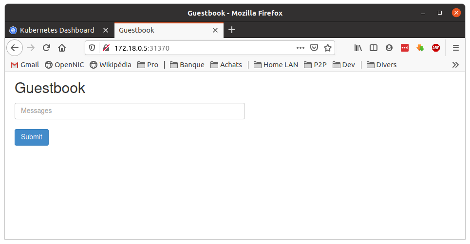

# Part 4 - Deploy a stateful app


In this section, you will build and deploy a simple, multi-tier web application - a PHP Guestbook application with Redis - using Kubernetes and Docker. This example consists of the following components:

* a single-instance Redis master to store guestbook entries
* multiple replicated Redis instances to serve reads
* multiple web frontend instances


## 4.1 - Start up the Redis Master

The guestbook application uses Redis to store its data. It writes its data to a Redis master instance and reads data from multiple Redis slave instances.

### 4.1.1 - Creating the Redis Master Deployment

The manifest file, included below, specifies a _Deployment_ controller that runs a single replica _Redis Master Pod_.

File: `./app-guestbook/redis-master-deployment.yaml`

```yaml
apiVersion: apps/v1 # for versions before 1.9.0 use apps/v1beta2
kind: Deployment
metadata:
  name: redis-master
  labels:
    app: redis
spec:
  selector:
    matchLabels:
      app: redis
      role: master
      tier: backend
  replicas: 1
  template:
    metadata:
      labels:
        app: redis
        role: master
        tier: backend
    spec:
      containers:
      - name: master
        image: k8s.gcr.io/redis:e2e  # or just image: redis
        resources:
          requests:
            cpu: 100m
            memory: 100Mi
        ports:
        - containerPort: 6379
```

Launch a terminal window in the directory where you downloaded the manifest files. Apply the *Redis Master Deployment* from the `redis-master-deployment.yaml` file:

```bash
tuto@laptop:~/learn-kubernetes$ kubectl apply -f ./app-guestbook/redis-master-deployment.yaml
kubectl apply -f redis-master-deployment.yaml
```

Query the list of Pods to verify that the Redis Master Pod is running:

```bash
tuto@laptop:~/learn-kubernetes$ kubectl get pods -o wide
NAME                            READY   STATUS    RESTARTS   AGE     IP           NODE               NOMINATED NODE   READINESS GATES
redis-master-6b54579d85-s7jcc   1/1     Running   0          8m41s   10.244.1.9   k8s-tuto-worker3   <none>           <none>
```

Run the following command to view the logs from the Redis Master Pod:

```bash
tuto@laptop:~/learn-kubernetes$ POD_NAME=redis-master-6b54579d85-s7jcc
tuto@laptop:~/learn-kubernetes$ kubectl logs -f $POD_NAME
                _._
           _.-``__ ''-._
      _.-``    `.  `_.  ''-._           Redis 2.8.19 (00000000/0) 64 bit
  .-`` .-```.  ```\/    _.,_ ''-._
 (    '      ,       .-`  | `,    )     Running in stand alone mode
 |`-._`-...-` __...-.``-._|'` _.-'|     Port: 6379
 |    `-._   `._    /     _.-'    |     PID: 1
  `-._    `-._  `-./  _.-'    _.-'
 |`-._`-._    `-.__.-'    _.-'_.-'|
 |    `-._`-._        _.-'_.-'    |           http://redis.io
  `-._    `-._`-.__.-'_.-'    _.-'
 |`-._`-._    `-.__.-'    _.-'_.-'|
 |    `-._`-._        _.-'_.-'    |
  `-._    `-._`-.__.-'_.-'    _.-'
      `-._    `-.__.-'    _.-'
          `-._        _.-'
              `-.__.-'

[1] 15 Jun 22:01:03.293 # Server started, Redis version 2.8.19
[1] 15 Jun 22:01:03.293 # WARNING you have Transparent Huge Pages (THP) support enabled in your kernel. This will create latency and memory usage issues with Redis. To fix this issue run the command 'echo never > /sys/kernel/mm/transparent_hugepage/enabled' as root, and add it to your /etc/rc.local in order to retain the setting after a reboot. Redis must be restarted after THP is disabled.
[1] 15 Jun 22:01:03.293 * The server is now ready to accept connections on port 6379
```

Here we are: the _Pods_ is running and the master DB server has started, it is listening on port 6379.


### 4.1.2 - Creating the *Redis Master Service*

The guestbook applications needs to communicate to the Redis master to write its data. You need to apply a _Service_ to proxy the traffic to the _Redis Master Pod_. A `Service` defines a policy to access the _Pods_.

The *Redis Master Service* is defined in the following `redis-master-service.yaml` file:

File: `./app-guestbook/redis-master-service.yaml`

```yaml
apiVersion: v1
kind: Service
metadata:
  name: redis-master
  labels:
    app: redis
    role: master
    tier: backend
spec:
  ports:
  - port: 6379
    targetPort: 6379
  selector:
    app: redis
    role: master
    tier: backend
```

Let's set up and run the *Redis Master Service*:

```bash
tuto@laptop:~/learn-kubernetes$ kubectl apply -f ./app-guestbook/redis-master-service.yaml
service/redis-master created
```

Query the list of _Services_ to verify that the *Redis Master Service* is running:

```bash
tuto@laptop:~/learn-kubernetes$ kubectl get service
NAME           TYPE        CLUSTER-IP       EXTERNAL-IP   PORT(S)        AGE
kubernetes     ClusterIP   10.96.0.1        <none>        443/TCP        4h18m
redis-master   ClusterIP   10.105.70.232    <none>        6379/TCP       16s
```

This manifest file creates a _Service_ named `redis-master` with a set of _labels_ that match the _labels_ previously defined on the _Deployment_, so the _Service_ routes network traffic to the _Redis Master Pod_.

You have here again an example of how important _labels_ are with Kubernetes.


## 4.2 - Start up the Redis Slaves

Although the Redis Master is a single _Pod_, you can make it highly available to meet traffic demands by adding replica Redis slaves. This is not really a 'high availability' (HA) setup, since the Master _Node_ still is a Single Point Of Failure (SPOF) but it nevertheless brings resilience for the read operations, which is very important in many applicaitons (i.e. in many cases, the application read vey often and writes much more rarely).


### 4.2.1 - Creating the *Redis Slave Deployment*

_Deployments_ scale based of the configurations set in the manifest file. In this case, the _Deployment_ object specifies two replicas.

If there are not any replicas running, this _Deployment_ would start the two replicas on your container cluster. Conversely, if there are more than two replicas are running, it would scale down until two replicas are running.

File: `./app-guestbook/redis-slave-deployment.yaml`

```yaml
apiVersion: apps/v1 # for versions before 1.9.0 use apps/v1beta2
kind: Deployment
metadata:
  name: redis-slave
  labels:
    app: redis
  spec:
   selector:
     matchLabels:
       app: redis
       role: slave
       tier: backend
   replicas: 2
   template:
     metadata:
       labels:
         app: redis
         role: slave
         tier: backend
     spec:
       containers:
       - name: slave
         image: gcr.io/google_samples/gb-redisslave:v3
         resources:
           requests:
             cpu: 100m
             memory: 100Mi
         env:
         - name: GET_HOSTS_FROM
           value: dns
           # Using `GET_HOSTS_FROM=dns` requires your cluster to
           # provide a dns service. As of Kubernetes 1.3, DNS is a built-in
           # service launched automatically. However, if the cluster you are using
           # does not have a built-in DNS service, you can instead
           # access an environment variable to find the master
           # service's host. To do so, comment out the 'value: dns' line above, and
           # uncomment the line below:
           # value: env
         ports:
         - containerPort: 6379
```

Let's apply this file to run the *Redis Slave Deployment*:

```bash
tuto@laptop:~/learn-kubernetes$ kubectl apply -f ./app-guestbook/redis-slave-deployment.yaml
deployment.apps/redis-slave created
```

Query the list of _Pods_ to verify that the _Redis Slave Pods_ are running:

```bash
tuto@laptop:~/learn-kubernetes$ kubectl get pods -o wide
NAME                            READY   STATUS    RESTARTS   AGE     IP            NODE               NOMINATED NODE   READINESS GATES
redis-master-6b54579d85-s7jcc   1/1     Running   0          25m     10.244.1.9    k8s-tuto-worker3   <none>           <none>
redis-slave-799788557c-8mchb    1/1     Running   0          3m36s   10.244.1.10   k8s-tuto-worker3   <none>           <none>
redis-slave-799788557c-b5mmq    1/1     Running   0          3m36s   10.244.2.6    k8s-tuto-worker2   <none>           <none>
```


### 4.2.2 - Creating the Redis Slave Service

The guestbook application needs to communicate to Redis slaves to read data. To make the Redis slaves discoverable, you need to set up a _Service_. A _Service_ provides transparent load balancing to a set of _Pods_.

File: `./app-guestbook/redis-slave-service.yaml`

```yaml
apiVersion: v1
kind: Service
metadata:
  name: redis-slave
  labels:
    app: redis
    role: slave
    tier: backend
spec:
  ports:
  - port: 6379
  selector:
    app: redis
    role: slave
    tier: backend
```

Let's apply this file to run the *Redis Slave Service*:

```bash
tuto@laptop:~/learn-kubernetes$ kubectl apply -f ./app-guestbook/redis-slave-service.yaml
service/redis-slave created
```

Query the list of _Services_ to verify that the *Redis slave Service* is running:

```bash
tuto@laptop:~/learn-kubernetes$ kubectl get services
NAME           TYPE        CLUSTER-IP      EXTERNAL-IP   PORT(S)    AGE
kubernetes     ClusterIP   10.96.0.1       <none>        443/TCP    32h
redis-master   ClusterIP   10.105.45.183   <none>        6379/TCP   11m
redis-slave    ClusterIP   10.109.95.61    <none>        6379/TCP   1s
```

## 4.3 - Set up and Expose the Guestbook Frontend

The guestbook application has a web frontend serving the HTTP requests written in PHP. It is configured to connect to the _Redis Master Service_ for write requests and the _Redis Slave Service_ for Read requests.

### 4.3.1 - Creating the Guestbook Frontend Deployment

File: `./app-guestbook/frontend-deployment.yaml`

```yaml
apiVersion: apps/v1 # for versions before 1.9.0 use apps/v1beta2
Kind: Deployment
metadata:
  name: frontend
    labels:
      app: guestbook
spec:
  selector:
    matchLabels:
      app: guestbook
      tier: frontend
  replicas: 3
  template:
    metadata:
      labels:
        app: guestbook
        tier: frontend
    spec:
      containers:
      - name: php-redis
      resources:
        image: gcr.io/google-samples/gb-frontend:v4
          requests:
            cpu: 100m
            memory: 100Mi
        env:
       - name: GET_HOSTS_FROM
         value: dns
         # Using `GET_HOSTS_FROM=dns` requires your cluster to
         # provide a dns service. As of Kubernetes 1.3, DNS is a built-in
         # service launched automatically. However, if the cluster you are using
         # does not have a built-in DNS service, you can instead
         # access an environment variable to find the master
         # service's host. To do so, comment out the 'value: dns' line above, and
         # uncomment the line below:
         # value: env
       ports:
       - containerPort: 80
```

Let's apply this file to run the frontend _Deployment_:

```bash
tuto@laptop:~/learn-kubernetes$ kubectl apply -f ./app-guestbook/frontend-deployment.yaml
deployment.apps/frontend created
```

Query the list of Pods to verify that the 3 frontend replicas are running:

```bash
tuto@laptop:~/learn-kubernetes$ kubectl get pods -l app=guestbook -l tier=frontend -o wide
NAME                        READY   STATUS              RESTARTS   AGE   IP       NODE               NOMINATED NODE   READINESS GATES
frontend-56fc5b6b47-fspmc   0/1     ContainerCreating   0          13s   <none>   k8s-tuto-worker2   <none>           <none>
frontend-56fc5b6b47-nvtxd   0/1     ContainerCreating   0          13s   <none>   k8s-tuto-worker    <none>           <none>
frontend-56fc5b6b47-tghs6   0/1     ContainerCreating   0          13s   <none>   k8s-tuto-worker4   <none>           <none>

tuto@laptop:~/learn-kubernetes$ kubectl get pods -l app=guestbook -l tier=backend -o wide
NNAME                       READY   STATUS    RESTARTS   AGE   IP           NODE               NOMINATED NODE   READINESS GATES
frontend-56fc5b6b47-fspmc   1/1     Running   0          37s   10.244.2.7   k8s-tuto-worker2   <none>           <none>
frontend-56fc5b6b47-nvtxd   1/1     Running   0          37s   10.244.4.7   k8s-tuto-worker    <none>           <none>
frontend-56fc5b6b47-tghs6   1/1     Running   0          37s   10.244.3.9   k8s-tuto-worker4   <none>           <none>
```

You can see again the importance of well thingking through the use of _labels_: it can be overwelmingly powerful when the time comes to debug complex and seamingly erratic issues in production.


### 4.3.2 - Creating the frontend _Service_

The _Redis Slave_ and *Redis Master Services* you applied are only accessible within the container cluster because the default type for a _Service_ is `ClusterIP`. `ClusterIP` provides a single IP address for the set of Pods the _Service_ is pointing to. This IP address is accessible only within the cluster.

If you want guests to be able to access your guestbook, you must configure the *frontend Service* to be externally visible, so a client can request the _Service_ from outside the container cluster. We will expose _Services_ through `NodePort`.

> Note: Some cloud providers, like Google Compute Engine or Google Kubernetes Engine, support external load balancers. If your cloud provider supports load balancers and you want to use it, simply delete or comment out type: NodePort, and uncomment type: LoadBalancer.

File: `./app-guestbook/frontend-service.yaml`

```yaml
apiVersion: v1
kind: Service
metadata:
  name: frontend
  labels:
    app: guestbook
    tier: frontend
spec:
  # comment or delete the following line if you want to use a LoadBalancer
  type: NodePort
  # if your cluster supports it, uncomment the following to automatically create
  # an external load-balanced IP for the frontend service.
  # type: LoadBalancer
  ports:
  - port: 80
  selector:
    app: guestbook
    tier: frontend
```

Let's apply this file to run the frontend Service:

```bash
tuto@laptop:~/learn-kubernetes$ kubectl apply -f ./app-guestbook/frontend-service.yaml
service/frontend created
```

Query the list of _Services_ to verify that the *frontend Service* is running:

```bash
tuto@laptop:~/learn-kubernetes$ kubectl get services
NAME           TYPE        CLUSTER-IP      EXTERNAL-IP   PORT(S)        AGE
frontend       NodePort    10.105.42.189   <none>        80:31370/TCP   7s
kubernetes     ClusterIP   10.96.0.1       <none>        443/TCP        33h
redis-master   ClusterIP   10.105.45.183   <none>        6379/TCP       18m
redis-slave    ClusterIP   10.109.95.61    <none>        6379/TCP       7m35s
```

### 4.3.3 - Viewing the Frontend Service via NodePort

If you deployed this application to a local cluster, you need to find the IP address to view your Guestbook. As we did in the Part 3, we will use the `kubectl describe` command to collect the details on the `EndPoint` (the IP address which exposes all the `NodePorts` in the cluster) and the `NodePort` for the *frontend Service*:

```bash
tuto@laptop:~/learn-kubernetes$ kubectl describe svc/frontend
NName:                     frontend
Namespace:                default
Labels:                   app=guestbook
                          tier=frontend
Annotations:              Selector:  app=guestbook,tier=frontend
Type:                     NodePort
IP:                       10.105.42.189
Port:                     <unset>  80/TCP
TargetPort:               80/TCP
NodePort:                 <unset>  31370/TCP
Endpoints:                10.244.2.7:80,10.244.3.9:80,10.244.4.7:80
Session Affinity:         None
External Traffic Policy:  Cluster
Events:                   <none>
```

You now know the `NodePort`: `31370`. Checking the kubernetes Service, you will also get the `EndPoint` which is used to expose all NodePort-type services:

```bash
tuto@laptop:~/learn-kubernetes$ kubectl describe svc/kubernetes
Name:              kubernetes
Namespace:         default
Labels:            component=apiserver
                   provider=kubernetes
Annotations:       <none>
Selector:          <none>
Type:              ClusterIP
IP:                10.96.0.1
Port:              https  443/TCP
TargetPort:        6443/TCP
Endpoints:         172.18.0.5:6443
Session Affinity:  None
Events:            <none>
```

Here you are: `172.18.0.5`. You know both the IP and the port used to expose the frontend Service:

```
tuto@laptop:~/learn-kubernetes$ export ENDPOINT=172.18.0.5
tuto@laptop:~/learn-kubernetes$ export NODE_PORT=31370

tuto@laptop:~/learn-kubernetes$ curl $ENDPOINT:$NODE_PORT
curl $ENDPOINT:$NODE_PORT
<html ng-app="redis">
  <head>
    <title>Guestbook</title>
    <link rel="stylesheet" href="//netdna.bootstrapcdn.com/bootstrap/3.1.1/css/bootstrap.min.css">
    <script src="https://ajax.googleapis.com/ajax/libs/angularjs/1.2.12/angular.min.js"></script>
    <script src="controllers.js"></script>
    <script src="https://cdnjs.cloudflare.com/ajax/libs/angular-ui-bootstrap/0.13.0/ui-bootstrap-tpls.js"></script>
  </head>
  <body ng-controller="RedisCtrl">
    <div style="width: 50%; margin-left: 20px">
      <h2>Guestbook</h2>
    <form>
    <fieldset>
    <input ng-model="msg" placeholder="Messages" class="form-control" type="text" name="input"><br>
    <button type="button" class="btn btn-primary" ng-click="controller.onRedis()">Submit</button>
    </fieldset>
    </form>
    <div>
      <div ng-repeat="msg in messages track by $index">
        {{msg}}
      </div>
    </div>
    </div>
  </body>
</html>
```

We receive HTML code, which means that the server is well exposed at this URL. Copy this URL (`172.18.0.5:31370`) and load the page in your browser to view your guestbook: a very simple app enabling guests to exchange messages.




## 4.4 - Scale the Web Frontend

Scaling up or down is easy because your servers are defined as a _Service_ that uses a _Deployment_ controller.

Run the following command to scale up the number of frontend _Pods_:

```bash
tuto@laptop:~/learn-kubernetes$ kubectl scale deployment frontend --replicas=5
deployment.apps/frontend scaled
```

Query the list of _Pods_ to verify the number of frontend _Pods_ running:

```bash
tuto@laptop:~/learn-kubernetes$ kubectl get pods
NAME                            READY   STATUS    RESTARTS   AGE
frontend-56fc5b6b47-fspmc       1/1     Running   0          14m
frontend-56fc5b6b47-glm6w       1/1     Running   0          62s
frontend-56fc5b6b47-nvtxd       1/1     Running   0          14m
frontend-56fc5b6b47-qbws5       1/1     Running   0          62s
frontend-56fc5b6b47-tghs6       1/1     Running   0          14m
redis-master-6b54579d85-s7jcc   1/1     Running   0          42m
redis-slave-799788557c-8mchb    1/1     Running   0          20m
redis-slave-799788557c-b5mmq    1/1     Running   0          20m
```

Run the following command to scale down the number of frontend Pods:

```bash
tuto@laptop:~/learn-kubernetes$ kubectl scale deployment frontend --replicas=2
deployment.apps/frontend scaled
```

Query the list of Pods to verify the number of frontend Pods running:

```bash
tuto@laptop:~/learn-kubernetes$ kubectl get pods
NAME                            READY   STATUS        RESTARTS   AGE
frontend-56fc5b6b47-fspmc       0/1     Terminating   0          15m
frontend-56fc5b6b47-glm6w       0/1     Terminating   0          103s
frontend-56fc5b6b47-nvtxd       1/1     Running       0          15m
frontend-56fc5b6b47-qbws5       0/1     Terminating   0          103s
frontend-56fc5b6b47-tghs6       1/1     Running       0          15m
redis-master-6b54579d85-s7jcc   1/1     Running       0          43m
redis-slave-799788557c-8mchb    1/1     Running       0          21m
redis-slave-799788557c-b5mmq    1/1     Running       0          21m

tuto@laptop:~/learn-kubernetes$ kubectl get pods
NAME                            READY   STATUS    RESTARTS   AGE
frontend-56fc5b6b47-nvtxd       1/1     Running   0          15m
frontend-56fc5b6b47-tghs6       1/1     Running   0          15m
redis-master-6b54579d85-s7jcc   1/1     Running   0          43m
redis-slave-799788557c-8mchb    1/1     Running   0          21m
redis-slave-799788557c-b5mmq    1/1     Running   0          21m
```

and let's now have a look at how the _Pods_ are distributed over the _Nodes_:

```bash
tuto@laptop:~/learn-kubernetes$ kubectl get pods -o wide
NAME                            READY   STATUS    RESTARTS   AGE   IP            NODE               NOMINATED NODE   READINESS GATES
frontend-56fc5b6b47-nvtxd       1/1     Running   0          16m   10.244.4.7    k8s-tuto-worker    <none>           <none>
frontend-56fc5b6b47-tghs6       1/1     Running   0          16m   10.244.3.9    k8s-tuto-worker4   <none>           <none>
redis-master-6b54579d85-s7jcc   1/1     Running   0          45m   10.244.1.9    k8s-tuto-worker3   <none>           <none>
redis-slave-799788557c-8mchb    1/1     Running   0          23m   10.244.1.10   k8s-tuto-worker3   <none>           <none>
redis-slave-799788557c-b5mmq    1/1     Running   0          23m   10.244.2.6    k8s-tuto-worker2   <none>           <none>
```

As expected, the Master tend to distribute the load as evenly as possible across the whole cluster. In our case, all _Nodes_ carry only one _Pod_, except one _Node_ which carries two _Pods_.


## 4.5 - Cleaning up

Deleting the _Deployments_ and _Services_ also deletes any running Pods. Use _labels_ to delete multiple resources with one command: run the following commands to delete all _Pods_, _Deployments_, and _Services_:

```bash
tuto@laptop:~/learn-kubernetes$ kubectl delete deployment -l app=redis
deployment.apps "redis-master" deleted
deployment.apps "redis-slave" deleted

tuto@laptop:~/learn-kubernetes$ kubectl delete service -l app=redis
service "redis-master" deleted
service "redis-slave" deleted

tuto@laptop:~/learn-kubernetes$ kubectl delete deployment -l app=guestbook
deployment.apps "frontend" deleted

tuto@laptop:~/learn-kubernetes$ kubectl delete service -l app=guestbook
service "frontend" deleted
```

Query the list of _Pods_ to verify that no _Pods_ are running anymore:

```bash
tuto@laptop:~/learn-kubernetes$ kubectl get pods
No resources found in default namespace.
```

## 4.6 - Conclusion

We have achieved great result since we deployed very easily an application counting three services and running multiple instances of the frontend and the Redis slave. However, I am not completely satisfied with this example: obviously, it show how easy it is to handle an application on top of Kubernetes, but it does not drill into the challenges of implementing statefulness on Kubernetes without any SPOF left. To be improved and continued... in Part 5 :smile:
