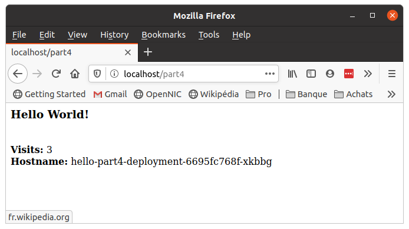

# Part 4 - Deploy a stateful app


In this section, you will build and deploy a simple, multi-tier web application: it is an improved version of the *Hello World!* application deployed in Part 3:
* the web frontend is a python application (very similar to Part 3 application), except that it displays a _'visitors counter'_ which increments each time the web page is visited. We will deploy several instances of this frontend, and the interesting feature is that the visit counter is shared amonst all instances;
* a single-instance Redis Master backend, used to store and share the _visitors counter_ which is the only stateful information in our very simple case.
* replicated Redis Slave backend, used to off-load the read requests over multiple slave Pods, so as to preserve the Master Pod for writing requests.


## 4.1 - Labels for our applications


In this section of the tutorial, we will use more elaborate YAML files to describe the backend and frontend _Deployments_ and _Services_. Not only these files will enable the various components of the app to communicate with each others, but we will also use _labels_ in order to tag the various components of the applications *(and then later be able to dientify or select the application resources accordingly)*.

Our **application** is composed of two **tiers**, each being composed of one or more **components**: hence, when looking into the configuration files, you will see the following _labels_:

| `LabelSelector` | `Value` | Explanation |
| --- | --- | --- |
| `application` | `hello-world-part4` | This is the name that we give to the **_application_**, which is composed of a **_frontend_** tier and a **_backend_** tier. This label will enable to identify or selct all the resources needed to run  contributing to the **_application_**. |
| `tier` | `frontend` or `backend` | This label enables to identify / select all the resources needed to run a given **_tier_**: the **_front-_** or the **_back-end_**. In our case, there is only one _Deployment_ and only one _Service_ for each **_tier_**, but you could have built the app with two **_backend components_**: a _Redis Master_ used to serve the write requests (it would still be a SPOF: one single Pod running on one single Node) and a _Redis Slave_ used to serve the read requests, which could run several replicas in order to manage more loads from the multiple **_frontend_** replicas. |
| `component` | `webserver` or `redis-master` | This _labels_ identify each **_components_**, of which the **_tiers_** are composed. |


## 4.2 - Set up and Expose the Hello-world webserver


The `hello-world` application is a web frontend writen in python and serving the HTTP requests. It is configured to connect to the _Redis Service_ for reading and incrementing the _visitors counter_.


### 4.2.1 - Looking into the new 'Hello-World' application


As we saw in Part 3, the new 'hello-world' application which we will use in Part 4 must be packaged into a Docker container: the corresponding image is available from DockerHub under my public repository, with the name `learn-kubernetes` and the tag `part4`: the **Appendix 1** explains how this image is built. The source files are in the `./app-part4` directory:

File 1: `./app-part4/app-part4.py`

```python
from flask import Flask
from redis import Redis, RedisError
import os

# Connect to Redis
redis = Redis(host="redis-master", db=0, socket_connect_timeout=2, socket_timeout=2)

app = Flask(__name__)

@app.route("/version")
def version():
    return "<b>Version 1</b> - <i>bonne année</i>"

@app.route("/")
def hello():
    #capture the variables
    name=os.getenv("NAME", "world")
    host=os.getenv("HOSTNAME")
    try:
        visits = redis.incr("counter")
    except RedisError:
        visits = "<i>cannot connect to Redis, counter disabled</i>"
        # build the html response
    html = "<h3>Hello {name}!</h3><br/>" \
           "<b>Visits:</b>   {visits}<br/>" \
           "<b>Hostname:</b> {hostname} " \
           "<br/>".format(name=name, hostname=host, visits=visits)
    return html

if __name__ == "__main__":
    app.run(host='0.0.0.0', port=80)
```

File 2: `./app-part4/requirements.txt`
```javascript
Flask
Redis
```

File 3: `./app-part4/Dockerfile`
```bash
# Use an official Python runtime as a parent image
FROM python:3.6
# Set the working directory to /app
WORKDIR /app
# Copy the current directory contents into the container at /app
ADD . /app
# Install any needed packages specified in requirements.txt
RUN pip install --trusted-host pypi.python.org -r requirements.txt
# Make port 80 available to the world outside this container
EXPOSE 80
# Define environment variable
ENV NAME World
# Run app.py when the container launches
CMD ["python", "app-part4.py"]
```

As you can see when looking into the python script, the application will show a "Hello World!" message *(or you can replace "World" with any other name in the `Dockerfile` by setting the NAME environement variable)* and try to connect to the Redis backend in order to read the visitors counter:

* if the backend is available, then it will display the number of visitors so far, and increment the counter;
* if the Redis backend is not available, then it will simply indicate it.


### 4.2.2 - Rolling out and exposing the "Hello World!" frontend


You will notice in the _Deployment_, _Service_ and _Ingress_ configuration file the triplet labels `application`-`tier`-`component`:


File: `./app-part4/webserver-deployment.yaml`

```yaml
apiVersion: apps/v1 # for versions before 1.9.0 use apps/v1beta2
kind: Deployment
metadata:
  name: webserver
  labels:
    application: hello-world-part4
    tier: frontend
    component: webserver
spec:
  selector:
    matchLabels:
      application: hello-world-part4
      tier: frontend
      component: webserver
  replicas: 3
  template:
    metadata:
      labels:
        application: hello-world-part4
        tier: frontend
        component: webserver
    spec:
      containers:
      - name: app-part4
        image: tsouche/learn-kubernetes:part4
        resources:
          requests:
            cpu: 100m
            memory: 100Mi
        env:
        - name: GET_HOSTS_FROM
          value: dns
          # Using `GET_HOSTS_FROM=dns` requires your cluster to
          # provide a dns service. As of Kubernetes 1.3, DNS is a built-in
          # service launched automatically. However, if the cluster you are using
          # does not have a built-in DNS service, you can instead
          # access an environment variable to find the master
          # service's host. To do so, comment out the 'value: dns' line above, and
          # uncomment the line below:
          # value: env
        ports:
        - containerPort: 80
```

File: `./app-part4/webserver-service.yaml`

```yaml
apiVersion: v1
kind: Service
metadata:
  name: webserver
  labels:
    application: hello-world-part4
    tier: frontend
    component: webserver
spec:
  # comment or delete the following line if you want to use a LoadBalancer
  type: NodePort
  # if your cluster supports it, uncomment the following to automatically create
  # an external load-balanced IP for the frontend service.
  # type: LoadBalancer
  ports:
  - port: 80
  selector:
    application: hello-world-part4
    tier: frontend
    component: webserver
```

File: `./app-part4/webserver-ingress.yaml`

```yaml
apiVersion: extensions/v1beta1
kind: Ingress
metadata:
  name: hello-part4-ingress
  annotations:
    kubernetes.io/ingress.class: ambassador
spec:
  rules:
  - http:
      paths:
      - path: /part4
        backend:
          serviceName: hello-part4-service
          servicePort: 80
```

Let's apply these files to run the frontend _Deployment_, _Service_ and _Ingress_:

```bash
tuto@laptop:~/learn-kubernetes$ kubectl apply -f ./app-part4/webserver-deployment.yaml
deployment.apps/webserver created
tuto@laptop:~/learn-kubernetes$ kubectl apply -f ./app-part4/webserver-service.yaml
service/hello-part4-service created
tuto@laptop:~/learn-kubernetes$ kubectl apply -f ./app-part4/webserver-ingress.yaml
ingress.extensions/hello-part4-ingress created
```

Query the list of Pods to verify that the 3 frontend replicas are running. We will use labels in order to identify resources (even though at this stage of the tutorial the only deployed _Pods_ are the `frontend` of the `hello-worl-part4` application), and check that the replicas are well distributed over the _Nodes_ of the cluster:

```bash
tuto@laptop:~/learn-kubernetes$ kubectl get pods -l application=hello-world-part4 -l tier=frontend
NAME                                      READY   STATUS              RESTARTS   AGE
hello-part4-deployment-6695fc768f-4bgrn   1/1     ContainerCreating   0          19s
hello-part4-deployment-6695fc768f-x9gdh   1/1     ContainerCreating   0          19s
hello-part4-deployment-6695fc768f-xkbbg   1/1     ContainerCreating   0          19s

tuto@laptop:~/learn-kubernetes$ kubectl get pods -l application=hello-world-part4 -l tier=frontend
NAME                                      READY   STATUS    RESTARTS   AGE
hello-part4-deployment-6695fc768f-4bgrn   1/1     Running   0          21s
hello-part4-deployment-6695fc768f-x9gdh   1/1     Running   0          21s
hello-part4-deployment-6695fc768f-xkbbg   1/1     Running   0          21s
```

```bash
ttuto@laptop:~/learn-kubernetes$ kubectl get pods -l application=hello-world-part4 -l tier=frontend -o wide
NAME                                      READY   STATUS    RESTARTS   AGE    IP           NODE               NOMINATED NODE   READINESS GATES
hello-part4-deployment-6695fc768f-4bgrn   1/1     Running   0          2m3s   10.244.2.2   k8s-tuto-worker3   <none>           <none>
hello-part4-deployment-6695fc768f-x9gdh   1/1     Running   0          2m3s   10.244.3.2   k8s-tuto-worker    <none>           <none>
hello-part4-deployment-6695fc768f-xkbbg   1/1     Running   0          2m3s   10.244.1.2   k8s-tuto-worker2   <none>           <none>
```

> Note: You can see again the importance of well thinking through the use of _labels_: it can be overwelmingly powerful when the time comes to debug complex and seamingly erratic issues in production.

### 4.1.2 - Viewing the Webserver Service via `NodePort` and the _Ingress_


Let's query the list of _Services_ to verify that the *frontend Service* is running:

```bash
tuto@laptop:~/learn-kubernetes$ kubectl get services
NAME                   TYPE        CLUSTER-IP       EXTERNAL-IP   PORT(S)        AGE
hello-part4-service    NodePort    10.104.159.200   <none>        80:30045/TCP   8s
kubernetes             ClusterIP   10.96.0.1        <none>        443/TCP        6h28m
```

Ok, the _webserver Service_ is now up and running and the `NODEPORT`is `30045`: let's try to access it via the Nodeport first. As we did in Part 3, we will find the Kuberntes cluster's `ENDPOINT` looking at the _Kubernetes Service_:

```bash
tuto@laptop:~/learn-kubernetes$ kubectl describe svc/kubernetes
Name:              kubernetes
Namespace:         default
Labels:            component=apiserver
                   provider=kubernetes
Annotations:       <none>
Selector:          <none>
Type:              ClusterIP
IP:                10.96.0.1
Port:              https  443/TCP
TargetPort:        6443/TCP
Endpoints:         172.18.0.4:6443
Session Affinity:  None
Events:            <none>
```

Here you are: `172.18.0.4`. You know both the IP and the port used to expose the frontend Service: you can hit into the web server multiple times using `curl` in order to check that the server is up and that the load is balanced over the 3 replicas:

```bash
tuto@laptop:~/learn-kubernetes$ export ENDPOINT=172.18.0.4
tuto@laptop:~/learn-kubernetes$ export NODE_PORT=30045

tuto@laptop:~/learn-kubernetes$ curl $ENDPOINT:$NODE_PORT
<h3>Hello World!</h3><br/><b>Visits:</b>   <i>cannot connect to Redis, counter disabled</i><br/><b>Hostname:</b> hello-part4-deployment-6695fc768f-4bgrn <br/>
tuto@laptop:~/learn-kubernetes$ curl $ENDPOINT:$NODE_PORT
<h3>Hello World!</h3><br/><b>Visits:</b>   <i>cannot connect to Redis, counter disabled</i><br/><b>Hostname:</b> hello-part4-deployment-6695fc768f-xkbbg <br/>
```

It works: as expected, the frontend cannot connect to the Redis database since the service was not yet deployed so the frontend only displays the `ContainerID` of the Pod which serves the request. But let's now use the _Ingress_ to make our life much simpler: the YAML configuration file indicates to the Master that the route `/part4` needs to be routed to the frontend:

```bash
tuto@laptop:~/learn-kubernetes$ curl localhost/part4
<h3>Hello World!</h3><br/><b>Visits:</b>   <i>cannot connect to Redis, counter disabled</i><br/><b>Hostname:</b> hello-part4-deployment-6695fc768f-xkbbg <br/>
tuto@laptop:~/learn-kubernetes$ curl localhost/part4
<h3>Hello World!</h3><br/><b>Visits:</b>   <i>cannot connect to Redis, counter disabled</i><br/><b>Hostname:</b> hello-part4-deployment-6695fc768f-x9gdh <br/>
tuto@laptop:~/learn-kubernetes$ curl localhost/part4
<h3>Hello World!</h3><br/><b>Visits:</b>   <i>cannot connect to Redis, counter disabled</i><br/><b>Hostname:</b> hello-part4-deployment-6695fc768f-4bgrn <br/>
```

You can also go on the browser and check with the URL `localhost/part4`. You should get something like this:


We can confirm that:

* the frontend is well routed to the localhost;
* the web server cannot access the Redis service, so the visitors counter is disabled,
* and the requests are distributed randomly to the 3 replicas.

So everything works so far :smile:. It is time to get the backend up and running.


## 4.2 - Start up the Redis backend


The application uses Redis to store its data. It writes its data to a single Redis Master instance and reads data from multiple Redis Slave instances.

> Nota: the Redis backend service is compsed of two components:
> * the *Redis Master Service* will serve all the write requests, and is running on one single Pod on one single Node, because the Redis technology cannot easily have multiple Master writing for the *same* data chunk;
> * the *Redis Slave Service* will serve all the read requests, and can be replicated over multiple Pods (on multiple Nodes): each replica holds a copy of the Master database, and can take off teh load for serving read requests.
> * the *Redis Slave Service* can then be resilient and scalable. However, the *Redis Master Service* will still be *Single Point of Failure* (SPOF) because it cannot be distributed over multiple replicas.


### 4.2.1 - Creating the Redis Master _Deployment_ and _Service_

The manifest files, included below, specify a _Deployment_ and a _Service_ that runs a single replica _Redis Master Service_.

File 1: `./app-part4/redis-master-deployment.yaml`

```yaml
apiVersion: apps/v1 # for versions before 1.9.0 use apps/v1beta2
kind: Deployment
metadata:
  name: redis-master
  labels:
    application: hello-world-part4
    tier: backend
    component: redis
spec:
  selector:
    matchLabels:
      application: hello-world-part4
      tier: backend
      component: redis
      role: master
  replicas: 1
  template:
    metadata:
      labels:
        application: hello-world-part4
        tier: backend
        component: redis
        role: master
    spec:
      containers:
      - name: master
        image: k8s.gcr.io/redis:e2e  # or just image: redis
        resources:
          requests:
            cpu: 100m
            memory: 100Mi
        ports:
        - containerPort: 6379
```

File 2: `./app-part4/redis-master-service.yaml`

```yaml
apiVersion: v1
kind: Service
metadata:
  name: redis-master
  labels:
    application: hello-world-part4
    tier: backend
    component: redis
    role: master
spec:
  ports:
  - port: 6379
    targetPort: 6379
  selector:
    application: hello-world-part4
    tier: backend
    component: redis
    role: master
```

Apply the *Redis Master Deployment* from the `redis-master-deployment.yaml` file:

```bash
tuto@laptop:~/learn-kubernetes$ kubectl apply -f ./app-part4/redis-master-deployment.yaml
deployment.apps/redis-master created
tuto@laptop:~/learn-kubernetes$ kubectl apply -f ./app-part4/redis-master-service.yaml
service/redis-master created
```

Query the list of Pods to verify that the Redis Master Pod is running, and check how the frontend behaves accordingly:

```bash
tuto@laptop:~/learn-kubernetes$ kubectl get pods -o wide
NAME                            READY   STATUS              RESTARTS   AGE   IP       NODE               NOMINATED NODE   READINESS GATES
redis-master-76fbb9b7bf-wk7hj   0/1     ContainerCreating   0          10s   <none>   k8s-tuto-worker    <none>           <none>

tuto@laptop:~/learn-kubernetes$ curl localhost/part4
<h3>Hello World!</h3><br/><b>Visits:</b>   <i>cannot connect to Redis, counter disabled</i><br/><b>Hostname:</b> hello-part4-deployment-6695fc768f-x9gdh <br/>

tuto@laptop:~/learn-kubernetes$ kubectl get pods -o wide
NAME                            READY   STATUS    RESTARTS   AGE   IP           NODE               NOMINATED NODE   READINESS GATES
redis-master-76fbb9b7bf-wk7hj   1/1     Running   0          94s   10.244.3.5   k8s-tuto-worker    <none>           <none>

tuto@laptop:~/learn-kubernetes$ curl localhost/part4
<h3>Hello World!</h3><br/><b>Visits:</b>   1<br/><b>Hostname:</b> hello-part4-deployment-6695fc768f-x9gdh <br/>

tuto@laptop:~/learn-kubernetes$ curl localhost/part4
<h3>Hello World!</h3><br/><b>Visits:</b>   2<br/><b>Hostname:</b> hello-part4-deployment-6695fc768f-4bgrn <br/>
```

It works as expected: the visitors counter starts incrementing as we hit the web server, and the requests are served to several frontend replicas. To this moment, there is still no _Redis Slave Service_ deployed, so we know that all requests go the _Redis Master Service_.

If you go the browser, it should look like that:




### 4.2.2 - Creating the *Redis Slave Deployment*


We will setup the Redis Slave Deployment and Service by applying the corresponding YAML configuration files. The Redis Slave Deployment ask for 2 replicas to be created:

File 1: `./app-guestbook/redis-slave-deployment.yaml`

```yaml
apiVersion: apps/v1 # for versions before 1.9.0 use apps/v1beta2
kind: Deployment
metadata:
  name: redis-slave
  labels:
    app: redis
  spec:
   selector:
     matchLabels:
       app: redis
       role: slave
       tier: backend
   replicas: 2
   template:
     metadata:
       labels:
         app: redis
         role: slave
         tier: backend
     spec:
       containers:
       - name: slave
         image: gcr.io/google_samples/gb-redisslave:v3
         resources:
           requests:
             cpu: 100m
             memory: 100Mi
         env:
         - name: GET_HOSTS_FROM
           value: dns
           # Using `GET_HOSTS_FROM=dns` requires your cluster to
           # provide a dns service. As of Kubernetes 1.3, DNS is a built-in
           # service launched automatically. However, if the cluster you are using
           # does not have a built-in DNS service, you can instead
           # access an environment variable to find the master
           # service's host. To do so, comment out the 'value: dns' line above, and
           # uncomment the line below:
           # value: env
         ports:
         - containerPort: 6379
```

File 2: `./app-guestbook/redis-slave-service.yaml`

```yaml
apiVersion: v1
kind: Service
metadata:
  name: redis-slave
  labels:
    app: redis
    role: slave
    tier: backend
spec:
  ports:
  - port: 6379
  selector:
    app: redis
    role: slave
    tier: backend
```

Let's apply these files to run the *Redis Slave Service*:

```bash
tuto@laptop:~/learn-kubernetes$ kubectl apply -f ./app-guestbook/redis-slave-deployment.yaml
deployment.apps/redis-slave created
tuto@laptop:~/learn-kubernetes$ kubectl apply -f ./app-guestbook/redis-slave-service.yaml
service/redis-slave created
```

Query the list of _Pods_ to verify that the _Redis Slave Pods_ are running:

```bash
tuto@laptop:~/learn-kubernetes$ kubectl get pods -o wide
NAME                                      READY   STATUS    RESTARTS   AGE     IP           NODE               NOMINATED NODE   READINESS GATES
hello-part4-deployment-6695fc768f-4bgrn   1/1     Running   0          25m     10.244.3.3   k8s-tuto-worker    <none>           <none>
hello-part4-deployment-6695fc768f-x9gdh   1/1     Running   0          25m     10.244.1.5   k8s-tuto-worker2   <none>           <none>
hello-part4-deployment-6695fc768f-xkbbg   1/1     Running   0          25m     10.244.3.4   k8s-tuto-worker    <none>           <none>
redis-master-76fbb9b7bf-wk7hj             1/1     Running   0          94s     10.244.3.5   k8s-tuto-worker    <none>           <none>
redis-slave-5bbbc574d6-sn5bz              1/1     Running   0          66s     10.244.1.6   k8s-tuto-worker2   <none>           <none>
redis-slave-5bbbc574d6-z98gk              1/1     Running   0          66s     10.244.3.6   k8s-tuto-worker    <none>           <none>
```

Query the list of _Services_ to verify that the *Redis slave Service* is running:

```bash
tuto@laptop:~/learn-kubernetes$ kubectl get services
NAME                  TYPE        CLUSTER-IP      EXTERNAL-IP   PORT(S)        AGE
hello-part4-service   NodePort    10.107.15.5     <none>        80:31122/TCP   25m
kubernetes            ClusterIP   10.96.0.1       <none>        443/TCP        26h
redis-master          ClusterIP   10.100.71.111   <none>        6379/TCP       2m
redis-slave           ClusterIP   10.98.115.42    <none>        6379/TCP       70m
```

And before we move to the resilience test, let's check how the labels can enable us to target some of the resources of the application:

```bash
tuto@laptop:~/learn-kubernetes$ kubectl get pods -l tier=frontend -o wide
NAME                                      READY   STATUS    RESTARTS   AGE     IP           NODE               NOMINATED NODE   READINESS GATES
hello-part4-deployment-6695fc768f-4bgrn   1/1     Running   0          3m18s   10.244.3.3   k8s-tuto-worker    <none>           <none>
hello-part4-deployment-6695fc768f-x9gdh   1/1     Running   0          3m18s   10.244.1.5   k8s-tuto-worker2   <none>           <none>
hello-part4-deployment-6695fc768f-xkbbg   1/1     Running   0          3m18s   10.244.3.4   k8s-tuto-worker    <none>           <none>

tuto@laptop:~/learn-kubernetes$ kubectl get pods -l tier=backend -o wide
NAME                            READY   STATUS    RESTARTS   AGE    IP           NODE               NOMINATED NODE   READINESS GATES
redis-master-76fbb9b7bf-wk7hj   1/1     Running   0          2m5s   10.244.3.5   k8s-tuto-worker    <none>           <none>
redis-slave-5bbbc574d6-sn5bz    1/1     Running   0          97s    10.244.1.6   k8s-tuto-worker2   <none>           <none>
redis-slave-5bbbc574d6-z98gk    1/1     Running   0          97s    10.244.3.6   k8s-tuto-worker    <none>           <none>

tuto@laptop:~/learn-kubernetes$ kubectl get pods -l component=webserver -o wide
NAME                                      READY   STATUS    RESTARTS   AGE     IP           NODE               NOMINATED NODE   READINESS GATES
hello-part4-deployment-6695fc768f-4bgrn   1/1     Running   0          5m26s   10.244.3.3   k8s-tuto-worker    <none>           <none>
hello-part4-deployment-6695fc768f-x9gdh   1/1     Running   0          5m26s   10.244.1.5   k8s-tuto-worker2   <none>           <none>
hello-part4-deployment-6695fc768f-xkbbg   1/1     Running   0          5m26s   10.244.3.4   k8s-tuto-worker    <none>           <none>

tuto@laptop:~/learn-kubernetes$ kubectl get pods -l component=redis-master -o wide
NAME                            READY   STATUS    RESTARTS   AGE     IP           NODE              NOMINATED NODE   READINESS GATES
redis-master-76fbb9b7bf-wk7hj   1/1     Running   0          4m13s   10.244.3.5   k8s-tuto-worker   <none>           <none>

tuto@laptop:~/learn-kubernetes$ kubectl get pods -l component=redis-slave -o wide
NAME                           READY   STATUS    RESTARTS   AGE     IP           NODE               NOMINATED NODE   READINESS GATES
redis-slave-5bbbc574d6-sn5bz   1/1     Running   0          4m15s   10.244.1.6   k8s-tuto-worker2   <none>           <none>
redis-slave-5bbbc574d6-z98gk   1/1     Running   0          4m15s   10.244.3.6   k8s-tuto-worker    <none>           <none>
```


## 4.5 - Testing the resilience

We have deployed an application with a replicated frontend, a replicated Redis Slave and a single instance of Redis Master. So, in theory, this setup should be robust against several types of problem with the infrastructure. The purpose of this section is... to test it :smile:.

### 4.5.1 - Let's kill a Redis Slave _pod_


The first attempt to destabilise the application will be to kill randomly a frontend _Pod_ and see the effect:


### 4.5.2 - Let's kill a Frontend _Pod_


### 4.5.3 - Let's kill the Redis Master _Pod_


### 4.5.4 - Let's kill a _Node_


### 4.5.5 - Let's kill the Redis Master _Node_

The is acutally **no** "Redis Master _Node_", but one of the _Nodes_ hosts the unique Redis Master _Pod_, and we want to test if this Node is _truely_ a SPOF: so let's kill it!


## 4.6 - Cleaning up

Deleting the _Deployments_ and _Services_ also deletes any running Pods. Use _labels_ to delete multiple resources with one command: run the following commands to delete all _Pods_, _Deployments_, and _Services_:

```bash
tuto@laptop:~/learn-kubernetes$ kubectl delete service -l application=hello-part4
service "hello-part4-service" deleted
service "redis-master" deleted

tuto@laptop:~/learn-kubernetes$ kubectl delete deployment -l application=hello-part4
deployment.apps "hello-part4-deployment" deleted
deployment.apps "redis-master" deleted
deployment.apps "redis-slave" deleted
```

Query the list of _Pods_ to verify that no _Pods_ are running anymore:

```bash
tuto@laptop:~/learn-kubernetes$ kubectl get pods
No resources found in default namespace.
```

## 4.7 - Conclusion

We have achieved great result since we deployed very easily an application counting three services and running multiple instances of the frontend and the Redis slave. However, I am not completely satisfied with this example: obviously, it show how easy it is to handle an application on top of Kubernetes, but it does not drill into the challenges of implementing statefulness on Kubernetes without any SPOF left. To be improved and continued... in Part 5 :smile:
