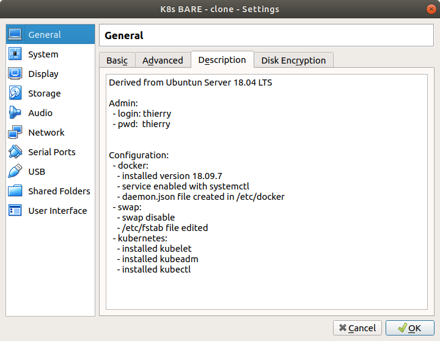
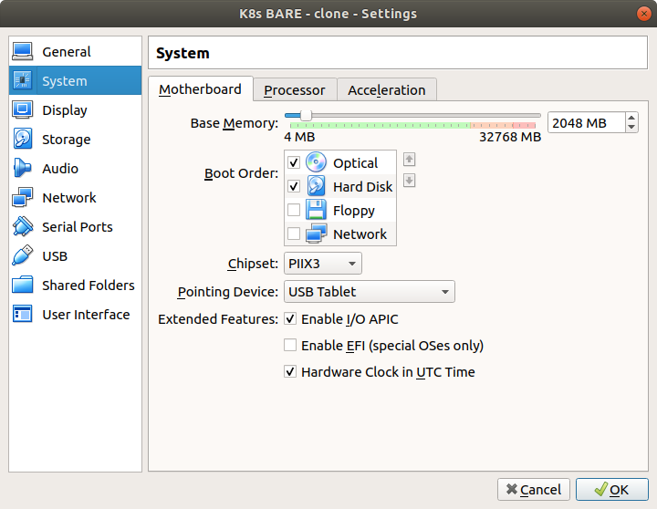
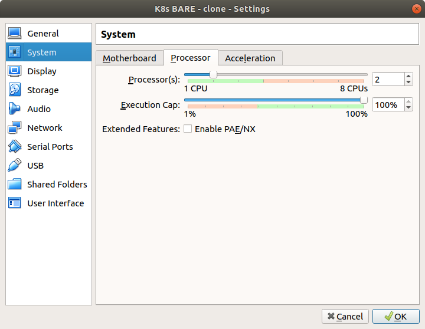
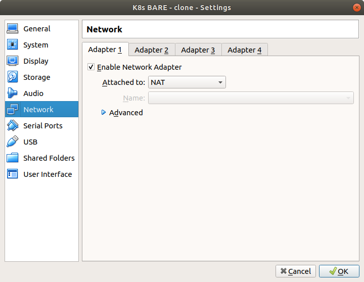
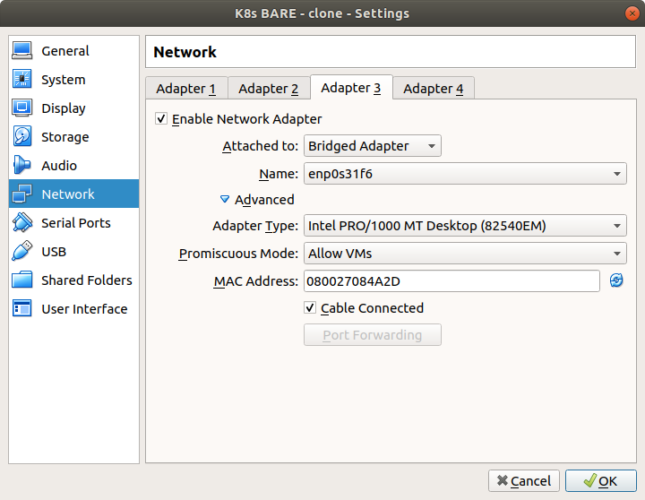
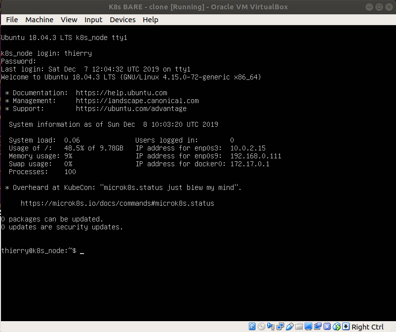
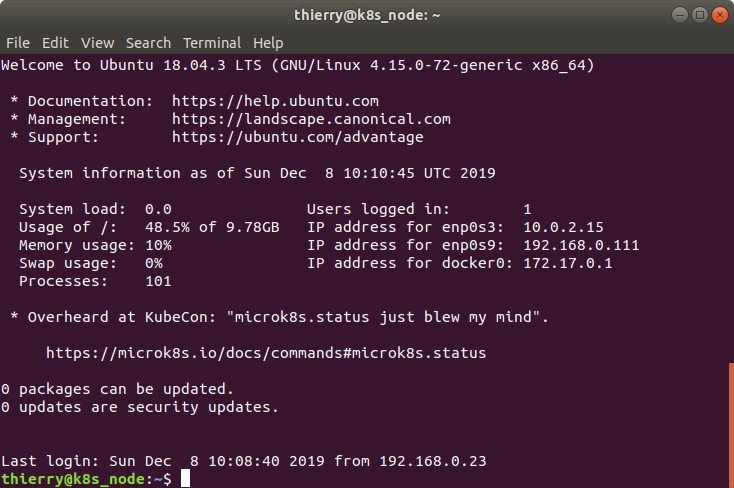

# APPENDIX 0 - Setting up the 3 Nodes Kubernetes cluster


We will describe here the setting up of a Kubernetes cluster according to three methods:
* on 3 virtual machines, one master and two slaves;
* on docker containers, using `Kind` (Kubernetes-in-Docker);
* on 1 medium size virtual machine, on which we will deploy a `Kind` cluster.

The first method is most representative of a real infrastructure, but it requires a powerful hardware (at least 4 CPUs and 16GB memory). However, it is also the most complex to set, mainly because:
1. the network setup is not representative, and can be complex when we have to configure rook operators on the local persistent volume
1. because the versions of main components changed 3 times during the writing of this tutorial... each change generating regressions: this  is a good lesson learned about 'managing open source components in a system'.

The second method appeared pretty fast as a good option to secure the timely delivery of the tutorial, in order to onboard the first student: it is fast, reasonably simple and it requires only a small hardware. However, I experienced  at least one version change even with `Kind`, with for instance the need to keep strictly aligned align the versions of the `dashboard` and of `Kubectl` with the one of `Kind`. And obviously, very little documentation is available to explains the dependencies: trial and error remains the rule...

And finally I had to combine the two approaches in order to meet a request from a student explaining that he did not have a Linux laptop with sudo privilege: he only could work out the tutorial on a Windows laptop. To meet this requirement, I had to spawn a virtual machine (on VirtualBox on Windows) and run the cluster - using `kind` - inside the virtual machine. Thus no need to have a Linux laptop... but an environment even less representative than the two other approaches.


## Part 1 - deployment of the cluster on 3 VMs

### 1.1 - Naming conventions & unique data

In this section, we will build step by step the infrastructure on which we will deploy a Kubernetes cluster. We intentionally make every step manual in this appendix, so that you can appreciate the full process at least once in your lifetime. We also provide here a script which automates the full procedure of setting up the cluster. In real production world, most of these steps are automated and you would simply "push a button" on a GUI.

> Note: Actually, we automated the whole process using Vagrant to automate the creation of the VMs and the specialization into Master or Slave thanks to specialized shell scripts.

> Note: various configuration files required to deploy the cluster are available in the directory:
  `/projects/learn-kubernetes/deploy-cluster-vm/source/`

The steps are:
* building an initial  VM image (`K8s BARE`) with all the prerequisites installed (Ubuntu OS, docker, kubernetes)
* renaming a VM to be the *master* node (`K8s master - cluster not deployed`), derived from `K8s BARE`
* renaming two *slave* VMs (`K8s slave - cluster not deployed`) derived from `K8s BARE`
* initialize and deploy a Kubernetes master node on the master, and join the two slaves into the cluster
* setup a dashboard and access it

> Note: if you are not interested in the setting up of the VMs, you can jump directly as the section 2.4 and set up the cluster from VM images which are provided and already configured. The VM images are named:
`2019-12-23 - K8s master - not configured`
`2019-12-23 - K8s slave 1 - not configured`
`2019-12-23 - K8s slave 2 - not configured`


**WARNING:**
Few information will be unique to each deployment and you need to carefully copy and save these information in order to adapt the commands as shown in the tutorial (i.e. replace the tutorial's info with yours) and run your own version of the commands.

This is typically the case for the ip@ of the VMs: while we set fixed ip@ for the VMs in the automated deployment, these ip@ may be allocated dynamically during the manual implementation, unless configured otherwise.

In writing the tutorial, I set a name and a static IP for each machine:
```
NAME    IP@ (in the private network)
master  192.168.1.200
slave1  192.168.1.201
slave2  192.168.1.202
```
The ip@ granted to each VM by the host machine may vary from one execution of this tutorial to another, so please note the ip@ as you will start the VMs and keep this information for the whole duration of the tutorial.

### 1.2 - Building the first VM


> Note: you can skip this phase if you use directly the `K8s BARE` VM image.

Nothing fancy here: we've built from the Ubuntu Server 20.04 LTS, with:
* 2 CPUs (it is mandatory to run a Kubernetes master)
* 4096 MB memory for the Master, and 2048 MB memory for the Slaves
* two network interfaces:
  * one NAT (which is default setting) for internet connectivity
  * one configured in a `Bridge Adapter` mode, pointing on the most relevant network adapter (in my case: the Ethernet card on the desktop, or the wifi card on the laptop)











In order to make this VM a generic basis on which we can run any type of Kubernetes nodes, we then need to log as `root` and (in this order):
* to install `docker`
* to disable the `swap`
* to install `kubernetes`

For convenience, in this tutorial, we will configure the VMs by connecting into them via ssh from terminals running on the host machine, using the default admin profile (login=`tuto`, password=`tuto`) (secure, huh!!!).
There are few advantages doing so, namely the fact that the prompt then tells on which machine you are actually logged, which is very convenient when you will have 3 VMs running at the same time.

To do so, you need to identify the ip@ of the VM: it will be displayed on your first loging into the VM from the VM GUI (when VirtualBox launches the VM):



Open a terminal and - as a regular user on the host machine, `ssh` into the VM:
(in my case, the hostname of my laptop is `laptop` and my login is `tso`)
```
tso@laptop:~$ ssh tuto@192.168.1.200
```
The first time you connect on a remote machine, you're asked to confirm: confirm by typing `yes` and then enter the password:
```
The authenticity of host '192.168.1.200 (192.168.1.200)' can't be established.
ECDSA key fingerprint is SHA256:blStegSimd9FZS74HYnmTW4CxvNY0gI2LDP7YCcbuzY.
Are you sure you want to continue connecting (yes/no)? yes
Warning: Permanently added '192.168.1.200' (ECDSA) to the list of known hosts.
tuto@192.168.1.200's password:
```
You are now connected on the VM and your prompt will show it:



```
tuto@kubernetes:~$
```
You are logged as `tuto` (the name of the account on the VM) and not anymore as `tso` (the name of the account on the host machine) and you are on `kubernetes` and not on 'laptop' anymore.

*: the initial name of the machine is whatever you have specified when
building the fist image from the Ubuntu OS in VirtualBox. I used the generic
name 'kubernetes' because the same VM will later be used to configure both
master and slave nodes.


We must do the following steps as 'root':

tuto@kubernetes:~$ sudo su

The prompt becomes 'root@kubernetes:/#' and we can continue the next steps.

We will install docker: collect the certificates, add the signing key to the
local apt repository, add the docker repository... and finally install docker:

root@kubernetes:/# apt-get install -y apt-transport-https ca-certificates curl gnupg2 software-properties-common
root@kubernetes:/#
root@kubernetes:/# add-apt-repository "deb https://download.docker.com/linux/debian stretch stable"
root@kubernetes:/# apt-get update
root@kubernetes:/# apt-get install -y docker-ce

Then we must disable the swap: we do so immediately with the "swappoff"
command:

root@kubernetes:/# swapoff -a

and we also prevent the swap to be re-activated at next boot, by editing the
fstab file (/etc/fstab) and disable the line indicating the swap partition
by commenting it (i.e. add a '#' at the beginning of the line). Thus, the
original file changes from:

UUID=96b5fd56-93ab-4512-a2da-c89f56a73da3 / ext4 defaults 0 0
/swap.img	none	swap	sw	0	0

to:

UUID=96b5fd56-93ab-4512-a2da-c89f56a73da3 / ext4 defaults 0 0
#/swap.img	none	swap	sw	0	0


We will then install Kubernetes: collect the certificates, add the signing
key to the local apt repository, add the google kubernetes repository... and
finally install kubernetes:

root@kubernetes:/# curl -s https://packages.cloud.google.com/apt/doc/apt-key.gpg | apt-key add -
root@kubernetes:/# add-apt-repository "deb http://apt.kubernetes.io/ kubernetes-bionic main"
root@kubernetes:/# apt-get update
root@kubernetes:/# apt-get install -y kubelet kubeadm kubectl


Here we are !!!
The generic VM is setup, and we can use this basis for crafting teh master
and slave nodes. As a matter of precaution, you should log out, go in
VirtualBox and shutdown the VM (softly), take a snapshot of the VM and export
it as and appliance under the name of  "K8s BARE".


=======================================
3 - Building the master and slave nodes
=======================================

In this section, we will configure one master node and two slave nodes
from "K8s BARE". To do so, we will clone K8s_BARE (which VirtualBox does very
easily).

In order to reduce the memory footprint of the tutorial, choose 'linked clone'
rather than 'full clone', since each VM virtual disk is more than 3.5GB (and
the laptop does not have infinite storage).

(K8s BARE - 7 - Cloning)

And you should get something looking like this:

(K8s BARE - 8 - Cloned machines)

Start the three VMs in VirtualBox, and as shown in the previous section,
log in, identify the ip@, and connect on these VMs from terminals running on
the host machine.

Since almost all prerequisites were already installed in the previous phase,
the task here merely consists in renaming the machines so that a) you know on
which machine you are logged, and b) you prevent naming conflicts within the
kubernetes cluster later on (since every node must have a unique name in the
cluster).

So we will edit two files: /etc/hosts and /etc/hostname

Log into the first VM (in our case 'ssh tuto@192.168.1.200) and edit the
file /etc/hostname: replace the previous host name (k8s-node) with the new
host name 'master'.

Then edit the file /etc/hosts and add the new name 'master' after
'127.0.0.1   localhost'.

After edition, it should look like this:

tuto@master:~$ cat /etc/hostname
master

tuto@master:~$ cat /etc/hosts
127.0.0.1 localhost master
127.0.1.1 kubernetes

Log out and log in again, and the prompt should look like:

tuto@master:~$

Then do so on the two other machines (respectively at 192.168.0.132 and
192.168.0.133) with the new host names 'slave1' and 'slave2'. The
prompt on these two machines should look like:

tuto@slave1:~$

and

tuto@slave2:~$

Interestingly, the prompt will always tell you on which machine and which
account you are a given moment in time, which will be important in order not
to do too many mistakes while we will configure the Kubernetes cluster.

That's it! We now have 3 machines running on the laptop, with all the
prerequisites installed and the right configuration to make them a master
and two slaves.

We can test the connectivity between the machines on the laptop (ping from
one machine to the other) to check that there is no problem, and then go to
the next section.


==============================================
4 - Configure the Master and start the cluster
==============================================

To start with, we will initiate the cluster on the Master node.

SSH onto the Master node and log as root. To initiate the cluster, we will use
'kubeadm' with the 'init' command. We specify two arguments:
    - specify the 'internal cluster network' which will enable the nodes to
      communicate one with the other. This internal network uses the second
      network interface declared in VirtualBox (the one in bridge mode, and
      use a dedicated internal IP range (10.244.0.0-255 in this example).
    - specifiy that the master node must advertise its own IP@ in order to
      enable the slave nodes to first connect to the master node.

root@master:/# kubeadm init --pod-network-cidr=10.244.0.0/16 --apiserver-advertise-address=192.168.1.200

The whole setup can take a bit of time, and it should conclude with displaying
the following message (truncated):

[init] Using Kubernetes version: v1.17.0
[preflight] Running pre-flight checks
[preflight] Pulling images required for setting up a Kubernetes cluster
[preflight] This might take a minute or two, depending on the speed of your internet connection
[preflight] You can also perform this action in beforehand using 'kubeadm config images pull'
[...]
[addons] Applied essential addon: CoreDNS
[addons] Applied essential addon: kube-proxy

Your Kubernetes control-plane has initialized successfully!

To start using your cluster, you need to run the following as a regular user:

  mkdir -p $HOME/.kube
  sudo cp -i /etc/kubernetes/admin.conf $HOME/.kube/config
  sudo chown $(id -u):$(id -g) $HOME/.kube/config

You should now deploy a pod network to the cluster.
Run "kubectl apply -f [podnetwork].yaml" with one of the options listed at:
  https://kubernetes.io/docs/concepts/cluster-administration/addons/

Then you can join any number of worker nodes by running the following on each as root:

kubeadm join 192.168.1.200:6443 --token f5m0sf.2p7ziygd5v75jk8g \
    --discovery-token-ca-cert-hash sha256:5e716f15b627edfa0eb9693971d79fc4cc12e618352a13c5b2a7d6e063b2027e


Here you are: your Kubernetes Master has initialized successfully!
You can see that the message displayed during the initialisation process
includes three very important directives:
    - you need to create on each machine from which you will manage the cluster
      (in our case, on the host and on the master) a .kube directory and
      configuration file to be able to operate the cluster as a regular user
      (i.e. not root)
    - you need to actually deploy the network which will connect all the pods
      together, and you will have to choose one of the possible network
      configurations.
    - you are given the information needed for a slave node to join the
      cluster by giving the right token and the public key of the master.

So, let's follow these directives.


4.1 - Copy the .kube/config file on the Master
==============================================

The next step is to configure the 'regular' user (i.e. not root) on the
master node who will manage the cluster, and on the host machine. First we
logout as 'root' but we stay logged as 'tuto' on the master, and as a
'tuto' we enter the commands given in the initialization message:

tuto@master:~$ mkdir -p $HOME/.kube
tuto@master:~$ sudo cp -i /etc/kubernetes/admin.conf $HOME/.kube/config
tuto@master:~$ sudo chown $(id -u):$(id -g) $HOME/.kube/config

Here you are, the config file is properly copied in the .kube directory, with
appropriate rights:

tuto@master:~$ ll .kube/
total 16
drwxrwxr-x 2 tuto tuto 4096 Dec 27 15:25 ./
drwxr-xr-x 5 tuto tuto 4096 Dec 27 15:25 ../
-rw------- 1 tuto tuto 5449 Dec 27 15:25 config
tuto@master:~$ cat .kube/config
apiVersion: v1
clusters:
- cluster:
    certificate-authority-data: LS0tLS1CRUdJTiBDRVJUSUZJQ0FURS0tLS0tCk[...]LQo=
    server: https://192.168.1.200:6443
  name: kubernetes
contexts:
- context:
    cluster: kubernetes
    user: kubernetes-admin
  name: kubernetes-admin@kubernetes
current-context: kubernetes-admin@kubernetes
kind: Config
preferences: {}
users:
- name: kubernetes-admin
  user:
    client-certificate-data: LS0tLS1CRUdJTiBDRVJUSUZJQ0FURS0tLS0tCk1JS[...]LQo=
    client-key-data: LS0tLS1CRUdJTiBSU0EgUFJJVkFURSBLRVktLS0tLQpNSUlFb[...]Cg==

(all tokens are truncated)

As you can see, the config file contains the credentials required to act as an
admin on the cluster. Once again, this would not happen this way in a
production environment...


4.2 - Deploy a Kubernetes network model
=======================================

We now must deploy the network within the cluster. For the sake of simplicity,
we will use the 'weave' network add-on (I tried 'flannel' by default but I
encountered multiple issues with the configuration of the cluster internal
network).

The configuration file for the 'weave' network can be directly retrieved
from the kubernetes github repository, and a copy is available in the 'yaml'
sub-directory, named 'weave-v1.10.yaml'.

From the host machine, we copy the configuration file on the Master node:

tso@laptop:~$ scp /projects/learn-kubernetes/deploy-cluster-vm/source/weave-v1.10.yaml tuto@192.168.1.200:~/.
tuto@192.168.1.200's password:
weave-v1.10.yaml                                  100% 6908     2.6MB/s   00:00
Then back from the master, we deploy this network configuration:

tuto@master:~$ kubectl apply -f weave-v1.10.yaml
serviceaccount/weave-net created
clusterrole.rbac.authorization.k8s.io/weave-net created
clusterrolebinding.rbac.authorization.k8s.io/weave-net created
role.rbac.authorization.k8s.io/weave-net created
rolebinding.rbac.authorization.k8s.io/weave-net created
daemonset.apps/weave-net created

Once you have received this message, the master will need a bit of time to
process the deployment as it will actually spawn new pods in charge of
operating the network. You can see the progress by asking several times to
show the pods running on the master with the command 'get pods': see the
results at several seconds distance, and observe that the pods status evolve as
their get from 'Pending' to 'ContainerCreating' and finally to 'Running'.

tuto@master:~$ kubectl get pods --all-namespaces
NAMESPACE     NAME                             READY   STATUS    RESTARTS   AGE
kube-system   coredns-6955765f44-5qgrs         0/1     Running   0          5m58s
kube-system   coredns-6955765f44-v29s9         0/1     Running   0          5m58s
kube-system   etcd-master                      1/1     Running   0          6m12s
kube-system   kube-apiserver-master            1/1     Running   0          6m12s
kube-system   kube-controller-manager-master   1/1     Running   0          6m12s
kube-system   kube-proxy-6kn74                 1/1     Running   0          5m58s
kube-system   kube-scheduler-master            1/1     Running   0          6m12s
kube-system   weave-net-c5hd4                  2/2     Running   0          27s
tuto@master:~$ kubectl get pods --all-namespaces
NAMESPACE     NAME                             READY   STATUS    RESTARTS   AGE
kube-system   coredns-6955765f44-5qgrs         1/1     Running   0          6m1s
kube-system   coredns-6955765f44-v29s9         1/1     Running   0          6m1s
kube-system   etcd-master                      1/1     Running   0          6m15s
kube-system   kube-apiserver-master            1/1     Running   0          6m15s
kube-system   kube-controller-manager-master   1/1     Running   0          6m15s
kube-system   kube-proxy-6kn74                 1/1     Running   0          6m1s
kube-system   kube-scheduler-master            1/1     Running   0          6m15s
kube-system   weave-net-c5hd4                  2/2     Running   0          30s


This is actually interesting as it reveals one key nature of Kubernetes: it
will enable you to run containerized applications, but it relies itself on
launching containers (i.e. containerized applications) to do its job. As your
can see above, it launches a DNS application wich will serve to connect pods
within the cluster: this DNS application is itself running in a container,
managed as a pod.

Looking at the list of the pods, you see that Kubernetes launched several
applications: an API server, a proxy, a scheduler, a datastore (etcd), two
DNS... and a controller manager. We will see abit later all these functions.


4.3 - Remotely manage the cluster as a regular user from the host
=================================================================

Now we need to enable the host machine to actually manage the Kubernetes
cluster, and in order to do so, we must get back to the host and create the
same .kube directory with the same config file (using the same commands as the
ones we used to create the directory and file on the master node). Log again as
'tso' on the laptop, and remote copy this .kube directory from the master to
the laptop:

tso@laptop:~$ mkdir -p $HOME/.kube

tso@laptop:~$ scp -r tuto@192.168.1.200:~/.kube/config ~/.kube/
tuto@192.168.1.200's password:
config                                           100% 5449     5.6MB/s   00:00

tso@laptop:~$ sudo chown $(id -u):$(id -g) $HOME/.kube/config
[sudo] password for tso:

Here you are: you now can manage the Kubernetes cluster from the host machine.
To check that the cluster is alive, you can run the version command:

tso@laptop:~$ kubectl version
Client Version: version.Info{Major:"1", Minor:"16", GitVersion:"v1.16.4", GitCommit:"224be7bdce5a9dd0c2fd0d46b83865648e2fe0ba", GitTreeState:"clean", BuildDate:"2019-12-11T12:47:40Z", GoVersion:"go1.12.12", Compiler:"gc", Platform:"linux/amd64"}
Server Version: version.Info{Major:"1", Minor:"17", GitVersion:"v1.17.0", GitCommit:"70132b0f130acc0bed193d9ba59dd186f0e634cf", GitTreeState:"clean", BuildDate:"2019-12-07T21:12:17Z", GoVersion:"go1.13.4", Compiler:"gc", Platform:"linux/amd64"}

and view the cluster details:

tso@laptop:~$ kubectl cluster-info
Kubernetes master is running at https://192.168.1.200:6443
KubeDNS is running at https://192.168.1.200:6443/api/v1/namespaces/kube-system/services/kube-dns:dns/proxy

To further debug and diagnose cluster problems, use 'kubectl cluster-info dump'.


tso@laptop:~$ kubectl get nodes
NAME     STATUS   ROLES    AGE   VERSION
master   Ready    master   10m   v1.17.0

tso@laptop:~$ kubectl get services -o wide
NAME         TYPE        CLUSTER-IP   EXTERNAL-IP   PORT(S)   AGE   SELECTOR
kubernetes   ClusterIP   10.96.0.1    <none>        443/TCP   10m   <none>

tso@laptop:~$ kubectl get pods -A -o wide
NAMESPACE     NAME                             READY   STATUS    RESTARTS   AGE     IP          NODE     NOMINATED NODE   READINESS GATES
kube-system   coredns-6955765f44-5qgrs         1/1     Running   0          10m     10.32.0.2   master   <none>           <none>
kube-system   coredns-6955765f44-v29s9         1/1     Running   0          10m     10.32.0.3   master   <none>           <none>
kube-system   etcd-master                      1/1     Running   0          10m     10.0.2.15   master   <none>           <none>
kube-system   kube-apiserver-master            1/1     Running   0          10m     10.0.2.15   master   <none>           <none>
kube-system   kube-controller-manager-master   1/1     Running   0          10m     10.0.2.15   master   <none>           <none>
kube-system   kube-proxy-6kn74                 1/1     Running   0          10m     10.0.2.15   master   <none>           <none>
kube-system   kube-scheduler-master            1/1     Running   0          10m     10.0.2.15   master   <none>           <none>
kube-system   weave-net-c5hd4                  2/2     Running   0          4m48s   10.0.2.15   master   <none>           <none>
As you can see, the master is still alone; you have not yet joined a slave
into the cluster.


=======================
5 - Setup the dashboard
=======================

Dashboard is a web-based Kubernetes user interface. You can use Dashboard to
deploy containerized applications to a Kubernetes cluster, troubleshoot your
containerized application, and manage the cluster resources. You can use
Dashboard to get an overview of applications running on your cluster, as well
as for creating or modifying individual Kubernetes resources (such as
Deployments, Jobs, DaemonSets, etc). For example, you can scale a Deployment,
initiate a rolling update, restart a pod or deploy new applications using a
deploy wizard.

Dashboard also provides information on the state of Kubernetes resources in
your cluster and on any errors that may have occurred.

(image: 'dashboard-general_view')

As Kubernetes exposes all its capability via REST APIs, the dashboard
application uses these APIs and shows graphically the information (exactly
the same way 'kubectl' does it with the CLI). The dashboard is itself a
containerized application running as a 'service' on the K8s cluster: it is
both using the cluster as its own infrastructure, and use the cluster's APIs
to monitor  and manage it.


5.1 - Deploy the dahsboard UI
=============================

The Dashboard UI is not deployed by default. To deploy it, run the following
command:

First copy the configuration files from the 'yaml' sub-directory to the
Master, with teh following command:

tso@laptop:~$ scp /projects/learn-kubernetes/deploy-cluster-vm/source/dashboard* tuto@192.168.1.200:~/
tuto@192.168.1.200's password:
dashboard-adminuser.yaml                        100%  377   191.8KB/s   00:00
dashboard-v200b8-recommended.yaml               100% 7568     2.8MB/s   00:00

You can verify that the 2 files are well copies on the home directory on the
Master:

tuto@master:~$ ll
total 108
drwxr-xr-x 17 tuto tuto 4096 janv.  7 14:34 ./
drwxr-xr-x  4 root root 4096 janv.  7 12:41 ../
-rw-------  1 tuto tuto  369 janv.  7 14:13 .bash_history
-rw-r--r--  1 tuto tuto  220 janv.  7 12:41 .bash_logout
-rw-r--r--  1 tuto tuto 3771 janv.  7 12:41 .bashrc
drwx------ 12 tuto tuto 4096 janv.  7 12:48 .config/
-rw-r--r--  1 tuto tuto  377 janv.  7 14:34 dashboard-adminuser.yaml
-rw-r--r--  1 tuto tuto 7568 janv.  7 14:34 dashboard-v200b8-recommended.yaml
drwx------  3 tuto tuto 4096 janv.  7 12:46 .gnupg/
drwxrwxr-x  4 tuto tuto 4096 janv.  7 14:27 .kube/
drwx------  3 tuto tuto 4096 janv.  7 12:45 .local/
-rw-r--r--  1 tuto tuto  807 janv.  7 12:41 .profile
drwx------  2 tuto tuto 4096 janv.  7 12:46 .ssh/
-rw-r--r--  1 tuto tuto 6908 janv.  7 14:26 weave-v1.10.yaml


tuto@master:~$ kubectl apply -f dashboard-v200b8-recommended.yaml
namespace/kubernetes-dashboard created
serviceaccount/kubernetes-dashboard created
service/kubernetes-dashboard created
secret/kubernetes-dashboard-certs created
secret/kubernetes-dashboard-csrf created
secret/kubernetes-dashboard-key-holder created
configmap/kubernetes-dashboard-settings created
role.rbac.authorization.k8s.io/kubernetes-dashboard created
clusterrole.rbac.authorization.k8s.io/kubernetes-dashboard created
rolebinding.rbac.authorization.k8s.io/kubernetes-dashboard created
clusterrolebinding.rbac.authorization.k8s.io/kubernetes-dashboard created
deployment.apps/kubernetes-dashboard created
service/dashboard-metrics-scraper created
deployment.apps/dashboard-metrics-scraper created


You can check that the dashboard is actually running by checking the pods from
the host machine:

tuto@master:~$ kubectl get pods --all-namespaces -o wide
NAMESPACE              NAME                                         READY   STATUS    RESTARTS   AGE     IP          NODE     NOMINATED NODE   READINESS GATES
kube-system            coredns-6955765f44-5qgrs                     1/1     Running   0          15m     10.32.0.2   master   <none>           <none>
kube-system            coredns-6955765f44-v29s9                     1/1     Running   0          15m     10.32.0.3   master   <none>           <none>
kube-system            etcd-master                                  1/1     Running   0          15m     10.0.2.15   master   <none>           <none>
kube-system            kube-apiserver-master                        1/1     Running   0          15m     10.0.2.15   master   <none>           <none>
kube-system            kube-controller-manager-master               1/1     Running   0          15m     10.0.2.15   master   <none>           <none>
kube-system            kube-proxy-6kn74                             1/1     Running   0          15m     10.0.2.15   master   <none>           <none>
kube-system            kube-scheduler-master                        1/1     Running   0          15m     10.0.2.15   master   <none>           <none>
kube-system            weave-net-c5hd4                              2/2     Running   0          9m43s   10.0.2.15   master   <none>           <none>
kubernetes-dashboard   dashboard-metrics-scraper-76585494d8-5slbj   1/1     Running   0          48s     10.32.0.5   master   <none>           <none>
kubernetes-dashboard   kubernetes-dashboard-5996555fd8-94p8b        1/1     Running   0          48s     10.32.0.4   master   <none>           <none>

Here you can see that a pod is running with the name 'dashboard'. However,
even if the dashboard is actually running, you still cannot access it. To get
there, we first need to setup a 'user' with the proper privileges and roles.


5.2 - Create a sample user to access the dashboard
==================================================

To protect your cluster data, Dashboard deploys with a minimal RBAC ('Role
Based Access Control') configuration by default. Currently, Dashboard only
supports logging in with a Bearer Token. To create a token for this demo, you
can follow this guide, and create a sample user.


    Note: This is ok for this tutorial, but it is NOT the right way to proceed
        in a production environment. In order to go fast and easily to a
        visible outcome, we create here a user whi will inherit administrative
        privileges, which is dangerous in a real environment. Like many
        shortcuts in this tutorial, please do not assume that this is
        representative of a 'real' environment.

We will create the user it by writing a yaml manifest describing the user,
and then add into it the description of its roles and privileges. We will then
apply this manifest to the cluster via the kubectl command.

A user's role/privilege is always linked to a set of resources:

First we describe the 'Service Account', which mean the account (= the user
profile) which will be related to the service (here the dashboard, which is a
Kubernetes service).
    - The name of the account is 'admin-user'.
    - We define a 'namespace' on which is it valid: its valid eclare it valid
        in the namespace 'kubernetes-dashboard' first.
Then we describe the role, called 'ClusterRoleBinding', granted to this user.

    (file: dashboard-adminuser.yaml)
    ---
    apiVersion: v1
    kind: ServiceAccount
    metadata:
      name: admin-user
      namespace: kubernetes-dashboard
    ---
    apiVersion: rbac.authorization.k8s.io/v1
    kind: ClusterRoleBinding
    metadata:
      name: admin-user
    roleRef:
      apiGroup: rbac.authorization.k8s.io
      kind: ClusterRole
      name: cluster-admin
    subjects:
    - kind: ServiceAccount
      name: admin-user
      namespace: kubernetes-dashboard

Then run the command:

tso@laptop:~$ scp /projects/learn-kubernetes/deploy-cluster-vm/source/dashboard* tuto@192.168.1.200:~/
tuto@192.168.1.200's password:
dashboard-adminuser.yaml                        100%  377   191.8KB/s   00:00
dashboard-v200b8-recommended.yaml               100% 7568     2.8MB/s   00:00

thierry@master:~$ kubectl apply -f dashboard-adminuser.yaml
tuto@master:~$ kubectl apply -f dashboard-adminuser.yaml
serviceaccount/admin-user created
clusterrolebinding.rbac.authorization.k8s.io/admin-user created

Done :-)


5.4 - Collect the Bearer Token
==============================

Now we need to find THE token needed to log in. Execute following command:

tuto@master:~$ admin_profile=kubectl -n kubernetes-dashboard get secret | grep admin-user | awk '{print $1}'
tuto@master:~$ kubectl -n kubernetes-dashboard describe secret $admin_proile
Name:         admin-user-token-n4pkj
Namespace:    kubernetes-dashboard
Labels:       <none>
Annotations:  kubernetes.io/service-account.name: admin-user
              kubernetes.io/service-account.uid: 2a675be5-ebf3-4519-9de3-32d404a37521

Type:  kubernetes.io/service-account-token

Data
====
token:      eyJhbGciOiJSUzI1NiIsImtpZCI6InJOUjVSVEpKV21xMlRjeVVPazNVNmVpcGhiUEtzQzRkSDF5dC1ad19JRFkifQ.eyJpc3MiOiJrdWJlcm5ldGVzL3NlcnZpY2VhY2NvdW50Iiwia3ViZXJuZXRlcy5pby9zZXJ2aWNlYWNjb3VudC9uYW1lc3BhY2UiOiJrdWJlcm5ldGVzLWRhc2hib2FyZCIsImt1YmVybmV0ZXMuaW8vc2VydmljZWFjY291bnQvc2VjcmV0Lm5hbWUiOiJhZG1pbi11c2VyLXRva2VuLW40cGtqIiwia3ViZXJuZXRlcy5pby9zZXJ2aWNlYWNjb3VudC9zZXJ2aWNlLWFjY291bnQubmFtZSI6ImFkbWluLXVzZXIiLCJrdWJlcm5ldGVzLmlvL3NlcnZpY2VhY2NvdW50L3NlcnZpY2UtYWNjb3VudC51aWQiOiIyYTY3NWJlNS1lYmYzLTQ1MTktOWRlMy0zMmQ0MDRhMzc1MjEiLCJzdWIiOiJzeXN0ZW06c2VydmljZWFjY291bnQ6a3ViZXJuZXRlcy1kYXNoYm9hcmQ6YWRtaW4tdXNlciJ9.oCwwmVVLIiYV40AjlHIe0YbYi8mDrkJ0fP8fGxHu-SBYZlbZShVgJRZpMZOaTabgAA_y1IzZNKxByzSmlNqsiDr0CG-wVXZCWG_t_OwWMDAGPqV3xDAcD4zhl-l-9EQ0G5ZrBUbAljzPbzZph8t644vdj0uSOsB28jk_vy2kQ_yYxNLgF12jhCLsjaA0iDnq31FajTv6-9cW8BVkxyGrMcCy8kg3lDv9OX9X8osIbWZU1uTLsvVx0KttQS6n3faFrS5ujWyxZ3hMq96nCFnQDCyQSA_WT24wrenWza-deV1PGbhjXxMnZezWIUsc24rlXA1J6mhqKo6QbAZVt7uk8A
ca.crt:     1025 bytes
namespace:  20 bytes


Copy the token (the long line of meaningless characters) because you will need
it to log into the dashboard, when we will access it via the browser.


5.5 - Connect to the Dashboard web server
=========================================

In order to connect to the dashboard, you simply need to access the URL
http://server@ip:server@port/api/v1/namespaces/kubernetes-dashboard/services/https:kubernetes-dashboard:/proxy/

However, the server runs on the cluster's internal network, and you cannot
access directly this network: you need to connect via a proxy provided by
Kubernetes. To be clear, the proxy need to run on the machine from which we
intend to access the dashboard, so in our case, we will run the proxy from the
host machine (i.e. the laptop):

First, let's activate the proxy from another tab of the terminal window

tso@laptop:~$ kubectl proxy -p 8001
Starting to serve on 127.0.0.1:8001

From now on, the Kubernetes API server is accessible on the laptop, listening
on the port 8001: let's check this by polling the API to ask for the server's
version:

tso@laptop:~$ curl http://127.0.0.1:8001/version
{
  "major": "1",
  "minor": "17",
  "gitVersion": "v1.17.0",
  "gitCommit": "70132b0f130acc0bed193d9ba59dd186f0e634cf",
  "gitTreeState": "clean",
  "buildDate": "2019-12-07T21:12:17Z",
  "goVersion": "go1.13.4",
  "compiler": "gc",
  "platform": "linux/amd64"
}

It works!!! Let's now try to access the dashboard:

tso@laptop:~$ curl http://localhost:8001/api/v1/namespaces/kubernetes-dashboard/services/https:kubernetes-dashboard:/proxy/
<!--
Copyright 2017 The Kubernetes Authors.

Licensed under the Apache License, Version 2.0 (the "License");
you may not use this file except in compliance with the License.
You may obtain a copy of the License at

    http://www.apache.org/licenses/LICENSE-2.0

Unless required by applicable law or agreed to in writing, software
distributed under the License is distributed on an "AS IS" BASIS,
WITHOUT WARRANTIES OR CONDITIONS OF ANY KIND, either express or implied.
See the License for the specific language governing permissions and
limitations under the License.
-->

<!doctype html>
<html>

<head>
  <meta charset="utf-8">
  <title>Kubernetes Dashboard</title>
  <link rel="icon" type="image/png" href="assets/images/kubernetes-logo.png"/>
  <meta name="viewport" content="width=device-width">
<link rel="stylesheet" href="styles.dd2d1d3576191b87904a.css"></head>

<body>
  <kd-root></kd-root>
<script src="runtime.380dd4d7ab4891f91b7b.js" defer=""></script><script src="polyfills-es5.65f1e5151c840cf04c3e.js" nomodule="" defer=""></script><script src="polyfills.8623bbc9d68876cdaaaf.js" defer=""></script><script src="scripts.7d5e232ea538f2c0f8a7.js" defer=""></script><script src="main.3036e86b43f81b098e24.js" defer=""></script></body>

</html>


The connection is accepted, even though the content here looks a bit cryptic:
we now can launch a browser on the laptop and see the login page of the
dashboard:
    - tick the 'Token' button and paste the token which you copied
        earliers (the one which we got from the 'get secret' and 'describe'
        commands).
    - sign in

and you are now on the welcome page of the dashboard: feel free navigating on
the pages, since it will give you detailed information about the cluster.
Namely, you can go on the 'Overview'and you will see that there is only one
service running right now, the 'Kubernetes' service (i.e. Kubernetes is
monitoring itself via the dashboard, the same wat it will monitor your
applications).

If you go on the 'Nodes' tab, you will see that 'master' is the only node
running so far. Click on its name, and you get a detailed status of the node:
go down and see the 'Allocation' section which shows the resources consummed
(vs the sizing of the node), and further down the 'Pods' section shows the
various components of the Kubernetes control plane which are running just to
keep the cluster active.

If you go on the 'Pods' tab, you will see that it is still empty. This tab
only shows the 'user's' Pods, the ones activated in order to run your
applications. You don't see here the control plane components (as shown
above).


===============================================
6 - Enroll the two slave nodes into the cluster
===============================================

It's now time to join the two slaves into the cluster. To do so, we need to
log into the slave nodes (with ssh), as 'root', and use the token and key
which were displayed at the end of the cluster initialisation message:

tso@laptop:~$ ssh tuto@192.168.1.201
The authenticity of host '192.168.1.201 (192.168.1.201)' can't be established.
[...]
Last login: Tue Jan  7 13:04:30 2020 from 192.168.1.25

tuto@slave1:~$ sudo su
[sudo] password for tuto:

root@slave1:/home/tuto# kubeadm join 192.168.1.200:6443 --token f5m0sf.2p7ziygd5v75jk8g \
>     --discovery-token-ca-cert-hash sha256:5e716f15b627edfa0eb9693971d79fc4cc12e618352a13c5b2a7d6e063b2027e
[preflight] WARNING: JoinControlPane.controlPlane settings will be ignored when control-plane flag is not set.
[preflight] Running pre-flight checks
[...]
[kubelet-start] Waiting for the kubelet to perform the TLS Bootstrap...

This node has joined the cluster:
* Certificate signing request was sent to apiserver and a response was received.
* The Kubelet was informed of the new secure connection details.

Run 'kubectl get nodes' on the control-plane to see this node join the cluster.

That's it: 'slave1' is now part of the cluster.

and then let's do the same for 'slave2':

tso@laptop:~$ ssh tuto@192.168.1.202
tuto@slave2:~$ sudo su
root@slave2:/# kubeadm join 192.168.1.200:6443 --token f5m0sf.2p7ziygd5v75jk8g \
>     --discovery-token-ca-cert-hash sha256:5e716f15b627edfa0eb9693971d79fc4cc12e618352a13c5b2a7d6e063b2027e
[preflight] WARNING: JoinControlPane.controlPlane settings will be ignored when control-plane flag is not set.
[preflight] Running pre-flight checks
[...]
[kubelet-start] Waiting for the kubelet to perform the TLS Bootstrap...

This node has joined the cluster:
* Certificate signing request was sent to apiserver and a response was received.
* The Kubelet was informed of the new secure connection details.

Run 'kubectl get nodes' on the control-plane to see this node join the cluster.

root@slave2:/#


And now 'slave2' has joined the cluster as well. Come back to the laptop and
check the status of the cluster. Check the number of nodes as they get
enlisted and active into the cluster:


tuto@master:~$ kubectl get nodes
NAME     STATUS     ROLES    AGE   VERSION
master   Ready      master   23m   v1.17.0
slave1   NotReady   <none>   9s    v1.17.0
tuto@master:~$ kubectl get nodes
NAME     STATUS     ROLES    AGE   VERSION
master   Ready      master   23m   v1.17.0
slave1   NotReady   <none>   33s   v1.17.0
slave2   NotReady   <none>   3s    v1.17.0
tso@laptop:~$ kubectl get nodes
NAME     STATUS     ROLES    AGE   VERSION
master   Ready      master   23m   v1.17.0
slave1   Ready      <none>   51s   v1.17.0
slave2   NotReady   <none>   21s   v1.17.0

Now, let's look at the pods running on the cluster: you can see that some
pods are now running on the slave nodes as well:

tso@laptop:~$ kubectl get pods --all-namespaces -o wide
NAMESPACE              NAME                                         READY   STATUS    RESTARTS   AGE     IP          NODE     NOMINATED NODE   READINESS GATES
kube-system            coredns-6955765f44-5qgrs                     1/1     Running   0          23m     10.32.0.2   master   <none>           <none>
kube-system            coredns-6955765f44-v29s9                     1/1     Running   0          23m     10.32.0.3   master   <none>           <none>
kube-system            etcd-master                                  1/1     Running   0          23m     10.0.2.15   master   <none>           <none>
kube-system            kube-apiserver-master                        1/1     Running   0          23m     10.0.2.15   master   <none>           <none>
kube-system            kube-controller-manager-master               1/1     Running   0          23m     10.0.2.15   master   <none>           <none>
kube-system            kube-proxy-2qmq7                             1/1     Running   0          29s     10.0.2.15   slave2   <none>           <none>
kube-system            kube-proxy-6kn74                             1/1     Running   0          23m     10.0.2.15   master   <none>           <none>
kube-system            kube-proxy-wbb28                             1/1     Running   0          59s     10.0.2.15   slave1   <none>           <none>
kube-system            kube-scheduler-master                        1/1     Running   0          23m     10.0.2.15   master   <none>           <none>
kube-system            weave-net-5vw9s                              1/2     Running   0          29s     10.0.2.15   slave2   <none>           <none>
kube-system            weave-net-c5hd4                              2/2     Running   0          18m     10.0.2.15   master   <none>           <none>
kube-system            weave-net-qlpr5                              2/2     Running   1          59s     10.0.2.15   slave1   <none>           <none>
kubernetes-dashboard   dashboard-metrics-scraper-76585494d8-5slbj   1/1     Running   0          9m15s   10.32.0.5   master   <none>           <none>
kubernetes-dashboard   kubernetes-dashboard-5996555fd8-94p8b        1/1     Running   0          9m15s   10.32.0.4   master   <none>           <none>


YES!!! The cluster is up and running and the master is actually scheduling
pods on the slave nodes. At this moment, the pods are only Kubernetes'
components, but this is already showing the principles by which Kubernetes
will schedule your own application on the pods.

Go to the browser, at the 'Nodes' tab, and you will see the three active nodes
with their respective details. Click on one of the salves and observe the
'Allocation' and teh 'Pods' section: the slave is significantly less loaded
than teh master, because it carries only a fraction of the control plane tasks
compared to the master. Quite logically, the slaves are primarily focused on
running your application, and not Kubernetes itself: the repartition of the
tasks amongst the node aims at freeing up as much as possible of the slave's
resources to make them available to... you.


                                    *

                                  *   *


===============================================================================

Part 2 - deployment of a Kubernetes-inDocker (Kind) cluster

===============================================================================


As in Part 1, we assume again that you have a Linux laptop and an account with
sudo privilege.

In order to avoid multiple side effects due to version changes, here is the set
of verions used for all main components:
    - docker of version 18.9 minimum
    - GO version 1.13 (language on which Kind is developped)
    - Kind version 0.6.1 (which runs Kubernetes version 1.16.0)
    - dashboard version 2.0.0 beta 8
    - kubectl version 1.16.4

The corresponding binary files are available in the 'deploy-cluster-kind'
directory.


Step 1: remove possible temporary files
=======================================

Previous deployments may have left temporary files, which may interfere with
the proper rollout of the cluster. The first step is to remove all of them:

$ rm -rf .kube
$ rm recommended.yaml
$ rm -rf data_dashboard_token
$ mkdir /.kube


Step 2: deploy the cluster
==========================

Kind automates the deployment of the cluster: we need to pass only two
arguments to kind:

    - the configuration of the cluster: the API's version, the number of nodes.
      The configuration file called 'kind-cluster.yaml' is located in the
      'deploy-cluster-kind' directory.
    - the name of the cluster: Kind can manage multiple clusters simultaneously
      and it can distinguish them only by their name.

The command is then:


$ kind create cluster --config kind-cluster.yaml --name newyear


Step 3: deploy the dashboard (web GUI)
======================================

The next step is to deploy the dashboard on top of the Kubernetes clsuter: the
dashboard actually runs on the cluster exactly the same way as any other
application. You need to use 'kubectl' and inject a YAML file in the cluster.

The YAML file is the one corresponding to the version 2.0.0 beta 8, available
in the 'deploy-cluster-kind' directory, and the command is:

$ kubectl apply -f dashboard-v200b8-recommended.yaml

We then create a 'sample user', i.e. a user with the profile and rights to
access the dashboard application:

$ kubectl apply -f dashboard-adminuser.yaml

Finally, we need to collect the secret token (which is needed to log on the
dashboard from within a browser): we use the 'get secret' command to identify
the user, and then the 'describe secret' to exctract the token:

$ admin_profile=$(kubectl -n kubernetes-dashboard get secret | grep admin-user | awk '{print $1}')
$ dashboard_token_full=$(kubectl -n kubernetes-dashboard describe secret $admin_profile | grep "token: ")

We remove various other element in the string, ni order to keep the token only:

$ dashboard_token=${dashboard_token_full#"token: "}

We save the token in a file called 'data_dashboard_token':

$ echo $dashboard_token > data_dashboard_token


Step 4: access the dashboard from a browser
===========================================

To access the dashboard from a browser, you will need to make the dashbaord
service accessible from otuside the cluster, with a proxy, and the token
collected at the end of Step 3.

The proxy will be established by Kubectl: open a different terminal window, and
run the following command from this new terminal:

$ kubectl proxy -p 8001
Starting to serve on 127.0.0.1:8001

Thanks to this proxy, you can now access the dashboard service from the laptop:
you simply have to copy the following URL in a browser:

http://localhost:8001/api/v1/namespaces/kubernetes-dashboard/services/https:kubernetes-dashboard:/proxy/

You will see a login screen: choose the 'Token' option and paste the token in
the following field. Here you are!


Step 5: conclusion
==================

Thats's it: you have a cluster running, which you can access with Kubectl. It
simulates 3 nodes, and Kind spoofs Kubernetes: the various containers behave as
Nodes and Pods and interact via the API server, with kubelets. The fact that
the topology is now 100% logical (topology between containers) and not physical
(the containers do not run on different machines) is not visible from the
various Kubernetes components. The contianers respect the APIs.

The interest here is both simplicity and footprint:
    - simplicity snice it takes very few steps to get a full cluster up and
      running, without having to bother about the network and other
      miscellaneous details...
    - footprint because it takes just one 'kindest' container per node to
      simulate the whole underlying infrastructure, and you then get a
      light-weight Kubernetes.

To me, this is more than just a spoof: Kind could bring the steps towards a
'100% containers' Kubernetes, where the whole nifrastructure would ONLY manage
containers, and not anymore rotate around servers or VMs. To be continued...


                                    *

                                  *   *


===============================================================================

Part 3 - deployment on a medium-size VM with Kind cluster

===============================================================================


The 'combi' scenario came from the constraints of a colleague who could not run
the tutorial on a Linux laptop... because he does not have a computer running
Linux (he's a VP, not a developper: his laptop is running MS Office...).

I did not want to bother with proting the whole thing onto Windows, and I am
really not familiar with coding on windows: looking for a 'simple' way to meet
his need, I finally resolved into setting up a VM with all the prerequisites
(Ubuntu desktop, docker, GO, Kind, Kubectl...).

I initially went the Vagrant way: however, for some reason, I felt it difficult
to work out with a desktop linux, while everything works fine with server
versions). So I eventually decided to setup the VM with VirtualBox, export the
OVA VM image and make it available to students so that they can run the
tutorial 'as if they were running Kind on Linux'.

The VM was set:
    - from a Ubuntu 18.04.3 LTS base OS
    - with GO version 1.13
    - with Kind version 0.6.1
    - with Kubectl version 1.16.4

and I cloned the 'learn-kubernetes' tutorial into the /projects directory.

As of this step, it is then very similar with the Part 2:
    - deploy a cluster with Kind (config file and name)
    - deploy the dashboard and the sample user
    - copy the token and log into the dashboard from a browser


                                    *

                                  *   *


===============================================================================

Part 4 - automated deployment

===============================================================================


A shell script is available in the tutorial to launch automated deployment for
Part 1 and Part 2: the 'deploy-cluster.sh' will deploy either on VM or on
containers depending on the arguments passed:

$ ./deploy-cluster.sh arg

    arg = -v or --vm        it will deploy 3 VMs and a Kubernetes cluster on
                            the VMs.
    agr = -k or --kind      it will deploy a cluster on containers, using kind

The whole process is automated, and the scripts is quite explicit.
