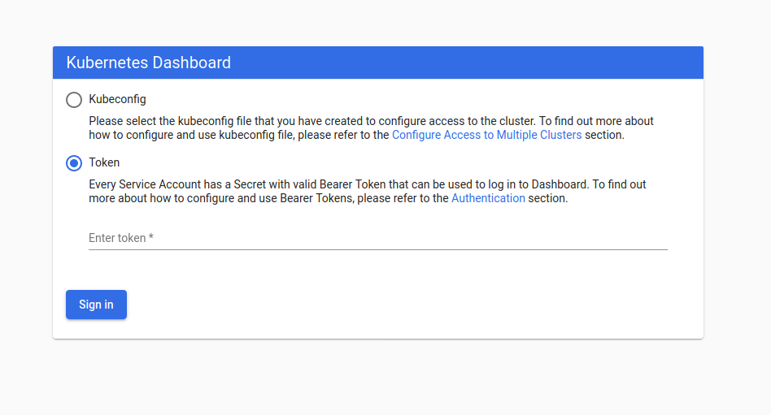
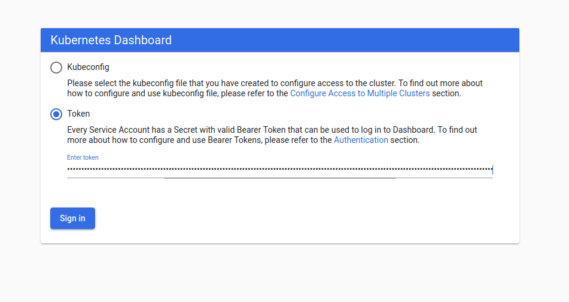

# Appendix 0 - deploy a `Kind` cluster


### 2.2.2 - deploy the cluster

Kind automates the deployment of the cluster: we need to pass only two arguments to kind:

* the configuration of the cluster: the API's version and the number of nodes. The configuration file called `kind-cluster.yaml` is located in the `./deploy` directory.
* the name of the cluster: Kind can manage multiple clusters simultaneously and it can distinguish them only by their name.

We copy and rename the required original files from `./deploy` to `./sandbox` (so that we can run several times a given step of the tutorial, with always the ability to reset the cluster and start from a fresh state), and then we go in the `sandbox` directory for the following steps:

```bash
tuto@laptop:~/learn-kubernetes$ cp ./deploy/kind-cluster-v0.2.yaml ./sandbox/kind-cluster.yaml
tuto@laptop:~/learn-kubernetes$ cp ./deploy/dashboard-v200-recommended.yaml ./sandbox/recommended.yaml
tuto@laptop:~/learn-kubernetes$ cp ./deploy/dashboard-adminuser.yaml ./sandbox/dashboard-adminuser.yaml
tuto@laptop:~$ cd sandbox/
tuto@laptop:~/learn-kubernetes/sandbox$
```

From there, we have in the `./sandbox` directory all the files required to deploy the cluster:

```bash
tuto@laptop:~$ kind create cluster --config ./kind-cluster.yaml --name k8s-tuto
```

### 2.2.3 - deploy the dashboard (web GUI)

The next step is to deploy the dashboard on top of the Kubernetes clsuter: the dashboard actually runs on the cluster exactly the same way as any other application. You need to use `kubectl` and inject a YAML file in the cluster.

The YAML file is the one corresponding to the version 2.0.0, available in the `./deploy` directory, and the command is:

```bash
tuto@laptop:~/learn-kubernetes/sandbox$ kubectl apply -f recommended.yaml
```

We then create a *sample user*, i.e. a user with the correct profile and rights to access the dashboard application:

```bash
tuto@laptop:~/learn-kubernetes/sandbox$ kubectl apply -f dashboard-adminuser.yaml
```

Finally, we need to collect the secret token (which is needed to log on the dashboard from within a browser): we use the `kubectl get secret` command to identify the user, and then the `kubectl describe secret` command to extract the token:

```bash
tuto@laptop:~/learn-kubernetes/sandbox$ admin_profile=$(kubectl -n kubernetes-dashboard get secret | grep admin-user | awk '{print $1}')
tuto@laptop:~/learn-kubernetes/sandbox$ dashboard_token_full=$(kubectl -n kubernetes-dashboard describe secret $admin_profile | grep "token: ")
```
We remove various other element in the string, in order to keep the token only:

```bash
tuto@laptop:~/learn-kubernetes/sandbox$ dashboard_token=${dashboard_token_full#"token: "}
```

We save the token in a file called `data_dashboard_token`:

```bash
tuto@laptop:~/learn-kubernetes/sandbox$ echo $dashboard_token > data_dashboard_token
```

### 2.2.4 - access the dashboard from a browser

To access the dashboard from a browser, you will need to make the dashbaord service accessible from outside the cluster, with a proxy. This proxy will be established by `Kubectl`: open a second terminal window, and run the following command from this new terminal:

```bash
tuto@laptop:~/learn-kubernetes/sandbox$ kubectl proxy -p 8001
Starting to serve on 127.0.0.1:8001
```

Thanks to this proxy, you can now access the dashboard service from the laptop:
* come back to the previous terminal window, in order to be able to continue running commands towards the cluster (via `kubectl`) for the rest of the tutorial,
* and copy the following URL in a browser to access the dashboard:
  [http://localhost:8001/api/v1/namespaces/kubernetes-dashboard/services/https:kubernetes-dashboard:/proxy/](http://localhost:8001/api/v1/namespaces/kubernetes-dashboard/services/https:kubernetes-dashboard:/proxy/)

* the browser (possibly you may need to refresh it after few seconds to give time to the cluster to start all services) will show a login page with two option: select the 'Token' box;

* paste into the field the token (yeah, its a very long line);

* and you are logged into the dashboard, which is a web GUI to help you see what is happening in the cluster, and even to operate the cluster from there:
")

You will see a login screen: choose the 'Token' option and paste the token in the following field. Here you are!
